<!-- markdownlint-disable MD013 -->

# Org Monitoring by sfdx-hardis (Grafana Dashboards v2)

The v2 dashboard set builds on the metrics and logs that [sfdx-hardis monitoring](salesforce-monitoring-home.md) already sends to Grafana ([setup guide](salesforce-ci-cd-setup-integration-api.md)).

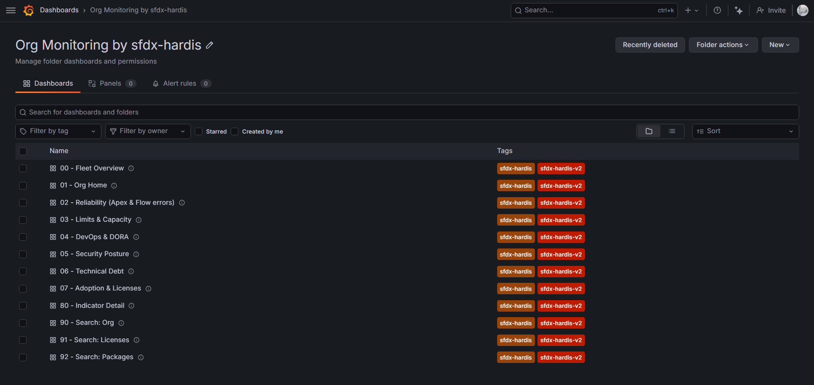

What it brings:

- A **Fleet Overview** showing every monitored org on one screen (health score, worst limit, errors, backups, freshness), with a Production/Sandbox filter
- **Trends and averages** on every indicator (7d/30d averages, week-over-week comparisons)
- **Forecasts**: projected date when each org limit or storage will be reached (30-day linear trend)
- A weekly **org health score** (0-100) with reliability / limits / security / tests / debt sub-scores
- **DORA metrics** panels (deployment frequency, lead time, change failure rate, MTTR, rework rate)
- **Drill-down navigation**: every number is clickable and leads to its detail view
- A ready-to-enable **alert pack** (shipped paused, so it costs nothing until you activate it)
- **No personal data**: combined with [data anonymization](salesforce-security-privacy.md#data-anonymization), dashboards display counts, aggregates and pseudonyms, never readable usernames

> The previous dashboard set is now **[legacy (v1)](salesforce-monitoring-grafana-v1-legacy.md)**. It keeps working (v2 uses its own folder, UIDs and files) but is frozen: new indicators and features only land in v2.

## Prerequisites

- Monitoring configured with **both** endpoints of the [API integration](salesforce-ci-cd-setup-integration-api.md):
  - `NOTIF_API_URL` (Loki logs): detail tables, searches, freshness detection
  - `NOTIF_API_METRICS_URL` (Prometheus/Mimir metrics): trends, averages, forecasts
- A Grafana instance: Grafana Cloud (free tier works) or any self-hosted Grafana OSS/Enterprise (v10+)
- Some panels need a recent sfdx-hardis version on the monitoring pipeline (health score, impacted users, top failing Apex). They show an empty state until your monitoring jobs run with it.

## Import the dashboards

The dashboards are instance-agnostic: no datasource UID is hardcoded. Each dashboard carries two hidden datasource variables (`ds_prom`, `ds_loki`) that resolve automatically to your Prometheus and Loki datasources: since sfdx-hardis data is sent to a single Prometheus and a single Loki, no picker is shown.

### Automated install (recommended)

Run [hardis:org:configure:grafana-dashboards](hardis/org/configure/grafana-dashboards.md):

```sh
sf hardis:org:configure:grafana-dashboards
```

The command asks for your Grafana instance URL and a service account token (Editor role; create one in **Administration** -> **Users and access** -> **Service accounts**), detects your Prometheus and Loki datasources, creates the `Org Monitoring by sfdx-hardis` folder and imports all the dashboards through the Grafana HTTP API. It works the same on Grafana Cloud and self-hosted instances.

Re-run the command after upgrading sfdx-hardis: dashboards are updated in place (stable uids, bookmarks and links keep working).

Non-interactive mode for CI and agents:

```sh
sf hardis:org:configure:grafana-dashboards --agent --grafana-url https://mycompany.grafana.net --grafana-token $GRAFANA_API_TOKEN
```

### Manual import

1. Download the JSON files from [docs/grafana/dashboards-v2](https://github.com/hardisgroupcom/sfdx-hardis/tree/main/docs/grafana/dashboards-v2)
2. In Grafana, create a folder (suggested name: `Org Monitoring by sfdx-hardis`)
3. **Dashboards** -> **New** -> **Import** -> upload each JSON file into that folder

If your instance has several Prometheus or Loki datasources and the automatic pick is wrong (Grafana Cloud internal datasources like alert state history are already filtered out), override it once per dashboard in **Dashboard settings** -> **Variables**, or pass `?var-ds_prom=<uid>&var-ds_loki=<uid>` in the URL.

Self-hosted instances can also use [file provisioning](https://grafana.com/docs/grafana/latest/administration/provisioning/#dashboards): copy the JSON files in your dashboards provisioning folder.

## Navigation model

The dashboards form a tree. You rarely need the Grafana dashboard list: start from the Fleet Overview and click your way down.

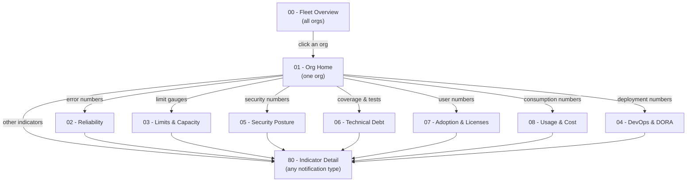

Rules used everywhere:

- **Every number is clickable.** Stats, gauges and table rows carry a data link to the matching detail: another dashboard, the generic Indicator Detail, or a full-screen table (e.g. the silent orgs list).
- **Selections follow you.** Links keep the current org, environment filter and datasources, so drilling down never resets your context.
- The **Org Monitoring by sfdx-hardis** dropdown (top of every dashboard) jumps to any other dashboard of the set.

## The dashboards

### 00 - Fleet Overview

The entry point: all monitored orgs at a glance.

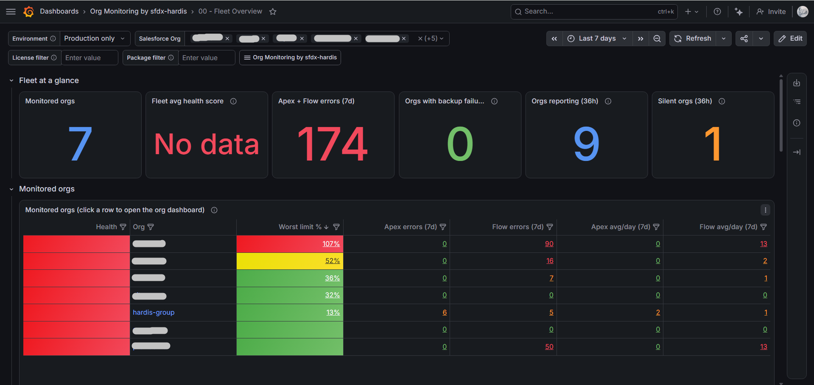

- **Fleet at a glance**: monitored orgs, fleet average health score, total errors (7d), orgs with backup failures, orgs reporting, silent orgs. Each stat opens its detail list.
- **Environment filter**: display all orgs, production only, or sandboxes only (sandboxes are recognized by their org identifier).
- **Monitored orgs table**: one row per org with health score, worst limit %, Apex/Flow errors (7d totals and daily averages). Click any cell to open the org's dashboard.
- **Health sub-scores by org**: the weekly composite score broken down (reliability, limits, security, tests, debt).
- **Errors across the fleet**: errors per day for all orgs, fleet-wide daily averages.
- **Recent alerts and search**: latest error/critical notifications (org, type, severity), plus license and package search criteria.
- **Freshness and backups**: silent orgs (no notification for 36h: the monitoring job probably failed), orgs reporting, backup failures.

### 01 - Org Home

Single-org overview, the hub for one org.

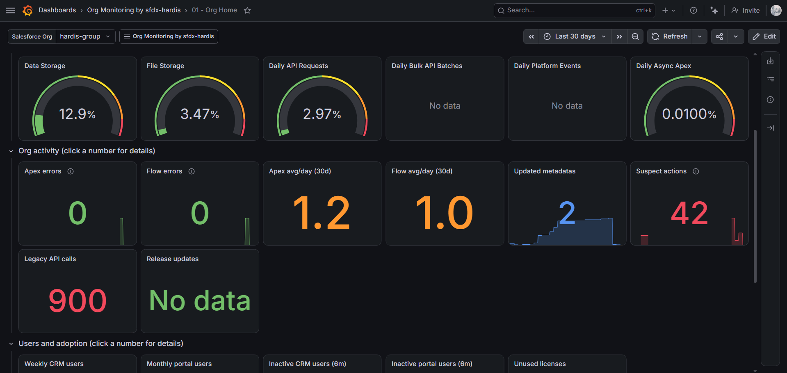

- Weekly **health score** with sub-scores bar gauge
- **Org limits** gauges (storage, API, bulk, platform events, async Apex): click to open Limits & Capacity
- **Org activity**: Apex/Flow errors (last run + 30d daily average), updated metadata, suspect setup actions, legacy API calls, release updates
- **Users and adoption**: active/inactive user counts
- **Tests and security**: Apex coverage, failing test classes, Security Health Check, unsecured Connected Apps, MFA bypass users

### 02 - Reliability (Apex & Flow errors)

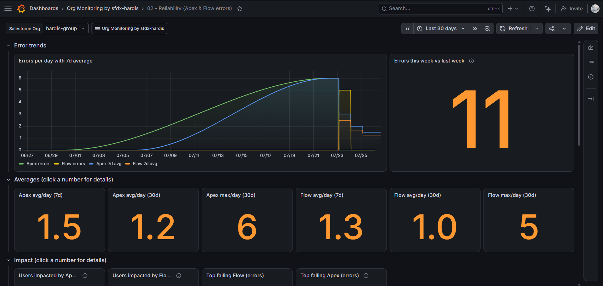

- Errors per day with 7-day average overlays, week-over-week comparison
- **Averages row**: avg/day over 7d and 30d, plus worst day (30d), for Apex and Flow errors
- **Impact**: distinct users hit by Apex/Flow errors
- **Top failing automations**: Flows, Flow steps, Apex classes ranked by error count
- Latest raw error rows (pseudonymized user identifiers)

### 03 - Limits & Capacity

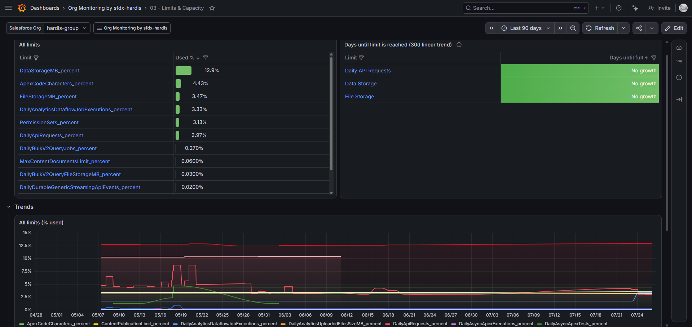

- **All limits** table with usage bars, sorted worst-first
- **Days until limit is reached**: 30-day linear regression per key limit, with "Limit exceeded" and "No growth" states
- 90-day trend for every limit percentage
- **Storage focus**: data and file storage gauges + evolution

### 04 - DevOps & DORA

- Deployment counts, success rates, average duration, validation success rate
- Deployments per week and per-deployment duration trends
- **Deployment impact**: how many components each deployment created, updated, deleted, or left untouched (a full deployment sends the whole package.xml, so the number of deployed items is the size of the project, not the size of the release)
- **DORA metrics** (deployment frequency, lead time, change failure rate, MTTR, rework rate): requires scheduling [hardis:doc:dora-report](https://sfdx-hardis.cloudity.com/hardis/doc/dora-report/)
- Recent deployments list

### 05 - Security Posture

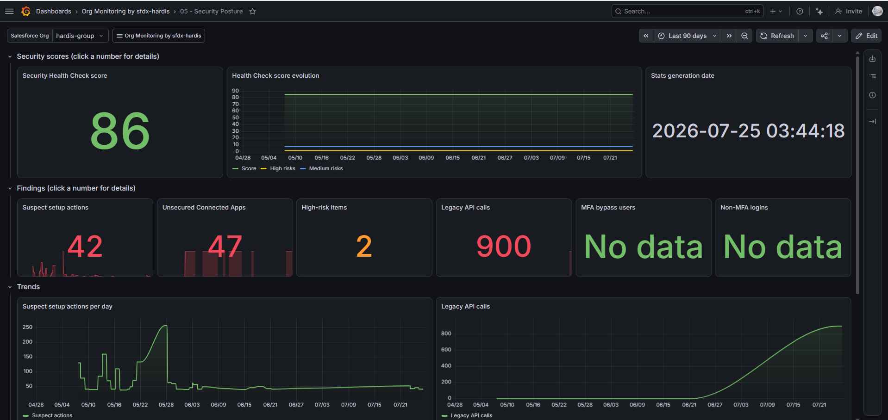

- **Security Health Check** score with evolution (score, high risks, medium risks)
- **Findings**: suspect setup actions, unsecured Connected Apps, high-risk items, legacy API calls, MFA bypass users, non-MFA logins
- Trends for suspect actions and legacy API calls
- Latest suspect audit trail entries (actor names stay readable: auditing setup actions requires knowing who did them)

### 06 - Technical Debt

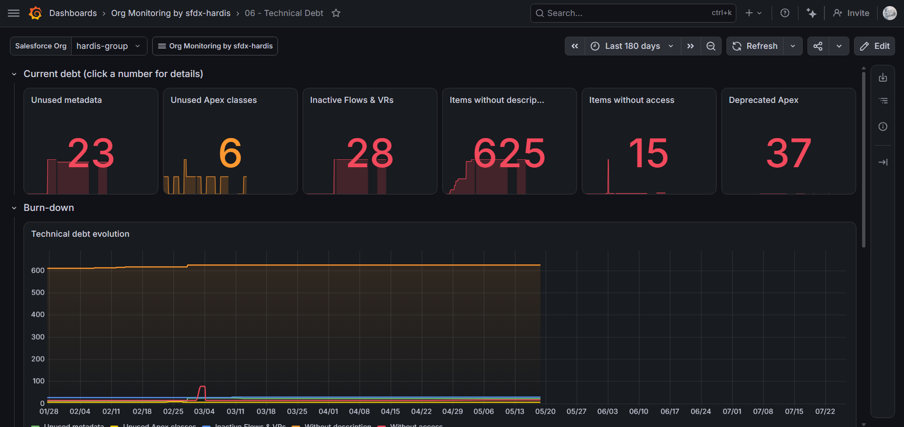

- **Debt burn-down**: unused metadata, unused Apex classes, inactive Flows & Validation Rules, missing descriptions, items without access, over 180 days
- **Apex coverage evolution** against the 75% threshold
- Permission set cleanup indicators

### 07 - Adoption & Licenses

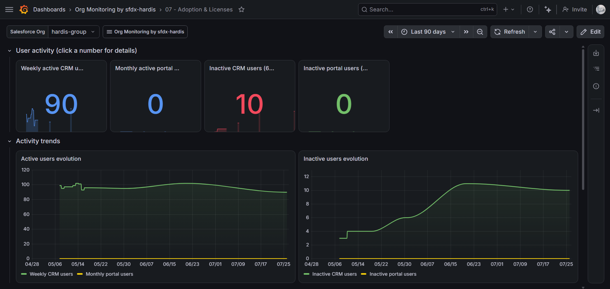

- Active CRM users (weekly) and portal users (monthly) with trends
- Inactive user counts (6 months)
- License usage table (used vs total per license)

### 08 - Usage & Cost

What Salesforce bills by consumption, as opposed to the throttling limits of **03 - Limits & Capacity**.

- **Over allowance**: entitlements whose paid allowance is already fully consumed, so overage is accruing now. This is the number to act on, ahead of any forecast
- **Worst consumption** and **entitlement consumption**: share of each purchased allowance already used in the current billing period
- **Projected consumption at period end**: where consumption is heading, from the share consumed against the share of the period elapsed. Above 100% means the allowance is on track to be exceeded
- **Cards in alert** and **highest alert**: consumption cards for which Salesforce raised a utilization alert, counted per card rather than per threshold crossed
- **Agentforce and Data 360 credits**: total, metered and unmetered credits, action counts and their evolution (requires Data 360)

See [usage-based entitlements](salesforce-monitoring-usage-entitlements.md), [consumption utilization alerts](salesforce-monitoring-consumption-alerts.md) and [Agentforce and Data 360 credits](salesforce-monitoring-ai-usage.md).

### 80 - Indicator Detail

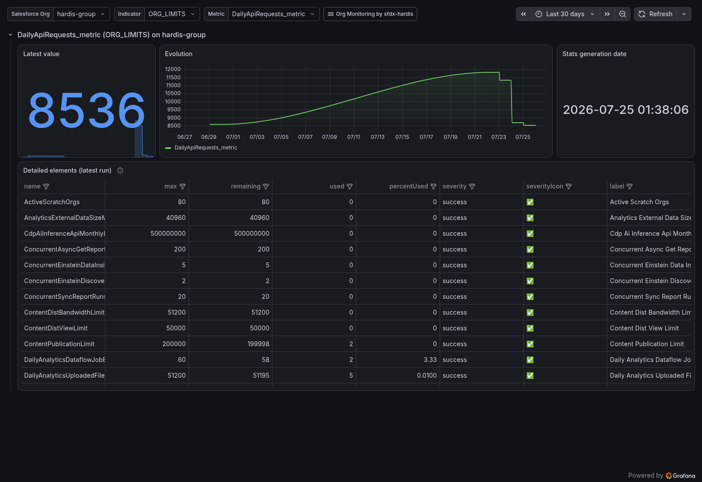

The generic drill-down: pick any org and any notification type, see the metric evolution and the detailed rows of the latest run. Every indicator lands here even when it has no dedicated panel.

### 90/91/92 - Search

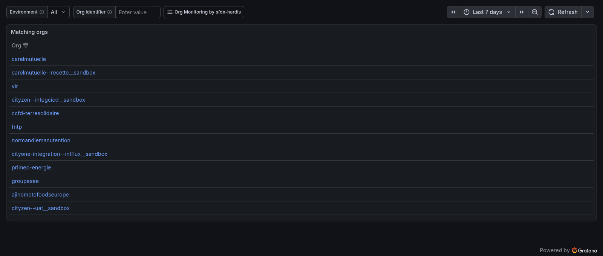

Find orgs across the fleet by identifier fragment, by held license, or by installed package. Results show what matched, not just the org list:

- **Org search**: organization name, Salesforce org id and country next to each matching org
- **License search**: the matching license names (e.g. searching `Voice` shows `Salesforce Voice User (Partner Telephony)`); clicking a row opens the org's **Adoption & Licenses** dashboard
- **Package search**: the matching package names with their installed version

Rows link to the relevant org dashboard.

## The org health score

On weekly monitoring runs, `hardis:org:monitor:all` computes a composite score (0-100) from the run's collected notifications, with no extra Salesforce API call:

| Sub-score      | Weight | Based on                                                                                                              |
|----------------|--------|-----------------------------------------------------------------------------------------------------------------------|
| Reliability    | 30     | Apex + Flow error counts                                                                                              |
| Security       | 25     | Security Health Check score, unsecured Connected Apps, suspect setup actions, legacy API calls, dangerous permissions |
| Limits         | 20     | Worst org limit usage percentage                                                                                      |
| Tests          | 15     | Apex coverage vs 75%, failing test classes                                                                            |
| Technical debt | 10     | Unused metadata/Apex, inactive automations, missing descriptions, access gaps                                         |

A sub-score is omitted (not counted as zero) when its source command did not run that week. A **failed metadata backup caps the global score at 50**: monitoring data is only trustworthy when the backup pipeline works.

Health score panels use an 8-day lookback so the weekly value displays all week.

The score travels with the `MONITORING_SUMMARY` notification, which reaches messaging/email channels only when an AI executive summary is generated (severity `info`). To receive the weekly score in Slack/Teams/email without AI, set the `MONITORING_SUMMARY` messaging threshold to `log` in your `notificationConfig`.

## Data freshness and silent orgs

`hardis:org:monitor:all` always sends a `MONITORING_SUMMARY` notification at the end of each run, which doubles as a daily heartbeat per org. The plain heartbeat has severity `log`, so it only reaches observability backends: your Slack/Teams/email channels are not spammed daily (when an AI executive summary is generated, it is sent with severity `info` and reaches them). The Fleet Overview compares recent activity (36h) against the last 7 days to list orgs whose monitoring job stopped running: a silent org means broken monitoring, not a healthy org.

The summary also carries a `ChannelsFailed` metric: notification channel failures (expired Slack token, wrong email configuration...) are logged as warnings without failing the monitoring jobs, so chart or alert on `ChannelsFailed_metric` to detect them.

## Import the alerts (optional)

The alert pack lives in [docs/grafana/alerts-v2](https://github.com/hardisgroupcom/sfdx-hardis/tree/main/docs/grafana/alerts-v2):

| Alert                                                               | Fires when                                                                                                         |
|---------------------------------------------------------------------|--------------------------------------------------------------------------------------------------------------------|
| Salesforce org limit above 90%                                      | Any limit of any org exceeds 90% usage                                                                             |
| Salesforce storage projected full within 14 days                    | Data or File storage trends toward 100% (30-day linear regression)                                                 |
| Salesforce Apex/Flow error spike                                    | Daily errors exceed twice the 7-day average                                                                        |
| Salesforce metadata backup failed                                   | A BACKUP notification with error severity was received                                                             |
| Salesforce org monitoring is silent                                 | An org sent nothing for 36 hours (its monitoring job probably failed)                                              |
| Salesforce org health score degraded                                | Score below 60, or dropped by more than 20 points                                                                  |
| Salesforce usage-based entitlement over or projected over allowance | An entitlement has already consumed its full allowance, or is on track to exceed 150% of it before the period ends |
| Salesforce consumption card near its full allowance                 | A consumption card has passed 90% of its allowance                                                                 |

All rules are **paused by default** (`isPaused: true`), so importing them triggers no evaluation and no cost on Grafana Cloud free tier.

Once imported, the rules appear in **Alerting** -> **Alert rules** (grouped under the dashboards folder), and in the **Alert rules** tab of the dashboards folder itself.

The easiest way to import them is the automated installer (the service account token then also needs alert provisioning permissions):

```sh
sf hardis:org:configure:grafana-dashboards --with-alerts
```

It substitutes the datasource placeholders with your datasource UIDs and imports every rule paused, editable from the Grafana UI.

To import manually:

1. Replace the `${DS_PROMETHEUS}` and `${DS_LOKI}` placeholders in the YAML with your datasource UIDs (found in **Connections** -> **Data sources**, in the datasource page URL)
2. Self-hosted: drop the file in your [alerting provisioning folder](https://grafana.com/docs/grafana/latest/alerting/set-up/provision-alerting-resources/file-provisioning/). Grafana Cloud: import through the [provisioning HTTP API](https://grafana.com/docs/grafana/latest/alerting/set-up/provision-alerting-resources/http-api-provisioning/) or Terraform

Then, in both cases:

1. In **Alerting** -> **Alert rules**, unpause the rules you want
2. Configure your [contact points and notification policies](https://grafana.com/docs/grafana/latest/alerting/configure-notifications/) (Slack, email, ...)

## Privacy

Dashboards only display aggregates, counts, and (for detail tables) the pseudonymized identifiers produced by [data anonymization](salesforce-security-privacy.md#data-anonymization), which is enabled by default in CI: `user_<hash>` for usernames, emails and display names, `id_<hash>` for user record Ids, `ip_<hash>` for client IPs. At the default `standard` level, setup audit trail actors stay readable on purpose (auditing setup actions requires knowing who did them); the `strict` level pseudonymizes them too.

## Troubleshooting

| Symptom                                                            | Likely cause                                                                                                                                                                                                          |
|--------------------------------------------------------------------|-----------------------------------------------------------------------------------------------------------------------------------------------------------------------------------------------------------------------|
| Everything shows "No data"                                         | `NOTIF_API_METRICS_URL` not configured (Prometheus feeds all trend/average panels), or the datasource variables resolved to the wrong datasource (see [Import the dashboards](#import-the-dashboards))                |
| Detail tables are empty but stats show values                      | `NOTIF_API_URL` (Loki) not configured, or logs skipped via `NOTIF_API_SKIP_LOGS`                                                                                                                                      |
| Health score, impacted users, or top failing Apex panels are empty | The monitoring pipeline runs an older sfdx-hardis version: these panels need recently added metrics                                                                                                                   |
| Health score panel empty on some days                              | Normal: the score is computed on weekly runs only, and panels look back 8 days                                                                                                                                        |
| DORA panels show "Schedule dora-report"                            | [hardis:doc:dora-report](https://sfdx-hardis.cloudity.com/hardis/doc/dora-report/) is not scheduled on the monitoring pipeline                                                                                        |
| Indicator Detail shows the graph and value but no detail rows      | Detail rows come from Loki logs (~30 days retention on Grafana Cloud) while metrics keep 13 months: the last run of that indicator is older than the logs retention. Fix the monitoring job so the command runs again |
| An org appears twice or values look doubled                        | Not expected in v2 (queries aggregate per org); check that two different monitoring repos are not both pushing with different `SFDX_HARDIS_MONITORING_KEY` values for the same org                                    |
| Old entries still show readable usernames                          | Anonymization only applies to new entries; older ones keep their values until logs retention expires                                                                                                                  |

## Contributing

The JSON files are generated: edit [`generator.mjs`](https://github.com/hardisgroupcom/sfdx-hardis/blob/main/docs/grafana/dashboards-v2/generator.mjs) (same folder), run `node generator.mjs`, then `npx mocha "test/grafana-dashboards-v2.test.ts"`. The test suite enforces the portability rules (no hardcoded datasource, daily-sample lookback wrappers, detail links on every number).
