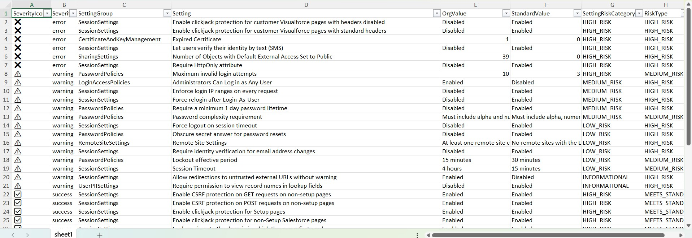
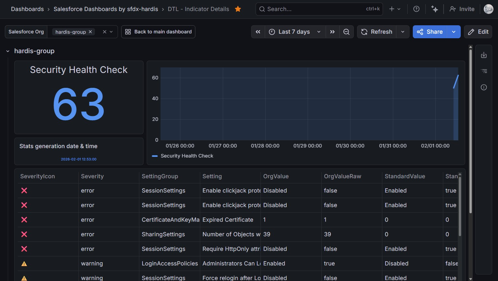

<!-- markdownlint-disable MD013 -->

## Security Health Check

Salesforce provide a [Security Health Check](https://help.salesforce.com/s/articleView?id=sf.security_health_check.htm&type=5) feature to analyze the security settings of your org, and compare them to Salesforce recommended values, or to a custom baseline.

The command reads the Salesforce Security Health Check report and summarizes how your org compares to the baseline across these areas:

- **Session security hardening** (clickjack/CSRF protections, CSP and content sniffing guards, session timeouts, domain/IP/session locking, login-as-user controls, MFA/email verification prompts).
- **Password policies** (complexity, history, length, rotation, lockout thresholds, secret-answer handling, minimum lifetime).
- **Access exposure** (default external access, guest user object permissions, admin login-as policy, lookup-name visibility restrictions).
- **External surfaces** (remote site entries, redirects to untrusted URLs, risky file types handling).
- **Certificates and keys** (expiration, key strength, expired artifacts).

> The list can be extended in the future according to Salesforce Health Check capabilities.

Sfdx-hardis command: [sf hardis:org:monitor:health-check](https://sfdx-hardis.cloudity.com/hardis/org/monitor/health-check/)

Key: **ORG_HEALTH_CHECK**

### Excel report example

### Grafana example

### Slack example

