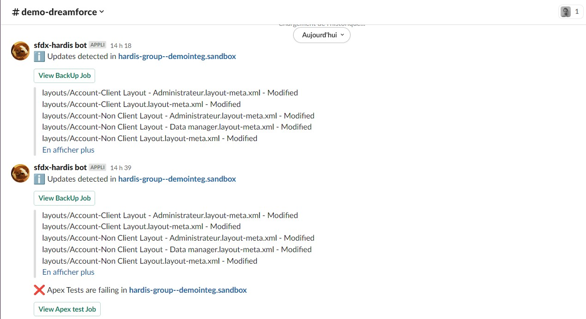
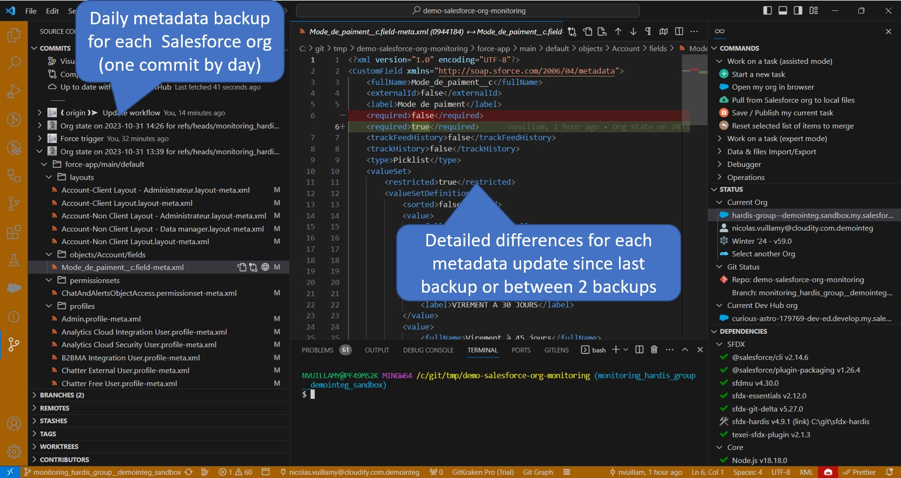

<!-- markdownlint-disable MD013 -->

- [Monitor your Salesforce org with sfdx-hardis](#monitor-your-salesforce-org-with-sfdx-hardis)
- [How does it work ?](#how-does-it-work)
- [Configuration](#configuration)

_sfdx-hardis monitoring is in beta but can already be safely used_

## Monitor your Salesforce org with sfdx-hardis

> This feature worked yesterday in production, but today it crashes, what happened ?

Salesforce provide **Audit Trail** to trace configuration updates in **production** or **sandbox** orgs.

You can **know who updated what**, but not with details (before / after).

Sfdx-hardis monitoring provides a **simple way to know the exact state of your orgs metadatas everyday**, or even several times a day, and provides an **exact and detailed comparison with the previous metadata configuration** (using git commits comparison)

Installation and usage are **admin-friendly**, and **notifications** can be sent via **Slack** or **Microsoft Teams**.

Extra features are also available, like:

- Run **apex tests** (and soon flow tests)
- Analyze the **quality and the security of your metadatas** with [MegaLinter](https://megalinter.io/latest/)
- Check if you have [**deprecated api versions called**](https://nicolas.vuillamy.fr/handle-salesforce-api-versions-deprecation-like-a-pro-335065f52238)
- **Custom command lines** that you can [define in `.sfdx-hardis.yml`](https://sfdx-hardis.cloudity.com/hardis/org/monitor/all/)

You don't need to work in CI/CD to use Monitoring, it is **compliant with any API enabled org** :)

## How does it work ?

Every night (or even more frequently, according to your schedule), a CI job will be triggered.

It will **extract all the metadatas of your org**, then push a **new commit in the monitoring repository** in case there are updates since the latest metadata backup.

The **list of updated metadatas** will be sent via notification to a **Slack and/or Microsoft Teams channel**.

After the metadata backup, other jobs will be triggered (Apex tests, Code Quality, Legacy API checks + your own commands), and their results will be stored in job artifacts and sent via notifications.

## Configuration

All you need to configure sfdx-hardis Org Monitoring is a **GitHub** , **Gitlab**, **Azure** or **BitBucket** repository.

- Create and clone a git repository
- Open it with Visual Studio Code, then open [VsCode SFDX Hardis](https://marketplace.visualstudio.com/items?itemName=NicolasVuillamy.vscode-sfdx-hardis) extension menu.
  - If you need installations instructions, please [visit documentation page](salesforce-ci-cd-use-install.md)

- Follow instructions, that can be specific according to your git provider

  - [GitHub](salesforce-monitoring-config-github.md)
    - [Pre-requisites](salesforce-monitoring-config-github.md#pre-requisites)
    - [Schedule monitoring job](salesforce-monitoring-config-github.md#schedule-the-monitoring-job)

  - [Gitlab](salesforce-monitoring-config-gitlab.md)
    - [Pre-requisites](salesforce-monitoring-config-gitlab.md#pre-requisites)
    - [Schedule monitoring job](salesforce-monitoring-config-gitlab.md#schedule-the-monitoring-job)

  - [Azure](salesforce-monitoring-config-azure.md)
    - [Pre-requisites](salesforce-monitoring-config-azure.md#pre-requisites)
    - [Schedule monitoring job](salesforce-monitoring-config-azure.md#schedule-the-monitoring-job)

  - [Bitbucket](salesforce-monitoring-config-bitbucket.md)
    - [Pre-requisites](salesforce-monitoring-config-bitbucket.md#pre-requisites)
    - [Schedule monitoring job](salesforce-monitoring-config-bitbucket.md#schedule-the-monitoring-job)

> You might want to customize which metadatas are backuped.
> In that case, you must manually update file `manifest/package-skip-items.xml` in each git branch corresponding to an org, then commit and push.

- Configure notifications (once by repository)
  - [Slack instructions](salesforce-ci-cd-setup-integration-slack.md)
  - [Microsoft Teams instructions](salesforce-ci-cd-setup-integration-ms-teams.md)
