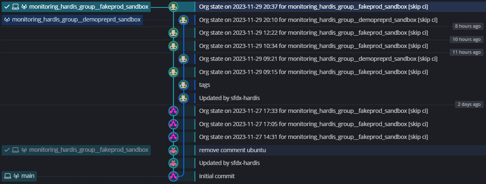
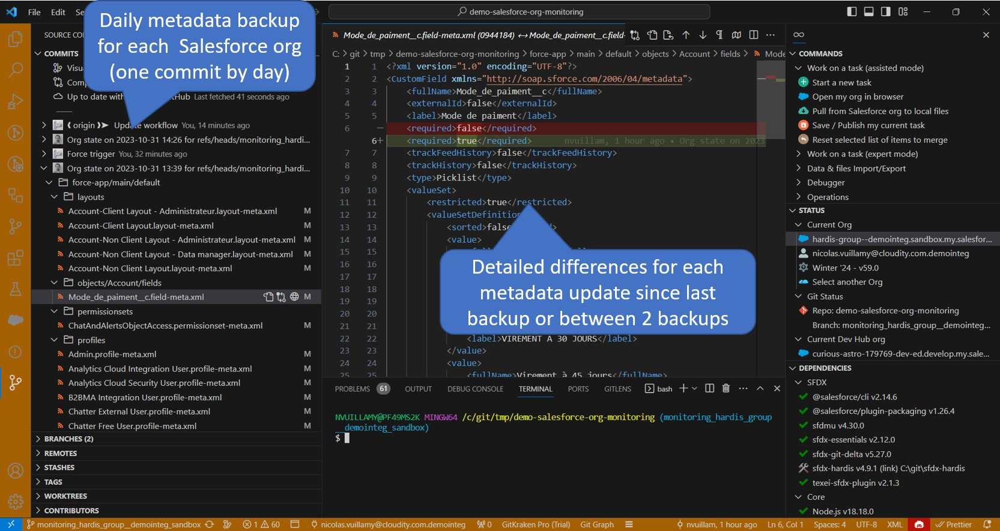
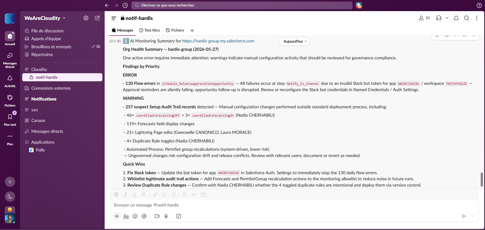
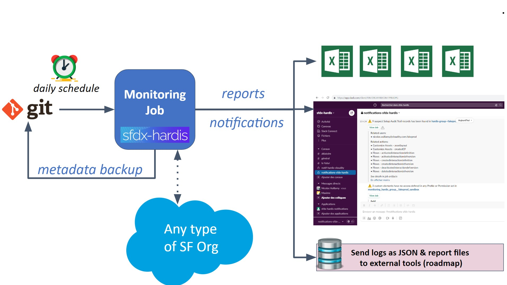
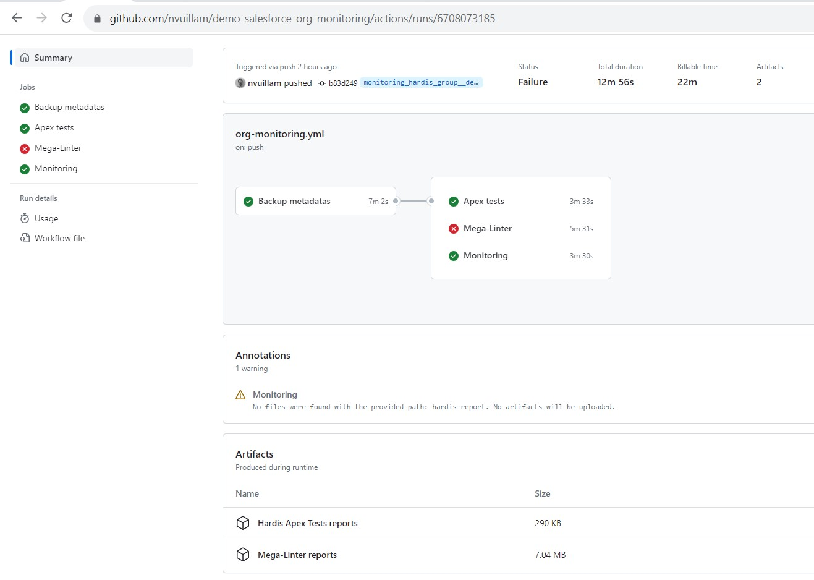

<!-- markdownlint-disable MD013 -->

## Salesforce Org Monitoring

Keep a **daily, version-tracked backup** of all the metadata in your Salesforce orgs, with **before/after diffs**, **quality and security checks**, and **notifications** routed where your team actually reads them.

> "This feature worked yesterday in production, but today it crashes. What happened?"
> Sfdx-hardis Monitoring answers that question in seconds.

---

## Why monitor your orgs?

- **See exactly what changed**: Salesforce Audit Trail tells you who updated what, but not the before/after. A git-based metadata backup gives you the full picture.
- **Catch problems early**: failing Apex tests, security issues, deprecated API calls, org limits, overdue Release Updates are all surfaced automatically.
- **Stay admin-friendly**: works on any API-enabled org. No CI/CD project required.
- **Route the right signal to the right channel**: stream everything to Grafana while keeping Slack and Teams reserved for warnings and errors only.

---

## What gets monitored

**Configuration changes**

- Daily metadata backup with full git history
- Detection of suspect setup actions in Audit Trail
- Visual diff of every change between two backups

**Quality and security**

- Apex tests (and soon Flow tests)
- Code quality and security analysis with [MegaLinter](https://megalinter.io/latest/)
- Salesforce Security Health Check
- Unsecured Connected Apps

**Org health**

- Org limits and Apex flex queue backlog
- Apex and Flow runtime errors
- Calls to [deprecated API versions](https://nicolas.vuillamy.fr/handle-salesforce-api-versions-deprecation-like-a-pro-335065f52238)
- Metadata deployments and validations
- Next major Salesforce upgrade date and incoming Release Updates

**Users and licenses**

- License usage and unused permission set licenses
- Active users without recent logins
- Underused or minimal permission sets

**Unused metadata**

- Custom labels, custom permissions, Apex classes, Connected Apps, inactive metadata
- Missing descriptions on custom fields
- Custom elements with no access rights in any permission set

**Custom checks**

- Your own [custom command lines](https://sfdx-hardis.cloudity.com/hardis/org/monitor/all/) defined in `.sfdx-hardis.yml`

---

## A look inside

Browse the **monitoring git repository** to see every metadata change, commit by commit.

Inspect diffs with **GitLens** to see exactly what was added, removed, or modified.

Track trends across all your orgs with the **[Org Monitoring by sfdx-hardis Grafana dashboards](salesforce-monitoring-grafana-v2.md)**: fleet overview, averages, limit forecasts, org health score, and a ready-to-enable alert pack.

Get **Slack** or **Teams** notifications when something needs attention.

---

## How it works

Every night (or on your own schedule), a CI job extracts all metadata from the org and pushes a new commit to the monitoring repository whenever something changed.

Additional jobs then run on top of the backup: Apex tests, code quality, legacy API checks, plus any custom command you define. Results are stored as job artifacts and forwarded to your notification channels.

---

## Route notifications anywhere

Each notification type (audit trail, org limits, Apex tests, ...) can be configured **per channel** with its own severity threshold. Configure it from the [VS Code SFDX Hardis extension](https://marketplace.visualstudio.com/items?itemName=NicolasVuillamy.vscode-sfdx-hardis) or directly in `.sfdx-hardis.yml`.

- **Messaging channels**: [Slack](salesforce-ci-cd-setup-integration-slack.md) and [Microsoft Teams](salesforce-ci-cd-setup-integration-ms-teams.md)
- **Email**: [any recipient list](salesforce-ci-cd-setup-integration-email.md), with per-notification-type overrides
- **API / Grafana / Prometheus**: [external endpoints](salesforce-ci-cd-setup-integration-api.md) for dashboards (e.g. Grafana Loki, Prometheus)

**Personal data stays private**: when monitoring runs in CI, usernames, emails, user Ids and client IPs are replaced by stable pseudonyms in generated reports and in every notification channel, so dashboards and shared files carry no readable end-user identity. Levels and overrides are described in [Security & Privacy](salesforce-security-privacy.md#data-anonymization).

---

## Customize the cadence

Most checks run daily; less critical ones run weekly (Saturday by default) to avoid overflowing your channels.

Every command is configurable in `.sfdx-hardis.yml` via the `monitoringCommands` property. Supported frequencies: `daily`, `weekly`, `biweekly`, `monthly`, `off`. Pick the day with `frequencyDay` (`monday`..`sunday`) or `frequencyDayOfMonth` (`1`..`31`). Pass `--force-all` to `hardis:org:monitor:all` (or set `MONITORING_IGNORE_FREQUENCY=true`) to run everything regardless of cadence.

See [Monitoring configuration](salesforce-monitoring-config-home.md#monitoring-commands) for full examples.

---

## All monitoring commands

| Check                                                                                                                       | Frequency |
|-----------------------------------------------------------------------------------------------------------------------------|-----------|
| [Metadata Backup](salesforce-monitoring-metadata-backup.md)                                                                 | Daily     |
| [Detect suspect setup actions in major org](salesforce-monitoring-suspect-audit-trail.md)                                   | Daily     |
| [Apex tests](salesforce-monitoring-apex-tests.md)                                                                           | Daily     |
| [Quality Checks with MegaLinter](salesforce-monitoring-quality-checks.md)                                                   | Daily     |
| [Detect calls to deprecated API versions](salesforce-monitoring-deprecated-api-calls.md)                                    | Daily     |
| [Detect limits issues](salesforce-monitoring-org-limits.md)                                                                 | Daily     |
| [Detect Apex flex queue backlog](salesforce-monitoring-apex-flex-queue.md)                                                  | Daily     |
| [Detect Apex and Flow errors](salesforce-monitoring-apex-flow-errors.md)                                                    | Daily     |
| [Detect unsecured Connected Apps in an org](salesforce-monitoring-unsecured-connected-apps.md)                              | Daily     |
| [Analyze metadata deployments and validations](salesforce-monitoring-deployments.md)                                        | Daily     |
| [Detect usage-based entitlements consumed too fast](salesforce-monitoring-usage-entitlements.md)                            | Daily     |
| [Collect the consumption utilization alerts Salesforce raises](salesforce-monitoring-consumption-alerts.md)                 | Daily     |
| [Agent tests](salesforce-monitoring-agent-tests.md)                                                                         | Weekly    |
| [Track Agentforce and Data 360 credit usage](salesforce-monitoring-ai-usage.md)                                             | Weekly    |
| [Audit Multi-Factor Authentication (MFA) configuration](salesforce-monitoring-mfa.md)                                       | Weekly    |
| [Extract licenses information](salesforce-monitoring-licenses-overview.md)                                                  | Weekly    |
| [Detect custom elements with no access rights defined in permission sets](salesforce-monitoring-missing-access.md)          | Weekly    |
| [Detect permission set licenses that are assigned to users that do not need them](salesforce-monitoring-unused-licenses.md) | Weekly    |
| [Detect active users without recent logins (All licenses, 6 months)](salesforce-monitoring-inactive-users.md)               | Weekly    |
| [Detect active users without recent logins (CRM, 6 months)](salesforce-monitoring-inactive-users.md)                        | Weekly    |
| [Detect active users without recent logins (Experience, 6 months)](salesforce-monitoring-inactive-users.md)                 | Weekly    |
| [Detect active users with recent logins (CRM, 1 week)](salesforce-monitoring-inactive-users.md)                             | Weekly    |
| [Detect active users with recent logins (Experience, 1 month)](salesforce-monitoring-inactive-users.md)                     | Weekly    |
| [Get org info + SF instance info + next major upgrade date](salesforce-monitoring-org-instance-upgrade.md)                  | Weekly    |
| [Gather warnings about incoming and overdue Release Updates](salesforce-monitoring-release-updates.md)                      | Weekly    |
| [Run Salesforce Security Health Check](salesforce-monitoring-health-check.md)                                               | Weekly    |
| [Detect custom labels and custom permissions that are not in use](salesforce-monitoring-unused-metadata.md)                 | Weekly    |
| [Detect unused Apex classes in an org](salesforce-monitoring-unused-apex-classes.md)                                        | Weekly    |
| [Detect unused Connected Apps in an org](salesforce-monitoring-unused-connected-apps.md)                                    | Weekly    |
| [Detect inactive metadata](salesforce-monitoring-inactive-metadata.md)                                                      | Weekly    |
| [Detect missing description on custom field](salesforce-monitoring-missing-metadata-attributes.md)                          | Weekly    |
| [Detect underused permission sets](salesforce-monitoring-underused-permsets.md)                                             | Weekly    |
| [Detect Apex classes and triggers with deprecated API version](salesforce-monitoring-apex-api-version.md)                   | Weekly    |
| [Detect permission sets with minimal permissions](salesforce-monitoring-minimal-permsets.md)                                | Weekly    |

---

## Next steps

- [**Configure monitoring on your orgs**](salesforce-monitoring-config-home.md): step-by-step setup guide.
- [**Pair it with project documentation**](salesforce-project-documentation.md): regenerate docs automatically on every backup.
- [**Watch the Dreamforce 24 talk**](https://reg.salesforce.com/flow/plus/df24/sessioncatalog/page/catalog/session/1718915808069001Q7HH): live demo from San Francisco.

---

## Dreamforce 24 presentation

<iframe width="560" height="315" src="https://www.youtube.com/embed/NxiLiYeo11A" title="YouTube video player" frameborder="0" allow="accelerometer; autoplay; clipboard-write; encrypted-media; gyroscope; picture-in-picture" allowfullscreen></iframe>

_Prefer reading? Here are the slides:_

<iframe src="https://www.slideshare.net/slideshow/embed_code/key/jxxBlqw7iup8Gh?hostedIn=slideshare&page=upload" width="476" height="400" frameborder="0" marginwidth="0" marginheight="0" scrolling="no"></iframe>

