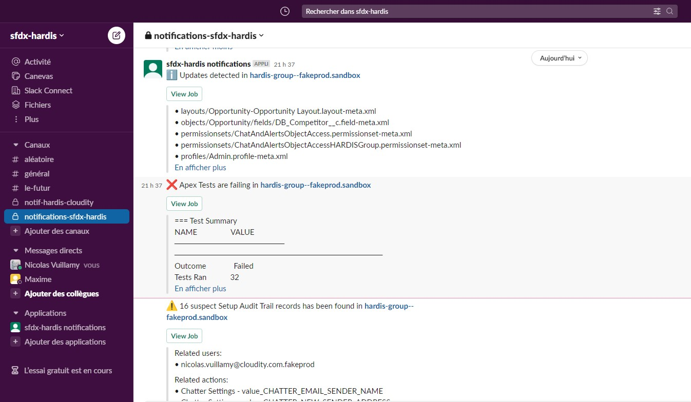

<!-- markdownlint-disable MD013 -->

- [Monitor your Salesforce org with sfdx-hardis](#monitor-your-salesforce-org-with-sfdx-hardis)
- [How does it work ?](#how-does-it-work--)
- [Monitoring Commands](#monitoring-commands)
  - [Detect suspect setup actions in major org](#detect-suspect-setup-actions-in-major-org)
  - [Detect calls to deprecated API versions](#detect-calls-to-deprecated-api-versions)
  - [Detect custom elements with no access rights defined in permission sets](#detect-custom-elements-with-no-access-rights-defined-in-permission-sets)
  - [Detect custom labels and custom permissions that are not in use](#detect-custom-labels-and-custom-permissions-that-are-not-in-use)
  - [Detect inactive metadata](#detect-inactive-metadata)
  - [Detect missing attributes](#detect-missing-attributes)

## Monitor your Salesforce org with sfdx-hardis

> This feature worked yesterday in production, but today it crashes, what happened ?

Salesforce provide **Audit Trail** to trace configuration updates in **production** or **sandbox** orgs.

You can **know who updated what**, but not with details (before / after).

Sfdx-hardis monitoring provides a **simple way to know the exact state of your orgs metadatas everyday**, or even several times a day, and provides an **exact and detailed comparison with the previous metadata configuration** (using git commits comparison)

Installation and usage are **admin-friendly**, and **notifications** can be sent via **Slack** or **Microsoft Teams**.

_Example notifications with Slack_



Extra features are also available, like:

- Run **apex tests** (and soon flow tests)
- Analyze the **quality and the security of your metadatas** with [MegaLinter](https://megalinter.io/latest/)
- Check if you have [**deprecated api versions called**](https://nicolas.vuillamy.fr/handle-salesforce-api-versions-deprecation-like-a-pro-335065f52238)
- **Custom command lines** that you can [define in `.sfdx-hardis.yml`](https://sfdx-hardis.cloudity.com/hardis/org/monitor/all/)

You don't need to work in CI/CD to use Monitoring, it is **compliant with any API enabled org** :)

_Example workflow with GitHub actions_


_Example diff visualization with GitLens_


## How does it work ?

Every night (or even more frequently, according to your schedule), a CI job will be triggered.

It will **extract all the metadatas of your org**, then push a **new commit in the monitoring repository** in case there are updates since the latest metadata backup.

The **list of updated metadatas** will be sent via notification to a **Slack and/or Microsoft Teams channel**.

After the metadata backup, other jobs will be triggered (Apex tests, Code Quality, Legacy API checks + your own commands), and their results will be stored in job artifacts and sent via notifications.

Are you ready ? [Configure the monitoring on your orgs](salesforce-monitoring-config-home.md) !

## Monitoring Commands

Latest step of monitoring runs the following checks.

You can disable some of them by defining either a **monitoringDisable** property in `.sfdx-hardis.yml`, or a comma separated list in env variable **MONITORING_DISABLE**

Example in .sfdx-hardis.yml:

```yaml
monitoringDisable:
  - METADATA_STATUS
  - UNUSED_METADATAS
```

Example in env var:

```sh
MONITORING_DISABLE=METADATA_STATUS,UNUSED_METADATAS
```

### Detect suspect setup actions in major org

Sfdx-hardis command: [sfdx hardis:org:diagnose:audittrail](https://sfdx-hardis.cloudity.com/hardis/org/diagnose/audittrail/)

Key: **AUDIT_TRAIL**

### Detect calls to deprecated API versions

Sfdx-hardis command: [sfdx hardis:org:diagnose:legacyapi](https://sfdx-hardis.cloudity.com/hardis/org/diagnose/legacyapi/)

Key: **LEGACY_API**

### Detect custom elements with no access rights defined in permission sets

Sfdx-hardis command: [sfdx hardis:lint:access](https://sfdx-hardis.cloudity.com/hardis/lint/access/)

Key: **LINT_ACCESS**

### Detect custom labels and custom permissions that are not in use

Sfdx-hardis command: [sfdx hardis:lint:unusedmetadatas](https://sfdx-hardis.cloudity.com/hardis/lint/unusedmetadatas/)

Key: **UNUSED_METADATAS**

### Detect inactive metadata

Sfdx-hardis command: [sfdx hardis:lint:metadatastatus](https://sfdx-hardis.cloudity.com/hardis/lint/metadatastatus/)

Key: **METADATA_STATUS**

### Detect missing attributes

Sfdx-hardis command: [sfdx hardis:lint:missingattributes](https://sfdx-hardis.cloudity.com/hardis/lint/missingattributes/)

Key: **MISSING_ATTRIBUTES**
