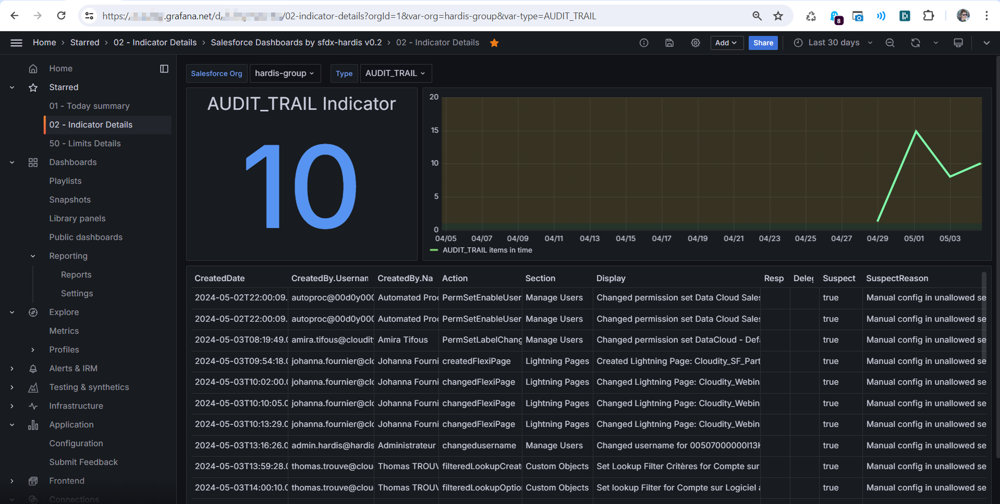
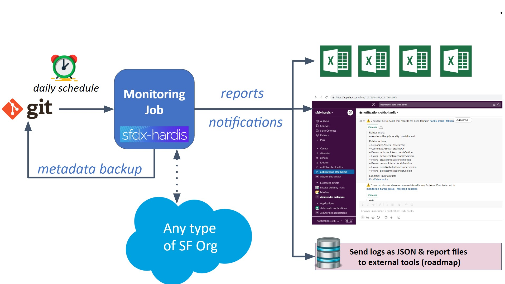

<!-- markdownlint-disable MD013 -->

- [Monitor your Salesforce org with sfdx-hardis](#monitor-your-salesforce-org-with-sfdx-hardis)
- [How does it work ?](#how-does-it-work--)
- [All Monitoring Commands](#all-monitoring-commands)

## Monitor your Salesforce org with sfdx-hardis

> This feature worked yesterday in production, but today it crashes, what happened ?

Salesforce provide **Audit Trail** to trace configuration updates in **production** or **sandbox** orgs.

You can **know who updated what**, but not with details (before / after).

Sfdx-hardis monitoring provides a **simple way to know the exact state of your orgs metadatas everyday**, or even several times a day, and provides an **exact and detailed comparison with the previous metadata configuration** (using git commits comparison)

Installation and usage are **admin-friendly**, and **notifications** can be sent via **Slack** or **Microsoft Teams**.

_Example of a monitoring git repository_

_Example notifications with Slack_

_Example of visualization in Grafana_

_See presentation at Wir Sind Ohana conference in Berlin, may 2024_

<iframe width="560" height="315" src="https://www.youtube.com/embed/xGbT6at7RZ0" title="YouTube video player" frameborder="0" allow="accelerometer; autoplay; clipboard-write; encrypted-media; gyroscope; picture-in-picture" allowfullscreen></iframe>

Extra features are also available, like:

- Run **apex tests** (and soon flow tests)
- Analyze the **quality and the security of your metadatas** with [MegaLinter](https://megalinter.io/latest/)
- Check if you have [**deprecated api versions called**](https://nicolas.vuillamy.fr/handle-salesforce-api-versions-deprecation-like-a-pro-335065f52238)
- **Custom command lines** that you can [define in `.sfdx-hardis.yml`](https://sfdx-hardis.cloudity.com/hardis/org/monitor/all/)

You don't need to work in CI/CD to use Monitoring, it is **compliant with any API enabled org** :)

## How does it work ?

Every night (or even more frequently, according to your schedule), a CI job will be triggered.

It will **extract all the metadatas of your org**, then push a **new commit in the monitoring repository** in case there are updates since the latest metadata backup.

_Example workflow with GitHub actions_

_Example diff visualization with GitLens_

The **list of updated metadatas** will be sent via notification to a **Slack and/or Microsoft Teams channel**.

After the metadata backup, other jobs will be triggered (Apex tests, Code Quality, Legacy API checks + your own commands), and their results will be stored in job artifacts and sent via notifications.

Are you ready ? [Configure the monitoring on your orgs](salesforce-monitoring-config-home.md) !

## All Monitoring Commands

The following checks are active out of the box.

In order to avoid to overflow channels of notifications, some commands are run everyday whereas less critical ones are run weekly (on saturday).

You can force the daily run of all commands by defining env var `MONITORING_IGNORE_FREQUENCY=true`.

- [Metadata Backup](#metadata-backup)
- [Apex tests](#apex-tests)
- [Quality Checks with MegaLinter](#quality-checks-with-megalinter)
- [Detect suspect setup actions in major org](#detect-suspect-setup-actions-in-major-org)
- [Detect limits issues]()
- [Detect calls to deprecated API versions](#detect-calls-to-deprecated-api-versions)
- [Detect custom elements with no access rights defined in permission sets](#detect-custom-elements-with-no-access-rights-defined-in-permission-sets)
- [Detect unused licenses](#detect-unused-licenses)
- [Detect custom labels and custom permissions that are not in use](#detect-custom-labels-and-custom-permissions-that-are-not-in-use)
- [Detect inactive metadata](#detect-inactive-metadata)
- [Detect missing attributes](#detect-missing-attributes)

