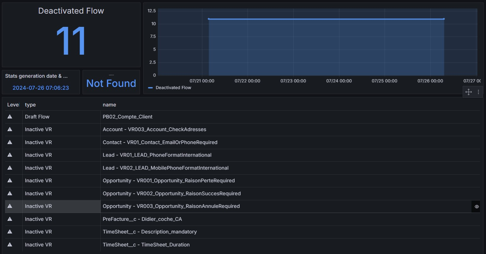

<!-- markdownlint-disable MD013 -->

## Detect inactive metadata

Are you sure this **inactive flow** should be inactive ?

And what about this **deactivated Validation** Rule ?

Maybe it's time to remove them !

Sfdx-hardis command: [sfdx hardis:lint:metadatastatus](https://sfdx-hardis.cloudity.com/hardis/lint/metadatastatus/)

Key: **METADATA_STATUS**

### Grafana example

### Slack example

