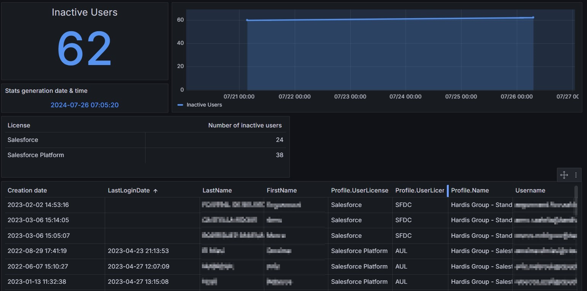
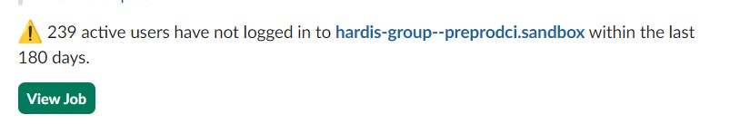

<!-- markdownlint-disable MD013 -->

## Detect inactive users

Detect if you are paying licenses for users that did not login for more than 6 months !

Sfdx-hardis command: [sf hardis:org:diagnose:unusedusers](https://sfdx-hardis.cloudity.com/hardis/org/diagnose/unusedusers/)

Key: **UNUSED_USERS**

### Grafana example

### Slack example

