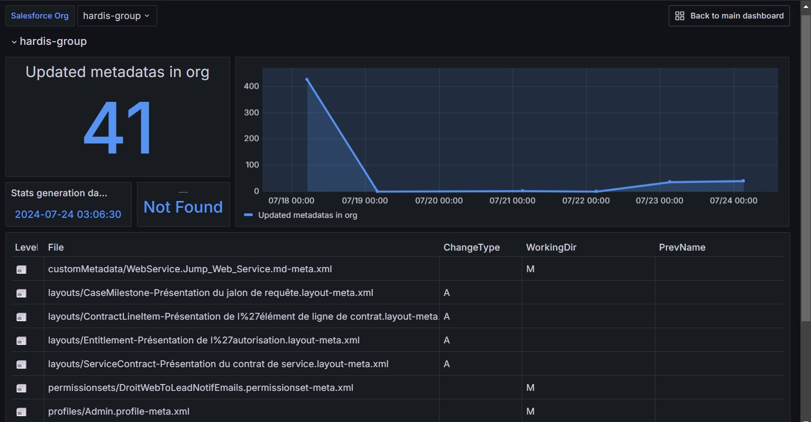
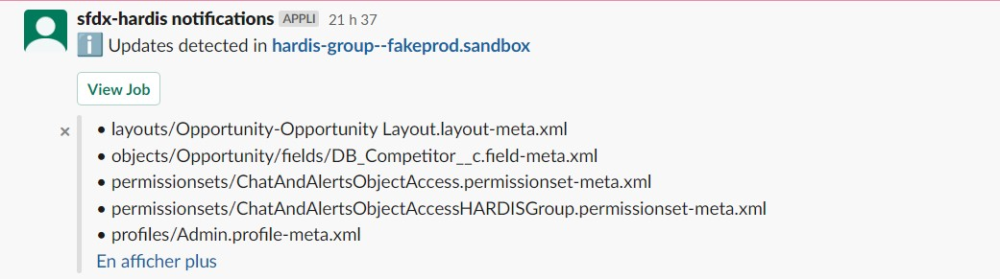

<!-- markdownlint-disable MD013 -->

## Metadata Backup

Adds a new commit to the git branch with the changes made since the latest monitoring run.

Sfdx-hardis command: [sf hardis:org:monitor:backup](https://sfdx-hardis.cloudity.com/hardis/org/monitor/backup/)

### Grafana example

### Slack example

