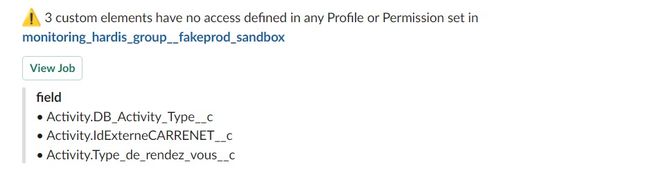

<!-- markdownlint-disable MD013 -->

## Detect custom elements with no access rights defined in permission sets

If there are elements that nobody has access to (not existing on any Profile or Permission Set), maybe they should be removed !

Sfdx-hardis command: [sfdx hardis:lint:access](https://sfdx-hardis.cloudity.com/hardis/lint/access/)

Key: **LINT_ACCESS**

### Grafana example

### Slack example

