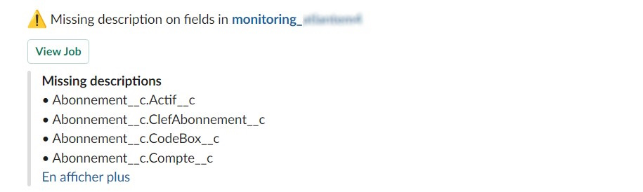

<!-- markdownlint-disable MD013 -->

## Detect missing attributes

Follow best practices by documenting your data model !

Sfdx-hardis command: [sf hardis:lint:missingattributes](https://sfdx-hardis.cloudity.com/hardis/lint/missingattributes/)

Key: **MISSING_ATTRIBUTES**

### Grafana example

### Slack example

