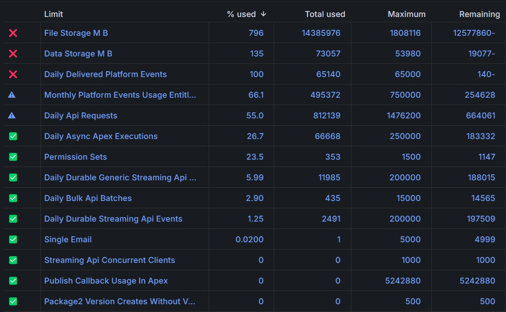
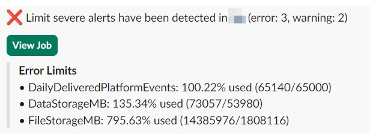

<!-- markdownlint-disable MD013 -->

## Detect org limits issues

There are many limits on a Salesforce org:

- Data storage
- File storage
- Daily API Calls
- Daily Bulk API Calls
- Daily Platform events
- and about 40 others !

This feature controls that they are not reached, and will send notifications:

- Info: > 50%
- Warning > 75%
- Error > 100%

Sfdx-hardis command: [sfdx hardis:org:monitor:limits](https://sfdx-hardis.cloudity.com/hardis/org/monitor/limits/)

Key: **ORG_LIMITS**

### Grafana example

### Slack example

