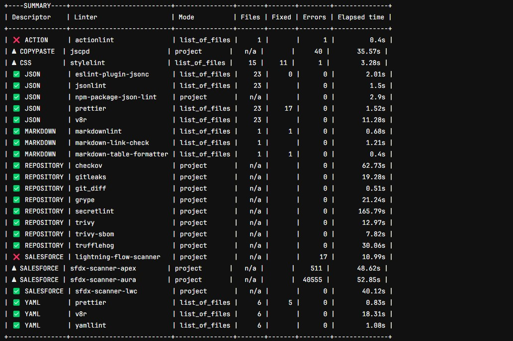

<!-- markdownlint-disable MD013 -->

## Quality Checks with MegaLinter

Checks whether best practices are applied for:

- Apex with PMD
- LWC & Aura with ESLint
- Flows with Lightning Flow Scanner
- Security with checkov, gitleaks, secretlint, trivy...

Full list in [MegaLinter Documentation](https://megalinter.io/latest/flavors/salesforce/)

