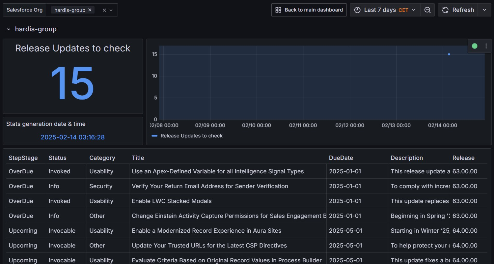
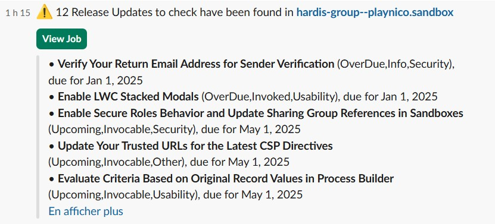

<!-- markdownlint-disable MD013 -->

## Check Release Updates

Before publishing **Breaking Changes** ❌, Salesforce announce them in the setup menu [**Release Updates**](https://help.salesforce.com/s/articleView?id=sf.release_updates.htm&type=5)

⚠️ Some of them are very important, because if you don't make the related upgrades in time (ex: before Winter 25) , your production org can crash !

This command will extract the Release Updates that needs to be checked in your org !

Sfdx-hardis command: [sf hardis:org:diagnose:releaseupdates](https://sfdx-hardis.cloudity.com/hardis/org/diagnose/releaseupdates/)

Key: **RELEASE_UPDATES***

### Grafana example

### Slack example

