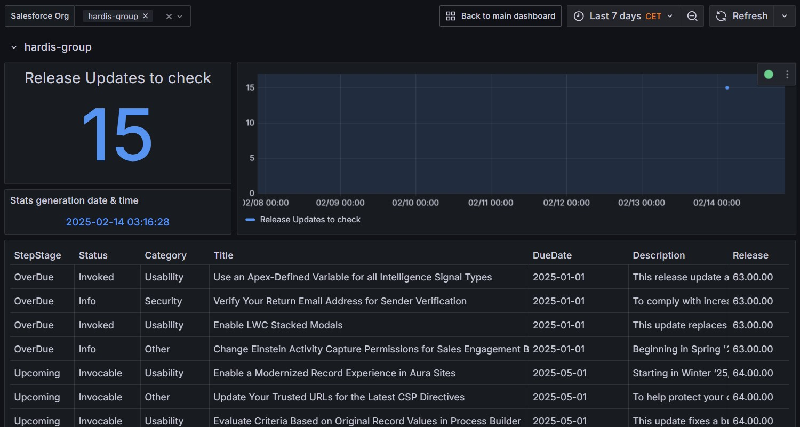
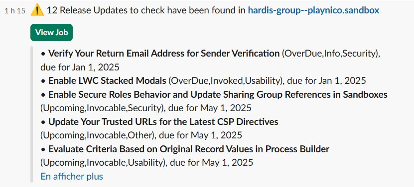

<!-- markdownlint-disable MD013 -->

## Check Release Updates

Before publishing **breaking changes**, Salesforce announces them in the Setup menu [**Release Updates**](https://help.salesforce.com/s/articleView?id=sf.release_updates.htm&type=5).

⚠️ Some of them are very important: if you do not make the related changes in time (for example before Winter '25), your production org can crash.

This command extracts the Release Updates that need to be checked in your org.

Sfdx-hardis command: [sf hardis:org:diagnose:releaseupdates](https://sfdx-hardis.cloudity.com/hardis/org/diagnose/releaseupdates/)

Key: **RELEASE_UPDATES**

### Grafana example

### Slack example

