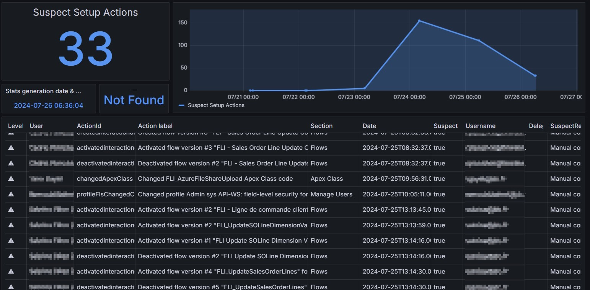
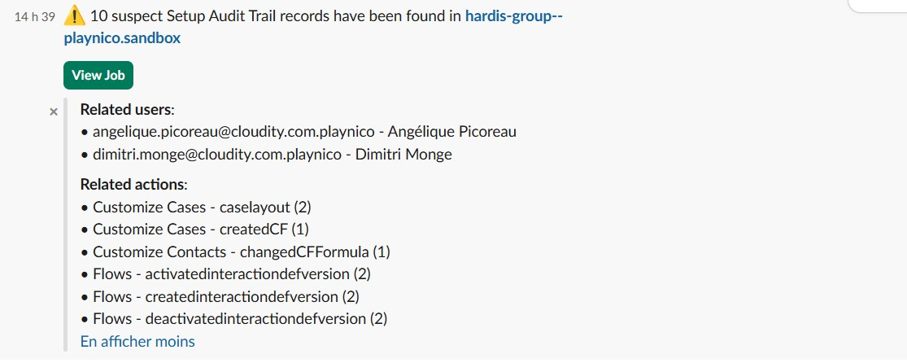

<!-- markdownlint-disable MD013 -->

## Detect suspect setup actions in major org

Will extract from audit trail all actions that are considered as suspect, excepted the ones related to the deployment user and a given list of users, like the release manager.

Sfdx-hardis command: [sfdx hardis:org:diagnose:audittrail](https://sfdx-hardis.cloudity.com/hardis/org/diagnose/audittrail/)

Key: **AUDIT_TRAIL**

### Grafana example

### Slack example

