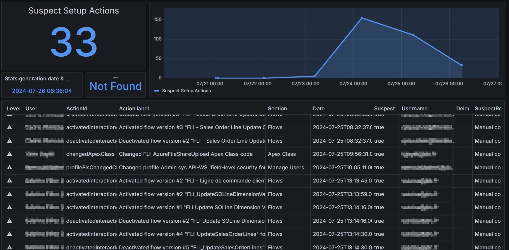
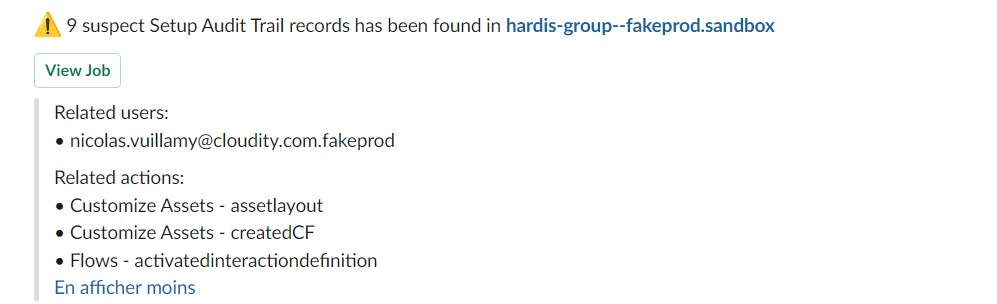
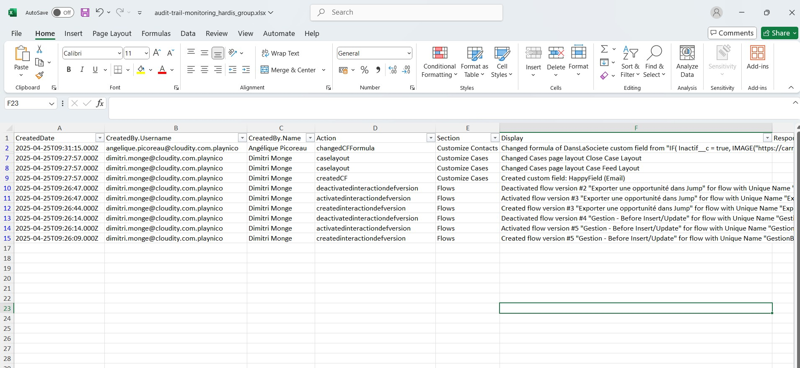
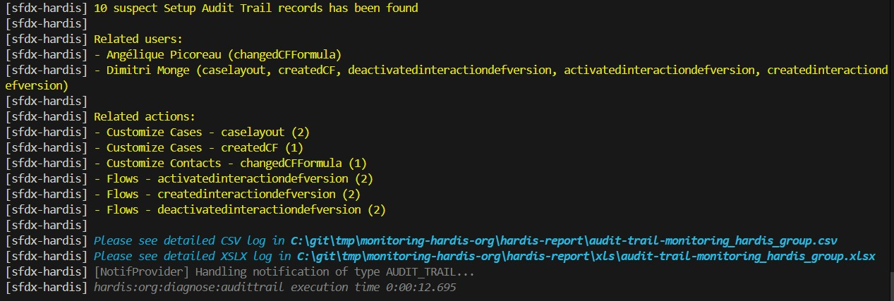

<!-- markdownlint-disable MD013 -->

## Detect suspect setup actions in major org

Extracts from the Audit Trail all actions that are considered suspect, except the ones related to the deployment user and to a given list of users, such as the release manager.

Sfdx-hardis command: [sf hardis:org:diagnose:audittrail](https://sfdx-hardis.cloudity.com/hardis/org/diagnose/audittrail/)

Key: **AUDIT_TRAIL**

### Grafana example

### Slack example

## Excel output example

## Local output example

