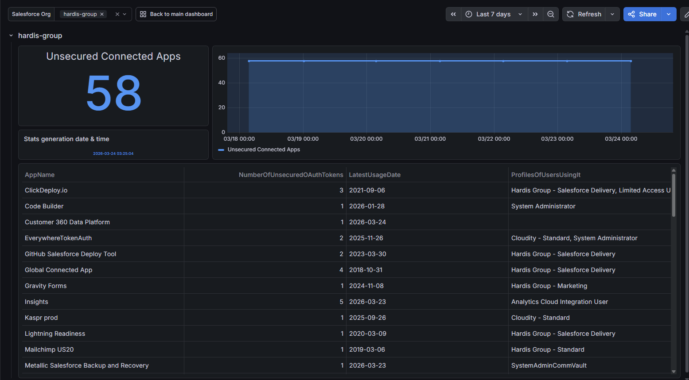
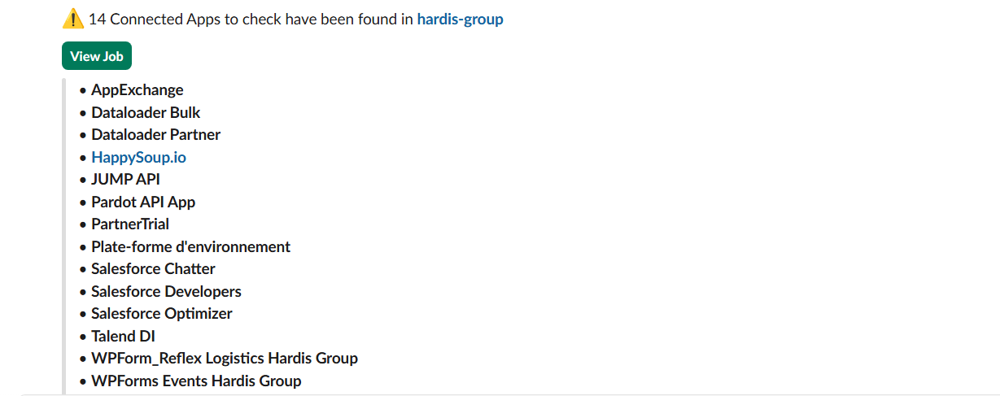
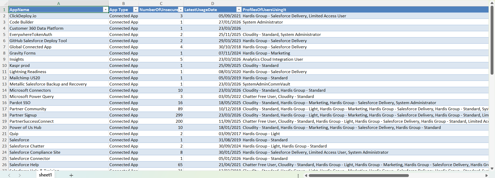

<!-- markdownlint-disable MD013 -->

## Detect unsecured Connected Apps

Connected Apps with weak security settings can expose your org to unnecessary risks.

This check identifies Connected Apps and External Client Apps that should be reviewed and hardened.

Sfdx-hardis command: [sf hardis:org:diagnose:unsecure-connected-apps](https://sfdx-hardis.cloudity.com/hardis/org/diagnose/unsecure-connected-apps/)

Key: **UNSECURED_CONNECTED_APPS**

### Grafana example

### Slack example

## Report example

