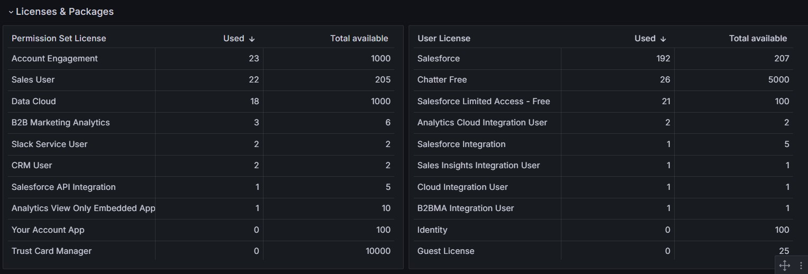
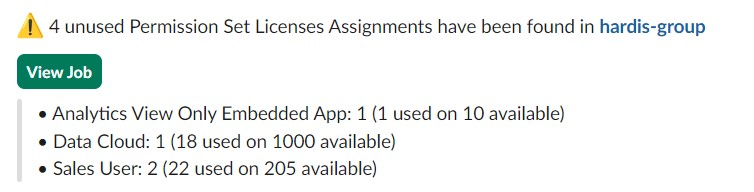

<!-- markdownlint-disable MD013 -->

## Detect unused licenses

When you assign a Permission Set related to a Permission Set License to a user, a Permission Set License Assignment is automatically created for that user.

But when you unassign this Permission Set from the user, **the Permission Set License Assignment is not deleted**.

As a result, you can be **charged for Permission Set Licenses that are not used**.

This command detects such unused Permission Set License Assignments and suggests deleting them.

Many thanks to [Vincent Finet](https://www.linkedin.com/in/vincentfinet/) for the inspiration during his great speaker session at [French Touch Dreamin '23](https://frenchtouchdreamin.com/), and for his kind agreement to reuse it in this command.

Sfdx-hardis command: [sf hardis:org:diagnose:unusedlicenses](https://sfdx-hardis.cloudity.com/hardis/org/diagnose/unusedlicenses/)

Key: **UNUSED_LICENSES**

### Grafana example

### Slack example

