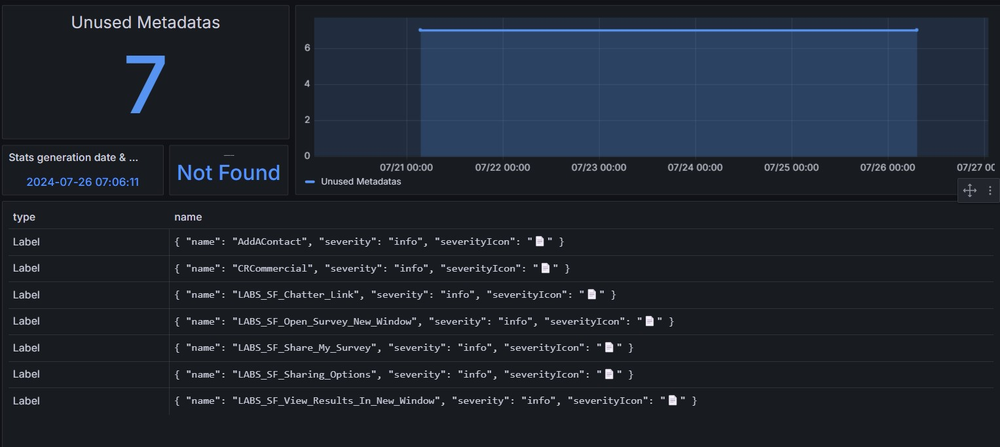
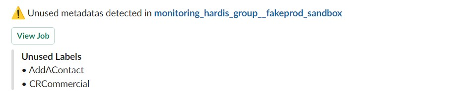

<!-- markdownlint-disable MD013 -->

### Detect metadata that is not used

If there are elements that are not used by anything, maybe they should be removed.

Currently supported metadata types:

- Custom Labels
- Custom Permissions

Sfdx-hardis command: [sf hardis:lint:unusedmetadatas](https://sfdx-hardis.cloudity.com/hardis/lint/unusedmetadatas/)

Key: **UNUSED_METADATAS**

### Grafana example

### Slack example

