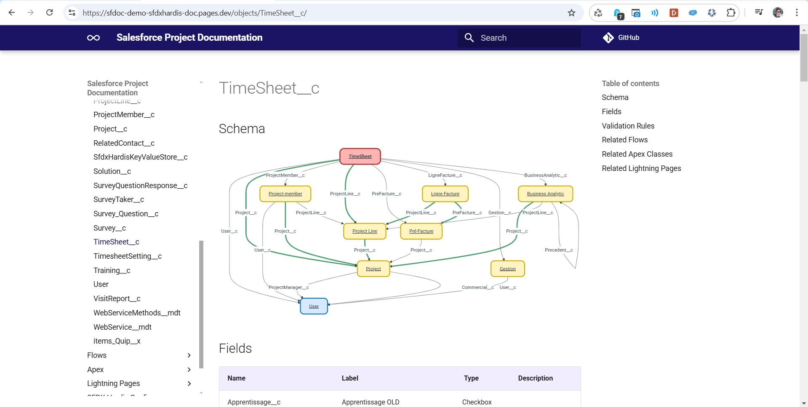

<!-- markdownlint-disable MD013 -->

## Host on Cloudflare

You can also host your HTML documentation on Cloudflare free tier !



### Manually

- Run command **Documentation Generation -> Upload HTML Doc to Cloudflare**
  - Corresponding command line: [`sf hardis:doc:mkdocs-to-cf`](hardis/doc/mkdocs-to-cf.md)

### From CI/CD

If using sfdx-hardis monitoring, just set the variable **SFDX_HARDIS_DOC_DEPLOY_TO_CLOUDFLARE=true** (or the .sfdx-hardis.yml variable `docDeployToCloudflare: true`)

If using custom pipelines, add `sf hardis:doc:project2markdown --with-history` then `sf hardis:doc:mkdocs-to-cf` in your workflow.

Make sure the following variables are defined and available from the backup command script

- SFDX_HARDIS_DOC_DEPLOY_TO_CLOUDFLARE=true
- CLOUDFLARE_EMAIL
- CLOUDFLARE_API_TOKEN
- CLOUDFLARE_ACCOUNT_ID
- CLOUDFLARE_PROJECT_NAME
- CLOUDFLARE_DEFAULT_LOGIN_METHOD_TYPE (optional, `onetimepin` by default)
- CLOUDFLARE_DEFAULT_ACCESS_EMAIL_DOMAIN  (optional, `@cloudity.com` by default)
- CLOUDFLARE_EXTRA_ACCESS_POLICY_ID_LIST (optional)

### Multilingual documentation

#### Using sfdx-hardis monitoring

If you want to generate the documentation in multiple languages, define variable SFDX_DOC_LANGUAGES (ex: `SFDX_DOC_LANGUAGES=en,fr,de`)

You can define one Cloudflare site by language, for example with the following variables:

- `CLOUDFLARE_PROJECT_NAME_EN=cloudity-demo-english`
- `CLOUDFLARE_PROJECT_NAME_FR=cloudity-demo-french`
- `CLOUDFLARE_PROJECT_NAME_DE=cloudity-demo-german`

#### Using custom pipelines

Use variables when you call the commands, for example:

```bash
PROMPTS_LANGUAGE=fr sf hardis:doc:project2markdown --with-history
CLOUDFLARE_PROJECT_NAME=cloudity-demo-french sf hardis:doc:mkdocs-to-cf

PROMPTS_LANGUAGE=en sf hardis:doc:project2markdown --with-history
CLOUDFLARE_PROJECT_NAME=cloudity-demo-english sf hardis:doc:mkdocs-to-cf
```

## Create & Configure Cloudflare free tier

Follow the video tutorial to see all described steps click by click :)

<div style="text-align:center"><iframe width="560" height="315" src="https://www.youtube.com/embed/AUipbKjgsDI" title="YouTube video player" frameborder="0" allow="accelerometer; autoplay; clipboard-write; encrypted-media; gyroscope; picture-in-picture" allowfullscreen></iframe></div>

- Create a new Cloudflare account on cloudflare.com

- Create an Cloudflare API Token with the following scopes, and set it in CI/CD variable **CLOUDFLARE_API_TOKEN**
  - Account.Cloudflare Pages
  - Account.Access: Organizations, Identity Providers, and Groups
  - Account.Access: Apps and Policies
  - User.User Details

- Set CI/CD variable **CLOUDFLARE_PROJECT_NAME**, it will be used to build the pages site (uses the repo name by default)

- Set CI/CD variable **CLOUDFLARE_EMAIL**, with the email you used to create the Cloudflare account

- Set CI/CD variable **CLOUDFLARE_ACCOUNT_ID**
  - To get its value, run `npm install wrangler -g && wrangler login && wrangler whoami`

- Set CI/CD variable **CLOUDFLARE_DEFAULT_ACCESS_EMAIL_DOMAIN** , using your company email domain.

- Configure a new **Cloudflare Zero Trust Team**
  - Select free tier (you need a credit card that won't be charged)

- If you want additional access policies, create them manually in Cloudflare Zero trust config, and set their ids in variable **CLOUDFLARE_EXTRA_ACCESS_POLICY_ID_LIST**