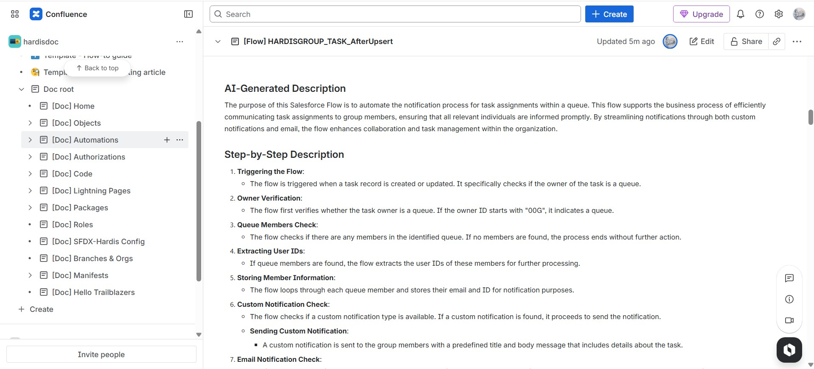

<!-- markdownlint-disable MD013 -->

## Publish to Confluence

Once your documentation has been generated, you can automatically publish it to Atlassian Confluence.



### Manually

```bash
sf hardis:doc:project2markdown
sf hardis:doc:mkdocs-to-confluence
```

### From CI/CD

```bash
sf hardis:doc:project2markdown --with-history
sf hardis:doc:mkdocs-to-confluence
```

If using the sfdx-hardis monitoring backup command, set **`SFDX_HARDIS_DOC_DEPLOY_TO_CONFLUENCE=true`** and the publish step will run automatically at the end of each backup.

---

## Configuration

Set these environment variables before running the command.

### Basic Auth

| Variable               | Description                                                                              |
|:-----------------------|:-----------------------------------------------------------------------------------------|
| `CONFLUENCE_BASE_URL`  | Your Confluence URL, e.g. `https://mycompany.atlassian.net`                              |
| `CONFLUENCE_SPACE_KEY` | The space key where pages will be published                                              |
| `CONFLUENCE_USERNAME`  | Your Confluence email address                                                            |
| `CONFLUENCE_TOKEN`     | Your [Confluence API token](https://id.atlassian.com/manage-profile/security/api-tokens) |

### OAuth2 Service Account

| Variable                   | Description                                                                                 |
|:---------------------------|:--------------------------------------------------------------------------------------------|
| `CONFLUENCE_CLIENT_ID`     | OAuth2 client ID from your [Atlassian app](https://developer.atlassian.com/console/myapps/) |
| `CONFLUENCE_CLIENT_SECRET` | OAuth2 client secret                                                                        |
| `CONFLUENCE_SPACE_KEY`     | The space key where pages will be published                                                 |

### Optional

| Variable                         | Description                                               |  Default   |
|:---------------------------------|:----------------------------------------------------------|:----------:|
| `CONFLUENCE_PARENT_PAGE_ID`      | ID of the page under which all doc pages will be nested   | Space root |
| `CONFLUENCE_PAGE_PREFIX`         | Prefix added to every page title to avoid name collisions |  `[Doc] `  |
| `CONFLUENCE_PUBLISH_CONCURRENCY` | Number of pages published simultaneously                  |    `5`     |

> **Tip — finding the parent page ID:** open the target parent page in Confluence and look at the URL:
> `https://mycompany.atlassian.net/wiki/spaces/MYSPACE/pages/**123456789**/My+Page`
> The number between `/pages/` and the title is the ID.

