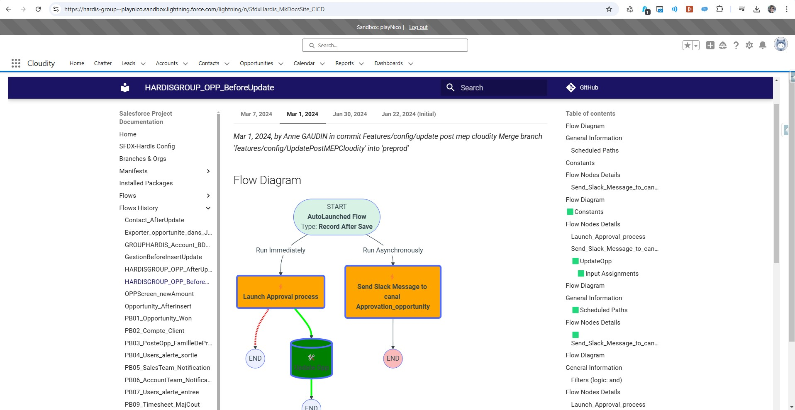

<!-- markdownlint-disable MD013 -->

## Host on Salesforce org

You can also host the HTML documentation directly in your Salesforce org.

> If you have too much metadata, the pages will be too big for a single static resource. In that case, consider self-hosting your documentation website on Cloudflare or on your own secured HTTP server.

### Manually

- Run command **Documentation Generation -> Upload HTML Doc to Salesforce**
  - Corresponding command line: [`sf hardis:doc:mkdocs-to-salesforce`](hardis/doc/mkdocs-to-salesforce.md)

- Set the generated Custom Tab as `Default On` on your Profile if necessary

- Assign the generated Permission Set to the users who need access to the SFDX Doc tab

- Add the tab in a Lightning Application (optional)

### From CI/CD

If using sfdx-hardis Monitoring, just set the variable **SFDX_HARDIS_DOC_DEPLOY_TO_ORG=true** (or the .sfdx-hardis.yml property `docDeployToOrg: true`).

If using custom pipelines, add `sf hardis:doc:project2markdown --with-history` then `sf hardis:doc:mkdocs-to-salesforce` in your workflow.
