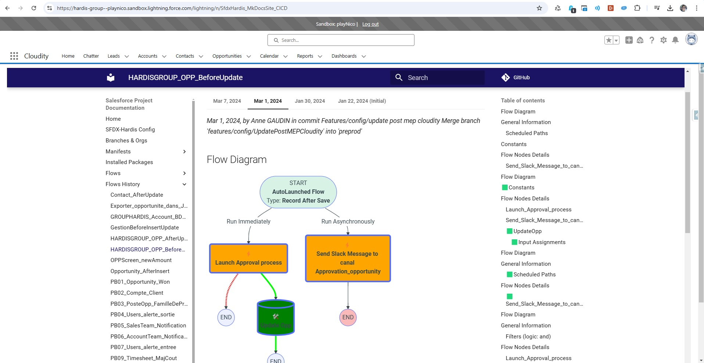

<!-- markdownlint-disable MD013 -->

## Host on Salesforce org

You can also host the HTML documentation directly in your Salesforce org !

> If your have too many metadatas, the pages will be too big for a single static resource. In that case, consider self-hosting your doc website using Cloudflare or your own secured HTTP server.

### Manually

- Run command **Documentation Generation -> Upload HTML Doc to Salesforce**
  - Corresponding command line: [`sf hardis:doc:mkdocs-to-salesforce`](hardis/doc/mkdocs-to-salesforce.md)

- Set generated Custom Tab as `Default On` on your Profile if necessary

- Assign generated Permission Set to the users you want to access the SFDX Doc tab

- Add the tab in a Lightning Application (optional)

### From CI/CD

If using sfdx-hardis monitoring, just set the variable **SFDX_HARDIS_DOC_DEPLOY_TO_ORG=true** (or the .sfdx-hardis.yml variable `docDeployToOrg: true`)

If using custom pipelines, add `sf hardis:doc:project2markdown --with-history` then `sf hardis:doc:mkdocs-to-salesforce` in your workflow.
