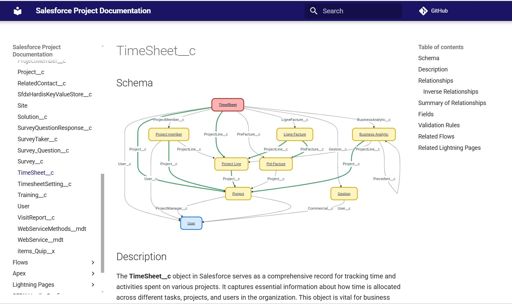
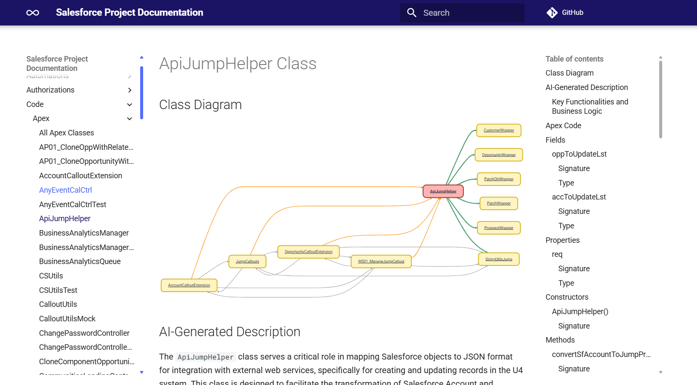
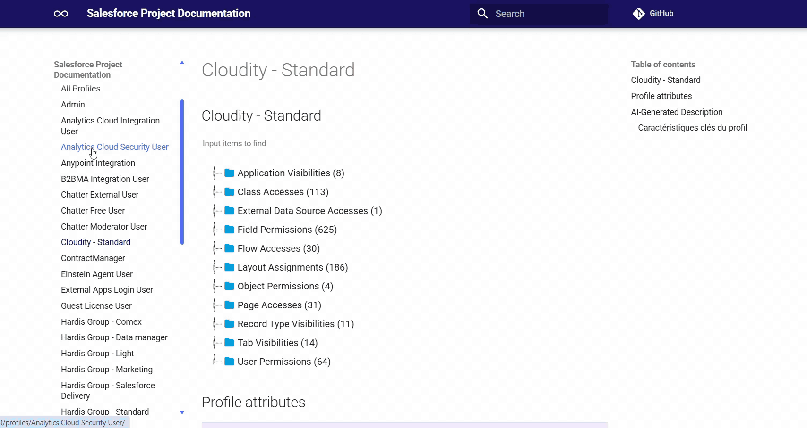

<!-- markdownlint-disable MD013 -->

## Salesforce Project Documentation

With a single command, you can generate a Web Site documenting your Salesforce metadatas

- Objects (with fields, validation rules, relationships and dependencies)
- Automations
  - Approval Processes
  - Assignment Rules
  - AutoResponse Rules
  - Escalation Rules
  - Flows
- Authorizations
  - Profiles
  - Permission Set Groups
  - Permission Sets
- Code
  - Apex
  - Lightning Web Components
- Lightning Pages
- Packages
- SFDX-Hardis Config
- Branches & Orgs
- Manifests

The documentation will be [**supercharged with AI**](salesforce-ai-setup.md) if activated;

If it is a sfdx-hardis CI/CD project, a diagram of the branches and orgs strategy will be generated.

