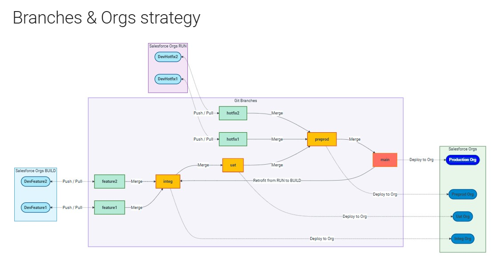
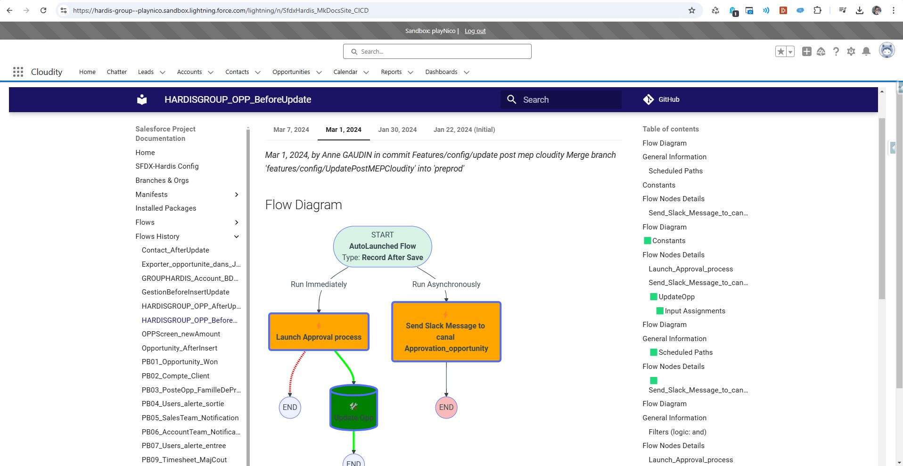

<!-- markdownlint-disable MD013 -->

## Salesforce Project Documentation

With a single command, you can generate a Web Site documenting your Salesforce metadatas (like Flows)

If it is a sfdx-hardis CI/CD project, a diagram of the branches and orgs strategy will be generated.

## How To generate

- Use the Git repository containing your SFDX project, or create it easily using [sfdx-hardis Monitoring](salesforce-monitoring-home.md), or simply calling [BackUp command](hardis/org/monitor/backup.md)

- Call VsCode SFDX-Hardis command [**Documentation Generation > Generate Project Documentation (with history)**](hardis/doc/project2markdown.md)
  - Corresponding command line: `sf hardis:doc:project2markdown --with-history`

## Run Locally

- Run command **Documentation Generation > Run local HTML Doc Pages** (Note: you need  [Python](https://www.python.org/downloads/) on your computer)
  - Corresponding command lines: `pip install mkdocs-material mdx_truly_sane_lists`, then `mkdocs serve`

- Open <http://127.0.0.1:8000/> in your Web Browser

## Host on Salesforce org

You can also host the HTML documentation directly in your Salesforce org !

### Manually

- Run command **Documentation Generation -> Upload HTML Doc to Salesforce**
  - Corresponding command line: [`sf hardis:doc:mkdocs-to-salesforce`](hardis/doc/mkdocs-to-salesforce.md)

- Set generated Custom Tab as `Default On` on your Profile if necessary

- Assign generated Permission Set to the users you want to access the SFDX Doc tab

- Add the tab in a Lightning Application (optional)

### From CI/CD

If using sfdx-hardis monitoring, just set the variable **SFDX_HARDIS_DOC_DEPLOY_TO_ORG=true** (or the .sfdx-hardis.yml variable `docDeployToOrg: true`)

If using custom pipelines, add `sf hardis:doc:project2markdown --with-history` then `sf hardis:doc:mkdocs-to-salesforce` in your workflow.
