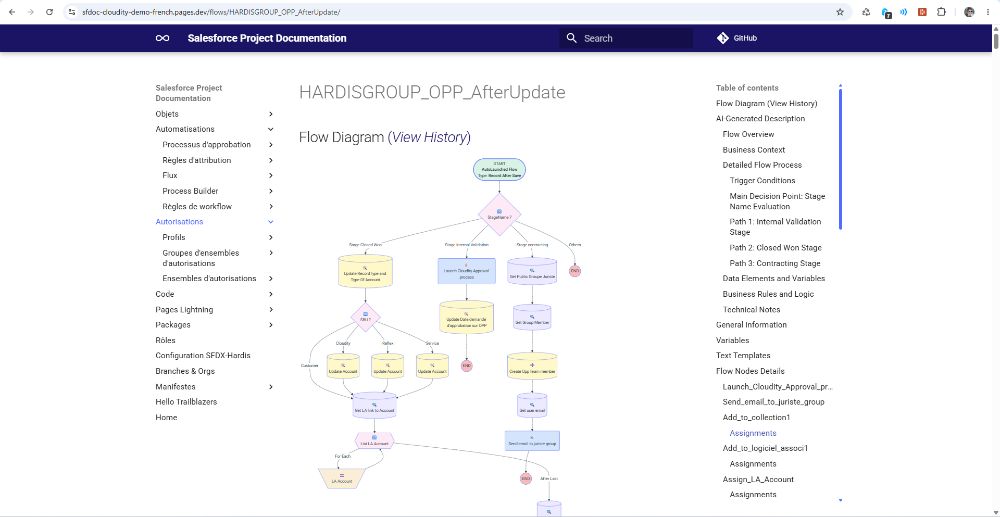
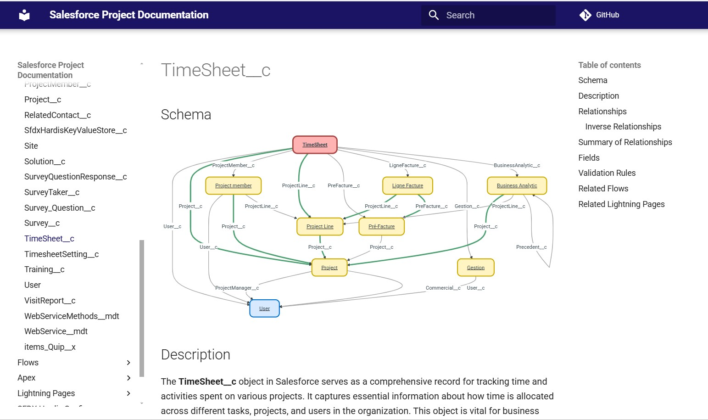
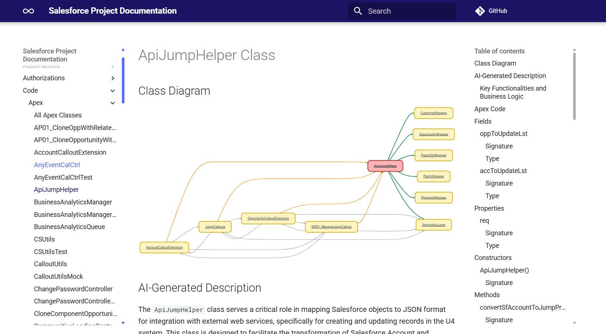
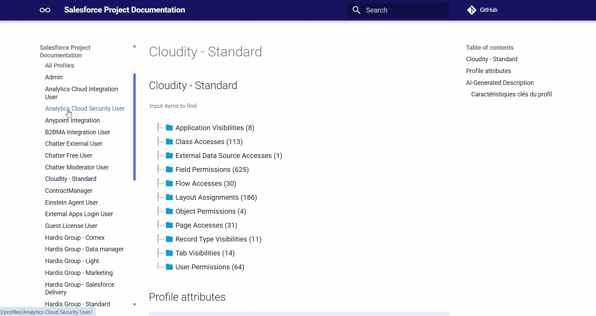
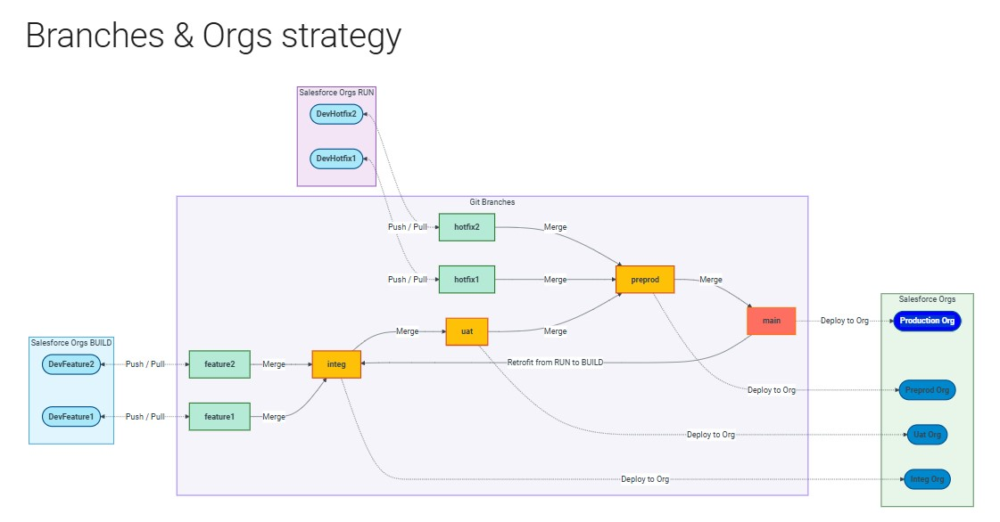
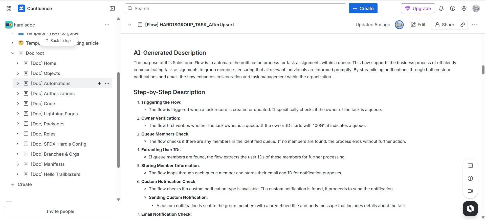

<!-- markdownlint-disable MD013 -->

## Salesforce Project Documentation

Turn your Salesforce project into a **beautiful, searchable documentation website** with a single command. Every Flow, Object, Profile, Apex class, and Lightning Page becomes browsable, AI-explained, and version-tracked.

> Activate [**AI integration**](salesforce-ai-setup.md) to add natural-language explanations and visual Flow diff history to your docs.

---

## Why generate it?

- **Onboard faster**: new developers and admins explore the org without opening Setup.
- **Track changes**: visualize how Flows evolve over time with diff history.
- **Share knowledge**: publish the documentation as a static website, on Confluence, or inside Salesforce itself.
- **Stay in sync**: regenerate on demand, or wire it into [sfdx-hardis Monitoring](salesforce-monitoring-home.md) to keep it automatically up to date.

---

## What gets documented

**Data Model**

- Objects with fields, validation rules, relationships, and dependencies
- Object diagrams

**Automations**

- Approval Processes
- Assignment Rules
- AutoResponse Rules
- Escalation Rules
- Flows (with visual diff history)

**Authorizations**

- Profiles
- Permission Sets
- Permission Set Groups

**Code**

- Apex classes and triggers
- Lightning Web Components
- Visualforce pages and components, with the metadata that uses them
- Aura components, with the metadata that uses them

**Configuration**

- Lightning Pages
- Packages
- Manifests
- sfdx-hardis configuration
- Branches and orgs strategy (CI/CD projects)

---

## A look inside

Object diagrams show relationships at a glance.

Apex classes are documented with AI-generated summaries.

Profiles and Permission Sets become searchable and reviewable.

For sfdx-hardis CI/CD projects, a branches and orgs strategy diagram is also generated.

---

## Publish anywhere

The output is plain Markdown powered by [MkDocs Material](https://squidfunk.github.io/mkdocs-material/), so you can:

- **Self-host** as a static website (GitHub Pages, GitLab Pages, Azure Static Web Apps, Cloudflare Pages...).
- **Push to Confluence** with [`hardis:doc:mkdocs-to-confluence`](hardis/doc/mkdocs-to-confluence.md).
- **Embed in Salesforce** with [`hardis:doc:mkdocs-to-salesforce`](hardis/doc/mkdocs-to-salesforce.md).

---

## Next steps

- [**Generate your documentation**](salesforce-project-doc-generate.md): step-by-step guide.
- [**Enhance it with AI**](salesforce-project-doc-ai.md): configure prompts and improve content quality.
- [**Set up AI integration**](salesforce-ai-setup.md): connect to your preferred LLM provider.
