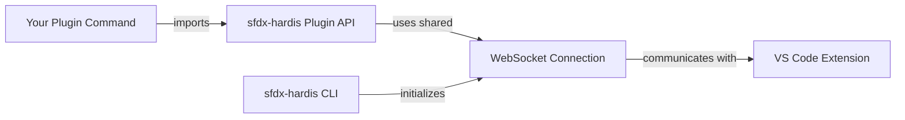

# Creating sfdx-hardis Plugins

sfdx-hardis exposes a **Plugin API** that allows community developers to build their own Salesforce CLI plugins that seamlessly integrate with the [sfdx-hardis VS Code extension](https://marketplace.visualstudio.com/items?itemName=NicolasVuillamy.vscode-sfdx-hardis).

Your plugin commands will automatically communicate with the VS Code extension using the same WebSocket connection initialized by the main sfdx-hardis CLI — no additional setup required.


See demo repository: <https://github.com/hardisgroupcom/sf-plugin-hardis-demo>

## How it works

When sfdx-hardis runs inside VS Code (via the extension), it initializes a WebSocket connection during its `init` hook. This connection lives in the Node.js process globals, so any plugin loaded into the same CLI process can reuse it.

The WebSocket connection is **automatically activated** for your plugin commands if your plugin lists `sfdx-hardis` in its `dependencies` or `peerDependencies` in `package.json`. The sfdx-hardis init hook detects this at runtime by inspecting the loaded plugins — no extra configuration needed.

Your plugin simply imports the exposed utilities from `sfdx-hardis` and calls them. The WebSocket routing happens automatically:

- **`uxLog`** sends log messages to both the terminal and the VS Code extension UI
- **`uxLogTable`** formats and sends tabular data to both the terminal and the VS Code extension UI
- **`prompts`** displays interactive prompts in VS Code (or falls back to terminal prompts)
- **`WebSocketClient`** provides direct access to send messages, progress updates, and more



### WebSocket activation rules

The sfdx-hardis `init` hook decides whether to start the WebSocket connection based on these rules (checked in order):

1. **Command prefix `hardis`**: Always activated for native sfdx-hardis commands.
2. **`SFDX_HARDIS_PLUGIN_PREFIXES` env var**: If set, the WebSocket activates for commands whose ID starts with any of the comma-separated prefixes (e.g., `SFDX_HARDIS_PLUGIN_PREFIXES=myplugin,otherplugin`).
3. **Automatic dependency detection**: If the command belongs to a plugin whose `package.json` lists `sfdx-hardis` in `dependencies` or `peerDependencies`, the WebSocket activates automatically.

## Getting started

### 1. Create your Salesforce CLI plugin project

Use the `sf dev generate plugin` command to scaffold a new Salesforce CLI plugin:

```bash
sf dev generate plugin my-sfdx-hardis-plugin
cd my-sfdx-hardis-plugin
```

### 2. Add sfdx-hardis as a dependency

```bash
yarn add sfdx-hardis
```

Or with npm:

```bash
npm install sfdx-hardis
```

### 3. Import and use the Plugin API

In your command files, import the utilities you need:

```typescript
import {
  uxLog,
  prompts,
  WebSocketClient,
  NotifProvider,
  execCommand,
  execSfdxJson,
  soqlQuery,
  soqlQueryTooling,
  bulkQuery,
  bulkQueryChunksIn,
  bulkQueryByChunks,
  bulkUpdate,
  bulkDelete,
  bulkDeleteTooling,
  generateCsvFile,
} from "sfdx-hardis/plugin-api";
// Types are also available
import type {
  LogType,
  PromptsQuestion,
  NotifMessage,
} from "sfdx-hardis/plugin-api";
```

You can also import from the main package entry point:

```typescript
import { uxLog, prompts, WebSocketClient } from "sfdx-hardis";
```

### 4. Install both plugins

Users of your plugin need to install both sfdx-hardis and your plugin:

```bash
sf plugins install sfdx-hardis
sf plugins install my-sfdx-hardis-plugin
```

### 5. Expose custom menus in the VS Code extension

The VS Code extension can now discover custom menus exposed by installed non-core Salesforce CLI plugins.

If your plugin implements a command named `sf <your-plugin-prefix>:hardis-commands --json`, the extension will call it in the background and merge the returned menus with the menus defined in `.sfdx-hardis.yml`.

This is useful when your plugin wants to surface guided entry points directly in:

- the **Welcome page** as clickable cards
- the **Commands panel** as custom menu sections

Your command should return a JSON payload with this shape:

```json
{
  "customCommands": [
    {
      "id": "my-plugin-menu",
      "label": "My Plugin",
      "description": "Short description shown on the Welcome page card",
      "vscodeIcon": "symbol-misc",
      "sldsIcon": "utility:apps",
      "commands": [
        {
          "id": "analyze-org",
          "label": "Analyze org",
          "command": "sf myplugin analyze org",
          "tooltip": "Run the org analysis workflow",
          "helpUrl": "https://example.com/docs/analyze-org",
          "icon": "cloudity-logo.svg",
          "vscodeIcon": "run",
          "sldsIcon": "utility:apex"
        }
      ]
    }
  ]
}
```

Notes:

- Menu defaults: `vscodeIcon` defaults to `symbol-misc`, `sldsIcon` defaults to `utility:apps`.
- Command defaults: `icon` defaults to `cloudity-logo.svg`, `vscodeIcon` defaults to `run`, `sldsIcon` defaults to `utility:apex`.
- `vscodeIcon` must be a valid [VS Code ThemeIcon](https://code.visualstudio.com/api/references/icons-in-labels#icon-listing).
- `sldsIcon` must be an [SLDS icon](https://www.lightningdesignsystem.com/icons/) in `category:name` format.

Example implementation:

```typescript
import { SfCommand } from "@salesforce/sf-plugins-core";
import { type AnyJson } from "@salesforce/ts-types";

export default class HardisCommands extends SfCommand<AnyJson> {
  public static readonly summary = "Expose custom menus to the sfdx-hardis VS Code extension";
  public static readonly hidden = true;

  public async run(): Promise<AnyJson> {
    return {
      customCommands: [
        {
          id: "my-plugin-menu",
          label: "My Plugin",
          description: "Quick entry points for plugin workflows",
          vscodeIcon: "symbol-misc",
          sldsIcon: "utility:apps",
          commands: [
            {
              id: "analyze-org",
              label: "Analyze org",
              command: "sf myplugin analyze org",
              tooltip: "Run the org analysis workflow",
              helpUrl: "https://example.com/docs/analyze-org",
              vscodeIcon: "run",
              sldsIcon: "utility:apex",
            },
          ],
        },
      ],
    } as AnyJson;
  }
}
```

## API Reference

### `uxLog(logType, commandThis, message, sensitive?)`

Sends a log message to the terminal and to the VS Code extension (when connected).

**Parameters:**

| Parameter     | Type      | Description                                                                            |
|---------------|-----------|----------------------------------------------------------------------------------------|
| `logType`     | `LogType` | One of: `'log'`, `'action'`, `'warning'`, `'error'`, `'success'`, `'table'`, `'other'` |
| `commandThis` | `any`     | The current command instance (`this` in a command's `run()` method)                    |
| `message`     | `string`  | The message to display (supports chalk formatting)                                     |
| `sensitive`   | `boolean` | Optional. If `true`, the message is obfuscated in log files                            |

**Example:**

```typescript
import { uxLog } from "sfdx-hardis/plugin-api";
import c from "chalk";

// In your command's run() method:
uxLog("action", this, c.cyan("Processing metadata..."));
uxLog("success", this, c.green("Deployment completed successfully!"));
uxLog("warning", this, c.yellow("Some items were skipped."));
uxLog("error", this, c.red("Failed to connect to org."));
```

### `uxLogTable(commandThis, tableData, columnsOrder?)`

Renders a user-facing table in the terminal and in the VS Code extension.

**Parameters:**

| Parameter      | Type       | Description                                                         |
|----------------|------------|---------------------------------------------------------------------|
| `commandThis`  | `any`      | The current command instance (`this` in a command's `run()` method) |
| `tableData`    | `any[]`    | Array of row objects to render                                      |
| `columnsOrder` | `string[]` | Optional. Column keys to keep and the order to display them         |

**Behavior:**

- If `columnsOrder` is omitted, headers come from `Object.keys(tableData[0])`.
- Boolean values are rendered as emoji (`✅` / `⬜`) in the terminal table.
- When the VS Code UI is active, the table payload is capped to 20 rows and a truncation row is appended.

**Example:**

```typescript
import { uxLogTable } from "sfdx-hardis/plugin-api";

// In your command's run() method:
uxLogTable(
  this,
  [
    { name: "My Flow", type: "Flow", status: "Active" },
    { name: "My Object", type: "Custom Object", status: "Inactive" },
  ],
  ["name", "type", "status"]
);
```

### `prompts(options)`

Displays interactive prompts. When the VS Code extension is connected, prompts are shown in the VS Code UI. Otherwise, they fall back to terminal-based prompts (using inquirer).

**Parameters:**

| Parameter | Type                                   | Description                             |
|-----------|----------------------------------------|-----------------------------------------|
| `options` | `PromptsQuestion \| PromptsQuestion[]` | A single question or array of questions |

**`PromptsQuestion` interface:**

| Property      | Type                                                           | Description                                                    |
|---------------|----------------------------------------------------------------|----------------------------------------------------------------|
| `message`     | `string`                                                       | The question text                                              |
| `description` | `string`                                                       | Additional description                                         |
| `placeholder` | `string`                                                       | Optional placeholder text                                      |
| `type`        | `'select' \| 'multiselect' \| 'confirm' \| 'text' \| 'number'` | Input type                                                     |
| `name`        | `string`                                                       | Optional. Property name for the answer (defaults to `'value'`) |
| `choices`     | `Array<{title: string, value: any}>`                           | Options for select/multiselect                                 |
| `default`     | `any`                                                          | Optional default value                                         |
| `initial`     | `any`                                                          | Optional initial value                                         |

**Example:**

```typescript
import { uxLog, prompts } from "sfdx-hardis/plugin-api";
import c from "chalk";

// Single select prompt
const envResponse = await prompts({
  type: "select",
  name: "environment",
  message: "Select target environment",
  description: "Choose where to deploy",
  choices: [
    { title: "Sandbox", value: "sandbox" },
    { title: "Production", value: "production" },
  ],
});
uxLog("action", this, c.cyan(`Selected: ${envResponse.environment}`));

// Text input
const nameResponse = await prompts({
  type: "text",
  name: "projectName",
  message: "Enter project name",
  description: "The name for your new project",
});

// Confirm prompt (automatically converted to select Yes/No)
const confirmResponse = await prompts({
  type: "confirm",
  name: "proceed",
  message: "Do you want to continue?",
  description: "This will start the deployment",
});
```

### `execCommand(command, commandThis, options)`

Runs a shell command and streams progress to the terminal and VS Code UI.

**Parameters:**

| Parameter     | Type     | Description                                                  |
|---------------|----------|--------------------------------------------------------------|
| `command`     | `string` | Command line to execute                                      |
| `commandThis` | `any`    | The current command instance (`this` in a command's `run()`) |
| `options`     | `object` | Optional. `{ fail, output, debug, spinner, cwd }`            |

**Example:**

```typescript
import { execCommand } from "sfdx-hardis/plugin-api";

await execCommand("sf org list", this, { output: true });
```

### `execSfdxJson(command, commandThis, options)`

Runs a Salesforce CLI command and forces `--json` output.

**Parameters:**

| Parameter     | Type     | Description                                                  |
|---------------|----------|--------------------------------------------------------------|
| `command`     | `string` | Salesforce CLI command (without `--json`)                    |
| `commandThis` | `any`    | The current command instance (`this` in a command's `run()`) |
| `options`     | `object` | Optional. `{ fail, output, debug }`                          |

**Example:**

```typescript
import { execSfdxJson } from "sfdx-hardis/plugin-api";

const res = await execSfdxJson("sf org display", this, { output: false });
```

### SOQL and Bulk helpers

Utility wrappers around REST/Tooling SOQL and Bulk API v2 helpers.

**Functions:**

- `soqlQuery(soqlQuery, conn)`
- `soqlQueryTooling(soqlQuery, conn)`
- `bulkQuery(soqlQuery, conn, retries?)`
- `bulkQueryChunksIn(soqlQuery, conn, inElements, batchSize?, retries?)`
- `bulkQueryByChunks(soqlQuery, conn, batchSize?, retries?)`
- `bulkUpdate(objectName, action, records, conn)`
- `bulkDelete(objectName, recordIds, conn)`
- `bulkDeleteTooling(objectName, recordIds, conn)`

**Example:**

```typescript
import { soqlQuery, bulkQuery } from "sfdx-hardis/plugin-api";

const res = await soqlQuery("SELECT Id, Name FROM Account", conn);
const bulkRes = await bulkQuery("SELECT Id FROM Contact", conn);
```

### `generateCsvFile(data, outputPath, options?)`

Generates CSV (and optionally XLSX) files and notifies the VS Code UI.

**Parameters:**

| Parameter    | Type     | Description                                                                    |
|--------------|----------|--------------------------------------------------------------------------------|
| `data`       | `any[]`  | Rows to export                                                                 |
| `outputPath` | `string` | Full output path for the CSV                                                   |
| `options`    | `object` | Optional. `{ fileTitle, noExcel, columnsCustomStyles, skipNotifyToWebSocket }` |

**Example:**

```typescript
import { generateCsvFile } from "sfdx-hardis/plugin-api";

await generateCsvFile(records, "./reports/accounts.csv", {
  fileTitle: "Accounts",
});
```

### `WebSocketClient`

Static class providing direct control over the VS Code extension communication.

#### `WebSocketClient.isAlive(): boolean`

Returns `true` if the WebSocket connection to the VS Code extension is active.

```typescript
if (WebSocketClient.isAlive()) {
  // We're running inside VS Code with the extension
}
```

#### `WebSocketClient.sendProgressStartMessage(title, totalSteps?)`

Starts a progress indicator in VS Code.

```typescript
WebSocketClient.sendProgressStartMessage("Processing files", files.length);
```

#### `WebSocketClient.sendProgressStepMessage(step, totalSteps?)`

Updates the progress indicator.

```typescript
for (let i = 0; i < files.length; i++) {
  // ... process file ...
  WebSocketClient.sendProgressStepMessage(i + 1, files.length);
}
```

#### `WebSocketClient.sendProgressEndMessage(totalSteps?)`

Ends the progress indicator.

```typescript
WebSocketClient.sendProgressEndMessage(files.length);
```

#### `WebSocketClient.requestOpenFile(file)`

Requests VS Code to open a specific file.

```typescript
WebSocketClient.requestOpenFile("/path/to/file.cls");
```

#### `WebSocketClient.sendReportFileMessage(file, title, type)`

Sends a downloadable report file or url notification to VS Code.

This will make appear clickable buttons at the bottom of command execution ui.

```typescript
WebSocketClient.sendReportFileMessage(
  reportFilePath,
  "Deployment Report",
  "report"
);
```

| `type` value      | Description               |
|-------------------|---------------------------|
| `"report"`        | A report file to download |
| `"docUrl"`        | A documentation URL       |
| `"actionUrl"`     | An action URL             |
| `"actionCommand"` | A command to run          |

#### Other available methods

| Method                                                      | Description                                  |
|-------------------------------------------------------------|----------------------------------------------|
| `sendRefreshStatusMessage()`                                | Triggers a status refresh in VS Code         |
| `sendRefreshCommandsMessage()`                              | Triggers a commands list refresh             |
| `sendCommandLogLineMessage(message, logType?, isQuestion?)` | Sends a log line to the command output panel |

### `NotifProvider`

Static class for posting notifications to all configured channels (Slack, MS Teams, Email, custom API). The channels are configured by the end user via environment variables or `.sfdx-hardis.yml`.

#### `NotifProvider.postNotifications(notifMessage)`

Posts a notification to all configured channels.

**Basic example — simple success notification:**

```typescript
import { NotifProvider } from "sfdx-hardis/plugin-api";

await NotifProvider.postNotifications({
  text: "My plugin completed successfully",
  type: "MY_PLUGIN_TYPE", // use a unique ALL_CAPS identifier for your plugin
  severity: "success",
  logElements: [],
  data: {},
  metrics: {},
});
```

**Example with action buttons and attachment text:**

```typescript
import { NotifProvider } from "sfdx-hardis/plugin-api";
import type { NotifMessage } from "sfdx-hardis/plugin-api";

const notif: NotifMessage = {
  text: `Deployment completed to *Production*\n- Components deployed: 42\n- Tests passed: 156`,
  type: "MY_DEPLOYMENT",
  severity: "success",
  attachments: [{ text: "• MyClass: OK\n• MyFlow: OK\n• MyPermissionSet: OK" }],
  buttons: [
    {
      text: "View Job",
      url: "https://ci.example.com/job/123",
      style: "primary",
    },
    { text: "View Org", url: "https://myorg.my.salesforce.com" },
  ],
  logElements: [],
  data: {},
  metrics: {},
};
await NotifProvider.postNotifications(notif);
```

**Advanced example — sending numeric metrics to Grafana/InfluxDB/Prometheus:**

The `metrics` property is used to send time-series data to a metrics API (InfluxDB line protocol or Prometheus format), configured by the end user via `NOTIF_API_METRICS_URL`.

Each key in `metrics` becomes a separate metric series. Values can be:

- A **plain number** (simple gauge: `metric=<value>`)
- An **object** with `value` (required), and optionally `min`, `max`, `percent`

```typescript
import { NotifProvider } from "sfdx-hardis/plugin-api";

const failingItems = [
  { name: "MyClass", error: "Assertion failed" },
  { name: "OtherClass", error: "DML exception" },
];

await NotifProvider.postNotifications({
  text: `Metadata analysis complete\n- Issues found: ${failingItems.length}\n- Coverage: 82%`,
  type: "MY_PLUGIN_ANALYSIS",
  severity: failingItems.length > 0 ? "warning" : "success",
  attachments: [
    {
      text: failingItems
        .map((item) => `• *${item.name}*: ${item.error}`)
        .join("\n"),
    },
  ],
  buttons: [
    {
      text: "View Report",
      url: "https://example.com/report",
      style: "primary",
    },
  ],
  // logElements: structured list sent as _logElements in the API payload
  // Useful for dashboards that render tabular data
  logElements: failingItems,
  // data: arbitrary key-value pairs merged into the API payload
  // Available as top-level fields in Grafana/Loki queries
  data: {
    orgUrl: "https://myorg.my.salesforce.com",
    branchName: "main",
    totalComponents: 120,
  },
  // metrics: numeric values pushed to NOTIF_API_METRICS_URL (InfluxDB / Prometheus)
  // Simple number → MetricName,... metric=<value>
  // Object with value/min/max/percent → multiple fields per series
  metrics: {
    // Simple gauge: one data point named "MyPluginIssues"
    MyPluginIssues: failingItems.length,
    // Simple gauge: code coverage percentage
    MyPluginCoverage: 82.0,
    // Complex gauge: sends metric=, min=, max=, percent= fields
    MyPluginLimitUsage: {
      value: 4200,
      min: 0,
      max: 5000,
      percent: 84.0,
    },
  },
});
```

The resulting InfluxDB line protocol for the metrics above would be:

```
MyPluginIssues,source=sfdx-hardis,type=MY_PLUGIN_ANALYSIS,orgIdentifier=myorg,gitIdentifier=repo/main metric=2.00
MyPluginCoverage,source=sfdx-hardis,type=MY_PLUGIN_ANALYSIS,orgIdentifier=myorg,gitIdentifier=repo/main metric=82.00
MyPluginLimitUsage,source=sfdx-hardis,type=MY_PLUGIN_ANALYSIS,orgIdentifier=myorg,gitIdentifier=repo/main min=0.00,max=5000.00,percent=84.00,metric=4200.00
```

See [`NotifMessage`](#notifmessage) for all available fields.

### `NotifMessage`

Interface describing a notification to send.

| Property        | Type                 | Required | Description                                                                                                                           |
|-----------------|----------------------|----------|---------------------------------------------------------------------------------------------------------------------------------------|
| `text`          | `string`             | ✓        | Main notification text (supports Slack markdown: `*bold*`, `_italic_`)                                                                |
| `type`          | `string`             | ✓        | Notification type identifier — use a unique ALL_CAPS string for your plugin (e.g. `"MY_PLUGIN_RESULT"`)                               |
| `severity`      | `NotifSeverity`      | ✓        | One of: `"critical"`, `"error"`, `"warning"`, `"info"`, `"success"`, `"log"`                                                          |
| `logElements`   | `any[]`              | ✓        | Array of structured items (e.g. failing tests, issues). Sent as `_logElements` in the API payload.                                    |
| `data`          | `any`                | ✓        | Arbitrary key-value pairs merged into the API payload (available in Grafana/Loki queries)                                             |
| `metrics`       | `any`                | ✓        | Numeric metrics pushed to `NOTIF_API_METRICS_URL`. Keys become metric names. Values are a number or `{ value, min?, max?, percent? }` |
| `attachments`   | `{ text: string }[]` |          | Extra detail blocks appended to the notification body                                                                                 |
| `buttons`       | `NotifButton[]`      |          | Action buttons shown in Slack/Teams (requires `text` + optional `url` and `style`)                                                    |
| `attachedFiles` | `string[]`           |          | Absolute paths to files uploaded as attachments (e.g. CSV reports)                                                                    |
| `alwaysSend`    | `boolean`            |          | If `true`, send even when the severity would normally be filtered out                                                                 |
| `sideImage`     | `string`             |          | URL of a side image shown in some providers                                                                                           |

## Complete plugin example

Here is a complete example of an sfdx-hardis plugin command:

```typescript
import { SfCommand } from "@salesforce/sf-plugins-core";
import { type AnyJson } from "@salesforce/ts-types";
import { uxLog, prompts, WebSocketClient } from "sfdx-hardis/plugin-api";
import type { PromptsQuestion } from "sfdx-hardis/plugin-api";
import c from "chalk";

export default class MyCustomCommand extends SfCommand<AnyJson> {
  public static readonly summary = "My custom sfdx-hardis plugin command";
  public static readonly description =
    "Does something awesome with VS Code integration";

  public async run(): Promise<AnyJson> {
    // Log messages appear in both terminal and VS Code
    uxLog("action", this, c.cyan("Starting custom processing..."));

    // Prompt user (VS Code UI or terminal fallback)
    const response = await prompts({
      type: "select",
      name: "action",
      message: "What would you like to do?",
      description: "Select an action",
      choices: [
        { title: "Analyze metadata", value: "analyze" },
        { title: "Generate report", value: "report" },
      ],
    });

    // Show progress in VS Code
    const items = ["Item1", "Item2", "Item3"];
    WebSocketClient.sendProgressStartMessage("Processing items", items.length);

    for (let i = 0; i < items.length; i++) {
      uxLog("log", this, c.grey(`Processing ${items[i]}...`));
      // ... do work ...
      WebSocketClient.sendProgressStepMessage(i + 1, items.length);
    }

    WebSocketClient.sendProgressEndMessage(items.length);
    uxLog("success", this, c.green("Processing complete!"));

    return { success: true, action: response.action } as AnyJson;
  }
}
```

## Important notes

- **The WebSocket connection is managed by sfdx-hardis.** Your plugin should never create its own `WebSocketClient` instance. Just call the static methods.
- **Automatic WebSocket activation.** As long as your plugin lists `sfdx-hardis` in `dependencies` or `peerDependencies`, the WebSocket connection is automatically initialized for your commands — no extra configuration required.
- **Manual prefix override.** If automatic detection does not work for your setup, set the `SFDX_HARDIS_PLUGIN_PREFIXES` environment variable to a comma-separated list of command prefixes (e.g., `SFDX_HARDIS_PLUGIN_PREFIXES=myplugin,otherplugin`).
- **Prompts throw in CI mode.** When `process.env.CI` is set, calling `prompts()` throws an error. Design your commands to accept flags for CI usage.
- **Graceful fallback.** When the VS Code extension is not connected, `uxLog` still outputs to the terminal, and `prompts` falls back to terminal-based inquirer prompts. Your plugin works everywhere.
- **sfdx-hardis must be installed.** Users need both sfdx-hardis and your plugin installed for the integration to work.
