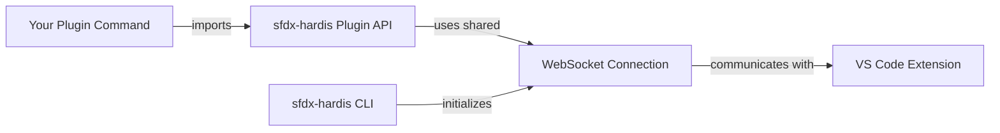

# Creating sfdx-hardis Plugins

sfdx-hardis exposes a **Plugin API** that allows community developers to build their own Salesforce CLI plugins that seamlessly integrate with the [sfdx-hardis VS Code extension](https://marketplace.visualstudio.com/items?itemName=NicolasVuillamy.vscode-sfdx-hardis).

Your plugin commands will automatically communicate with the VS Code extension using the same WebSocket connection initialized by the main sfdx-hardis CLI — no additional setup required.

## How it works

When sfdx-hardis runs inside VS Code (via the extension), it initializes a WebSocket connection during its `init` hook. This connection lives in the Node.js process globals, so any plugin loaded into the same CLI process can reuse it.

Your plugin simply imports the exposed utilities from `sfdx-hardis` and calls them. The WebSocket routing happens automatically:

- **`uxLog`** sends log messages to both the terminal and the VS Code extension UI
- **`prompts`** displays interactive prompts in VS Code (or falls back to terminal prompts)
- **`WebSocketClient`** provides direct access to send messages, progress updates, and more



## Getting started

### 1. Create your Salesforce CLI plugin project

Use the `sf dev generate plugin` command to scaffold a new Salesforce CLI plugin:

```bash
sf dev generate plugin my-sfdx-hardis-plugin
cd my-sfdx-hardis-plugin
```

### 2. Add sfdx-hardis as a dependency

```bash
yarn add sfdx-hardis
```

Or with npm:

```bash
npm install sfdx-hardis
```

### 3. Import and use the Plugin API

In your command files, import the utilities you need:

```typescript
import { uxLog, prompts, WebSocketClient } from 'sfdx-hardis/plugin-api';
// Types are also available
import type { LogType, PromptsQuestion } from 'sfdx-hardis/plugin-api';
```

You can also import from the main package entry point:

```typescript
import { uxLog, prompts, WebSocketClient } from 'sfdx-hardis';
```

### 4. Install both plugins

Users of your plugin need to install both sfdx-hardis and your plugin:

```bash
sf plugins install sfdx-hardis
sf plugins install my-sfdx-hardis-plugin
```

## API Reference

### `uxLog(logType, commandThis, message, sensitive?)`

Sends a log message to the terminal and to the VS Code extension (when connected).

**Parameters:**

| Parameter | Type | Description |
|-----------|------|-------------|
| `logType` | `LogType` | One of: `'log'`, `'action'`, `'warning'`, `'error'`, `'success'`, `'table'`, `'other'` |
| `commandThis` | `any` | The current command instance (`this` in a command's `run()` method) |
| `message` | `string` | The message to display (supports chalk formatting) |
| `sensitive` | `boolean` | Optional. If `true`, the message is obfuscated in log files |

**Example:**

```typescript
import { uxLog } from 'sfdx-hardis/plugin-api';
import c from 'chalk';

// In your command's run() method:
uxLog("action", this, c.cyan("Processing metadata..."));
uxLog("success", this, c.green("Deployment completed successfully!"));
uxLog("warning", this, c.yellow("Some items were skipped."));
uxLog("error", this, c.red("Failed to connect to org."));
```

### `prompts(options)`

Displays interactive prompts. When the VS Code extension is connected, prompts are shown in the VS Code UI. Otherwise, they fall back to terminal-based prompts (using inquirer).

**Parameters:**

| Parameter | Type | Description |
|-----------|------|-------------|
| `options` | `PromptsQuestion \| PromptsQuestion[]` | A single question or array of questions |

**`PromptsQuestion` interface:**

| Property | Type | Description |
|----------|------|-------------|
| `message` | `string` | The question text |
| `description` | `string` | Additional description |
| `placeholder` | `string` | Optional placeholder text |
| `type` | `'select' \| 'multiselect' \| 'confirm' \| 'text' \| 'number'` | Input type |
| `name` | `string` | Optional. Property name for the answer (defaults to `'value'`) |
| `choices` | `Array<{title: string, value: any}>` | Options for select/multiselect |
| `default` | `any` | Optional default value |
| `initial` | `any` | Optional initial value |

**Example:**

```typescript
import { uxLog, prompts } from 'sfdx-hardis/plugin-api';
import c from 'chalk';

// Single select prompt
const envResponse = await prompts({
  type: 'select',
  name: 'environment',
  message: 'Select target environment',
  description: 'Choose where to deploy',
  choices: [
    { title: 'Sandbox', value: 'sandbox' },
    { title: 'Production', value: 'production' },
  ],
});
uxLog("action", this, c.cyan(`Selected: ${envResponse.environment}`));

// Text input
const nameResponse = await prompts({
  type: 'text',
  name: 'projectName',
  message: 'Enter project name',
  description: 'The name for your new project',
});

// Confirm prompt (automatically converted to select Yes/No)
const confirmResponse = await prompts({
  type: 'confirm',
  name: 'proceed',
  message: 'Do you want to continue?',
  description: 'This will start the deployment',
});
```

### `WebSocketClient`

Static class providing direct control over the VS Code extension communication.

#### `WebSocketClient.isAlive(): boolean`

Returns `true` if the WebSocket connection to the VS Code extension is active.

```typescript
if (WebSocketClient.isAlive()) {
  // We're running inside VS Code with the extension
}
```

#### `WebSocketClient.sendProgressStartMessage(title, totalSteps?)`

Starts a progress indicator in VS Code.

```typescript
WebSocketClient.sendProgressStartMessage("Processing files", files.length);
```

#### `WebSocketClient.sendProgressStepMessage(step, totalSteps?)`

Updates the progress indicator.

```typescript
for (let i = 0; i < files.length; i++) {
  // ... process file ...
  WebSocketClient.sendProgressStepMessage(i + 1, files.length);
}
```

#### `WebSocketClient.sendProgressEndMessage(totalSteps?)`

Ends the progress indicator.

```typescript
WebSocketClient.sendProgressEndMessage(files.length);
```

#### `WebSocketClient.requestOpenFile(file)`

Requests VS Code to open a specific file.

```typescript
WebSocketClient.requestOpenFile("/path/to/file.cls");
```

#### `WebSocketClient.sendReportFileMessage(file, title, type)`

Sends a downloadable report file notification to VS Code.

```typescript
WebSocketClient.sendReportFileMessage(
  reportFilePath,
  "Deployment Report",
  "report"
);
```

| `type` value | Description |
|-------------|-------------|
| `"report"` | A report file to download |
| `"docUrl"` | A documentation URL |
| `"actionUrl"` | An action URL |
| `"actionCommand"` | A command to run |

#### `WebSocketClient.sendMessage(data)`

Sends a raw message to the VS Code extension. Use this for advanced scenarios.

```typescript
WebSocketClient.sendMessage({
  event: 'customEvent',
  data: { key: 'value' }
});
```

#### Other available methods

| Method | Description |
|--------|-------------|
| `sendRefreshStatusMessage()` | Triggers a status refresh in VS Code |
| `sendRefreshCommandsMessage()` | Triggers a commands list refresh |
| `sendCommandLogLineMessage(message, logType?, isQuestion?)` | Sends a log line to the command output panel |

### `LogType`

Type alias for allowed log types: `'log' | 'action' | 'warning' | 'error' | 'success' | 'table' | 'other'`

### `LOG_TYPES`

Constant array of all valid log types: `['log', 'action', 'warning', 'error', 'success', 'table', 'other']`

## Complete plugin example

Here is a complete example of an sfdx-hardis plugin command:

```typescript
import { SfCommand } from '@salesforce/sf-plugins-core';
import { type AnyJson } from '@salesforce/ts-types';
import { uxLog, prompts, WebSocketClient } from 'sfdx-hardis/plugin-api';
import type { PromptsQuestion } from 'sfdx-hardis/plugin-api';
import c from 'chalk';

export default class MyCustomCommand extends SfCommand<AnyJson> {
  public static readonly summary = 'My custom sfdx-hardis plugin command';
  public static readonly description = 'Does something awesome with VS Code integration';

  public async run(): Promise<AnyJson> {
    // Log messages appear in both terminal and VS Code
    uxLog("action", this, c.cyan("Starting custom processing..."));

    // Prompt user (VS Code UI or terminal fallback)
    const response = await prompts({
      type: 'select',
      name: 'action',
      message: 'What would you like to do?',
      description: 'Select an action',
      choices: [
        { title: 'Analyze metadata', value: 'analyze' },
        { title: 'Generate report', value: 'report' },
      ],
    });

    // Show progress in VS Code
    const items = ['Item1', 'Item2', 'Item3'];
    WebSocketClient.sendProgressStartMessage("Processing items", items.length);

    for (let i = 0; i < items.length; i++) {
      uxLog("log", this, c.grey(`Processing ${items[i]}...`));
      // ... do work ...
      WebSocketClient.sendProgressStepMessage(i + 1, items.length);
    }

    WebSocketClient.sendProgressEndMessage(items.length);
    uxLog("success", this, c.green("Processing complete!"));

    return { success: true, action: response.action } as AnyJson;
  }
}
```

## Important notes

- **The WebSocket connection is managed by sfdx-hardis.** Your plugin should never create its own `WebSocketClient` instance. Just call the static methods.
- **Prompts throw in CI mode.** When `process.env.CI` is set, calling `prompts()` throws an error. Design your commands to accept flags for CI usage.
- **Graceful fallback.** When the VS Code extension is not connected, `uxLog` still outputs to the terminal, and `prompts` falls back to terminal-based inquirer prompts. Your plugin works everywhere.
- **sfdx-hardis must be installed.** Users need both sfdx-hardis and your plugin installed for the integration to work.
