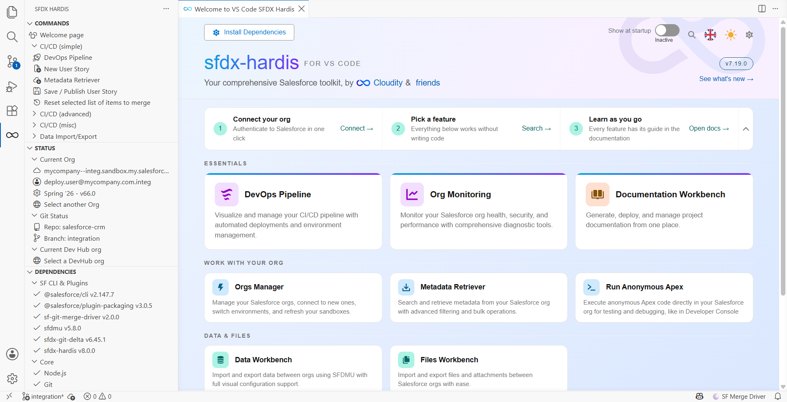
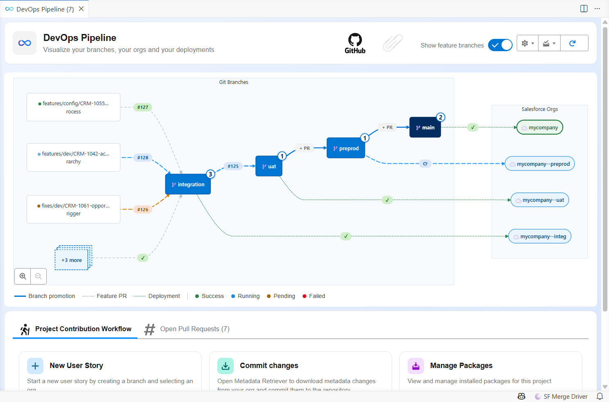
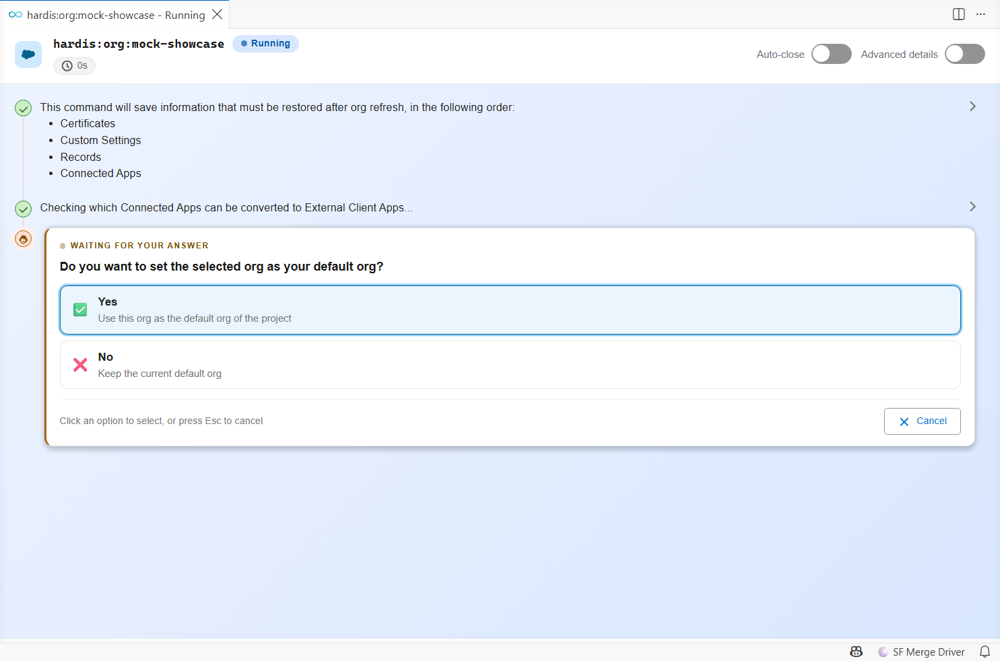
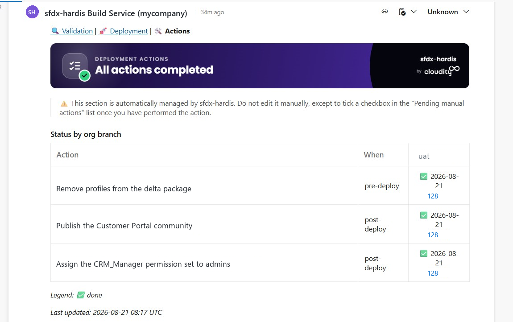
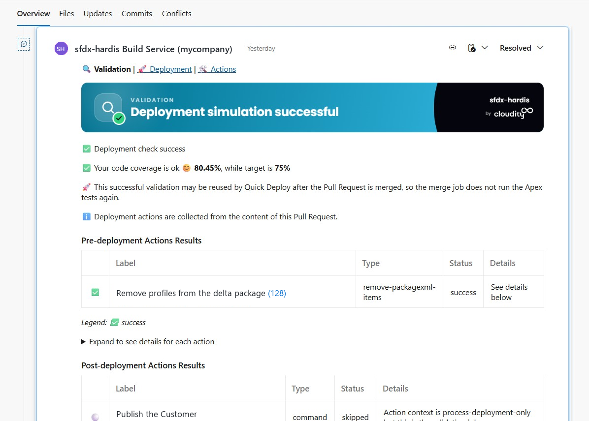
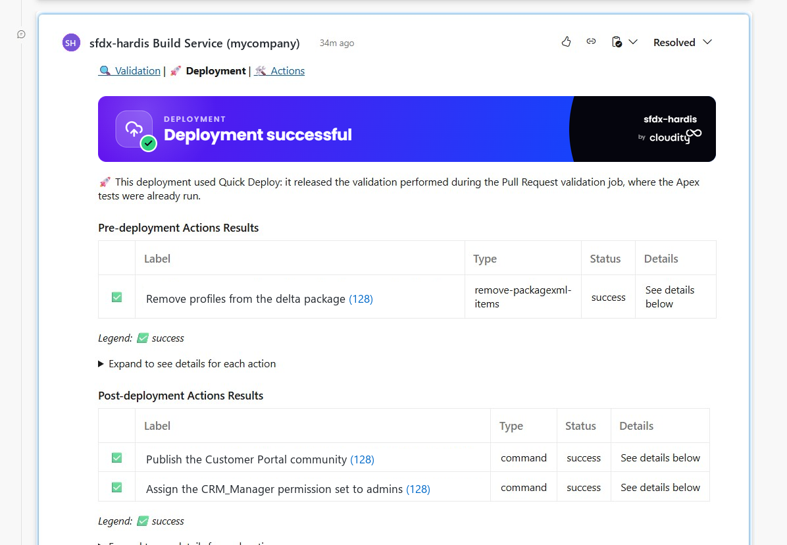
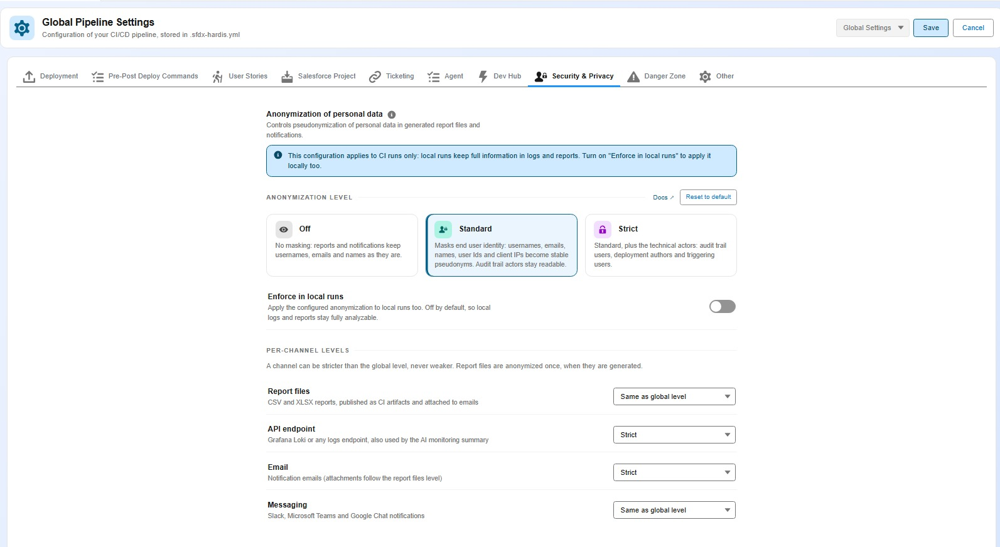
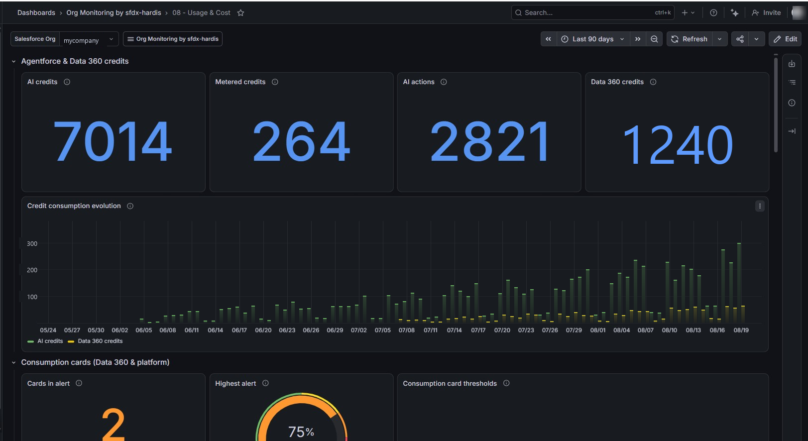

<!-- markdownlint-disable MD013 -->

# What's new in v8

[](https://sfdx-hardis.cloudity.com)

v8 ships the **sfdx-hardis plugin** and the **VS Code extension** together.

The headline is **Deployment Actions leaving beta**. But there is a lot more:

| What changed                                                                                  | Why you care                                                                                                     |
|-----------------------------------------------------------------------------------------------|------------------------------------------------------------------------------------------------------------------|
| [**VS Code extension rebuilt**](#the-vs-code-extension-got-a-full-redesign)                   | One consistent design, readable tables, and a command panel that shows a whole run on a single screen            |
| [**Everything runs faster**](#everything-runs-faster)                                         | Save / Publish my User Story reaches its first question in 5 seconds instead of 16                               |
| [**Deployment Actions are generally available**](#deployment-actions-are-generally-available) | Everything that must happen around a deployment is declared on the Pull Request and runs by itself, in every org |
| [**Pull Request comments redesigned**](#pull-request-comments-you-can-read-at-a-glance)       | You know in one second which comment you are reading and how the deployment went                                 |
| [**Smaller footprint, safer supply chain**](#lighter-and-safer)                               | Half the npm packages removed: faster installs and fewer dependencies to trust                                   |
| [**Personal data anonymized**](#personal-data-no-longer-leaves-your-org-in-clear-text)        | Names, emails, user Ids and IP addresses are pseudonymized in every report and every notification channel        |
| [**Usage and cost monitoring**](#watch-what-your-org-consumes-and-what-it-costs)              | Entitlements, consumption alerts and Agentforce credits, in percentages and in your own currency                 |
| [**Sandbox refresh covered end to end**](#sandbox-refresh-covered-end-to-end)                 | Connected Apps, Scheduled Apex and restores that survive a failure                                               |
| [**Flow deletion in destructive changes**](#deleting-a-flow-is-now-part-of-the-deployment)    | Deleting a Flow no longer means a manual step in every org                                                       |
| [**Pipelines run in the Docker image**](#pipelines-run-in-the-sfdx-hardis-docker-image)       | Faster jobs that a bad dependency release can no longer break                                                    |
| [**Professional support by Cloudity**](#free-and-supported-if-you-want-it)                    | Still free and open-source, with setup, support subscriptions and Release Manager as a Service if you need them  |

---

## The VS Code extension got a full redesign

Every panel now shares the same header, the same cards and buttons, the **official Salesforce color palette**, and colors that stay readable in **both light and dark themes**.



- The **Welcome page** shows your setup status at a glance: the Install Dependencies button becomes a live status, and is highlighted only when something actually needs you.
- **Tables are easier to scan** everywhere: alternate row colors, status as colored pills, initials avatars, branch chips, short dates. **Right-click any cell** to copy its value.
- In the **DevOps Pipeline** diagram, CI job status is color-coded consistently: blue animated for running, orange for pending, red for failed, green for success.



- The **command execution tab** now shows a whole run as a compact timeline that fits on one screen, with the command name, its status, the org it runs on, the elapsed time and a link to the log file.



- Questions are highlighted, long choice lists are **searchable in place**, and answered questions collapse to a single line showing your answer.
- Log lines carrying a **big JSON** or a very long text show only their beginning: click to expand, copy, or open in a VS Code tab.
- Every query gets a **record count chip** next to it: a running indicator while it executes, then the number of records it returned, or **Query failed**. SOQL, Tooling API, Bulk API and Data Cloud queries all report it.
- Once a command is over, **Run again** replays it with the same parameters.
- **Hovering any table cell** shows its full value, so a long text cut off by a narrow column stays readable.
- The Install Dependencies panel offers an **Upgrade** button that installs the required version, instead of a link to the repository, when your sfdx-hardis plugin is too old.
- **Extension Settings** are readable at last: real setting names, and each description visible under its name instead of hidden behind a hover icon.
- Panels **follow your VS Code theme** by default, so they no longer open in light mode inside a dark VS Code.

**Your orgs, color-coded**


- A status bar badge spells out the type of your default org: **PROD**, **MAJOR**, **SANDBOX**, **SCRATCH** or **DEV ORG**. Click it to open the Orgs Manager.
- The new **Org color mode** setting chooses how much of the window is colored: status bar only (the new default), title bar too, or the whole activity bar as before.
- **Select color for current org** now offers a palette with a live preview, instead of asking you to type a color code.

**Find any command**

- **7 new commands** in the Commands panel: MFA Readiness, Unsecure Permissions, Usage-Based Entitlements, Consumption Alerts, AI Credit Usage, Run Agentforce Tests and Data Dictionary.
- A new **Search** button lists commands from every category and filters as you type, including **17 extra commands** that are not displayed in the panel, like Deployments history analysis, Org licenses, Create sandbox org or Data Cloud SQL query.

---

## Everything runs faster

Waiting was the most common complaint about the extension. v8 attacks it from both sides.

| What you do                                                         | v7.23              | v8                  |
|---------------------------------------------------------------------|--------------------|---------------------|
| Click **Save / Publish my User Story**, wait for the first question | **16 s**           | **5 s**             |
| See the command switch from **Starting** to **Running**             | up to 5 s          | **about 1 s**       |
| Save a User Story with three automatic cleanings                    | 30 s of cleaning   | **a few seconds**   |
| Open a panel showing org information                                | 3 to 4 s each time | **instant**         |
| Open the Data or Files workbench on a project with large exports    | VS Code frozen     | **opens right away**|

### Clicking a command no longer means waiting

The biggest one: clicking **Save / Publish my User Story** or **New User Story** took 16 seconds to ask its first question. Ten of those seconds were spent doing strictly nothing, because of a handshake between the extension and the command that never completed. It is fixed on both sides, so you now get your first question in about 5 seconds.

The rest follows: the command panel says **Running** about a second after your click instead of sitting on **Starting**, and the org check that printed "You are already connected as..." before every single command is gone.

<details markdown="1">
<summary>Where the 16 seconds went</summary>

Measured end to end on `hardis:work:save`, with a bench harness spawning the real CLI against a mock extension and timestamping every WebSocket event.

| Phase between the click and the first question | v7.23      | v8         |
|------------------------------------------------|------------|------------|
| Node and oclif boot, WebSocket connect          | 0.8 s      | 0.8 s      |
| Waiting for the extension's go-ahead            | **10.0 s** | **0 s**    |
| Loading the command and its dependency tree     | 2.7 s      | overlapped |
| Org authentication check and configuration read | 1.5 s      | **0 s**    |
| Hooks, flag parsing and git calls               | 1.3 s      | 1.3 s      |
| **Total**                                       | **16.3 s** | **~5.2 s** |

The 10 seconds were a missed signal. The command waited for the extension to confirm that its panel was ready, with a 10-second safety timeout. The extension only listened for that "panel ready" signal once the command had connected, but panels open at click time and had already sent it, so the answer never came and every command launched from the UI paid the full timeout. The extension now answers immediately when the panel is already open, and the command loads itself during the wait instead of after it.

The command also announces itself before loading its whole implementation, which is what moves the panel to **Running**:

| Process launch to the "Running" announcement | v7.23   | v8         |
|-----------------------------------------------|---------|------------|
| `sf hardis:work:new`                          | 5074 ms | **749 ms** |
| `sf hardis:work:save`                         | 3844 ms | **754 ms** |

And the extension starts the process differently: directly instead of through Git Bash and the npm `sf` launcher script, reusing the compiled code of the CLI from one command to the next.

| Launch strategy (spawn to first prompt of `hardis:work:new`, median) | Time        |
|-----------------------------------------------------------------------|-------------|
| Git Bash and npm launcher script (v7.23)                              | 1985 ms     |
| Direct Node launch                                                    | 1664 ms     |
| Direct Node launch and compile cache (v8)                             | **1315 ms** |

</details>

### Org information appears instantly

The org badge, the org color, the Dev Hub lookup, the **Orgs Manager** list, the **Metadata Retriever** listings and the queries it runs all used to start a Salesforce CLI process behind your back, and wait 3 to 4 seconds for it to boot. They now answer in milliseconds, using the libraries of the Salesforce CLI already installed on your machine. Anything unusual still runs the real command, so nothing behaves differently.

The **Orgs Manager** also stops making you wait for the whole list: your orgs appear at once, and the **Connected** column fills in afterwards.

<details markdown="1">
<summary>Measured, against the real Salesforce CLI</summary>

Same project, same org, identical JSON returned in every case.

| Command                             | Salesforce CLI | In-process | Gain |
|-------------------------------------|----------------|------------|------|
| `sf config get target-org`          | 2635 ms        | **19 ms**  | 138x |
| `sf org display --target-org <org>` | 2695 ms        | **65 ms**  | 41x  |
| `sf config set target-org=<value>`  | 2730 ms        | **70 ms**  | 39x  |
| `sf org display`                    | 2843 ms        | **225 ms** | 13x  |

The extension covers `sf org list`, `sf org list metadata` and `sf data query` as well, in a worker thread so the interface stays responsive: `sf org list` **8x** faster, listing 1481 CustomObjects **11x** faster, a SOQL query **39x** faster.

Every `sf` process started by sfdx-hardis also skips its log file, its "new version available" check and its autoupdate probe, which saves another **400 to 750 ms per call**. Set `SFDX_HARDIS_ENHANCE_PERFORMANCE=false`, or check **Disable performance enhancements when calling sf commands** in the extension, to run the plain commands everywhere.

</details>

### Saving a User Story stops scanning your whole repository

The automatic cleanings applied when you save used to start their own Salesforce CLI, one after the other, and the Flow cleaning went through every Flow of the repository even when your User Story touched none. A project with three cleanings configured gets **about 30 seconds back on every save**.

<details markdown="1">
<summary>Measured on a project of 3235 tracked files</summary>

| Operation                                                                                     | Before    | After      |
|-----------------------------------------------------------------------------------------------|-----------|------------|
| One cleaning of [hardis:project:clean:references](hardis/project/clean/references.md)          | 11 248 ms | **34 ms**  |
| Resolving 500 metadata files by name                                                          | 2237 ms   | **26 ms**  |
| [hardis:lint:metadatastatus](hardis/lint/metadatastatus.md) source scan                        | 1708 ms   | **216 ms** |
| [hardis:misc:custom-label-translations](hardis/misc/custom-label-translations.md) source scan  | 1579 ms   | **606 ms** |
| `purge-references` source scan                                                                | 342 ms    | **192 ms** |

The cleanings now run inside the current process instead of spawning a CLI each, the Flow positions cleaning is restricted to the Flows of your git delta and skipped entirely when there is none, and a full pass over the 88 places the plugin walks your sources removed the walks that were scanning `node_modules` or repeating themselves once per metadata type.

</details>

### VS Code stops freezing

| Before                                                                                                        | Now                                                                                            |
|---------------------------------------------------------------------------------------------------------------|------------------------------------------------------------------------------------------------|
| Clicking a command could wait **more than 10 seconds** for the Salesforce CLI to boot before showing anything | The execution tab opens **immediately** on click                                               |
| Commands run in a terminal waited for the terminal to be ready                                                | They **start immediately**, and use **Git Bash** automatically on Windows when it is installed |
| VS Code could freeze several times a day after a file was created or renamed                                  | Fixed, and VS Code **starts faster**                                                           |
| Commands clicked right after startup were rejected with "not initialized yet"                                 | They just run                                                                                  |
| Panels could stay stuck on a loading spinner                                                                  | They load, and a display error shows a **Try again** button                                    |
| The Data and Files workbenches froze VS Code while they opened                                                | They open right away, whatever the size of your exports                                        |
| Searching your sources walked `node_modules`, and the Metadata Retriever was slow on projects with many types | Folders holding no Salesforce metadata are skipped, and the sources are read once              |

<details markdown="1">
<summary>What was slowing them down</summary>

- The Data and Files workbenches read **every exported CSV whole**, byte by byte, just to display a line count. An SFDMU export routinely holds files of several hundred megabytes. Files are now read by chunks, and anything above 50 MB shows **Not counted** instead.
- Searching the sources passed no exclusion list at all, so `node_modules` was walked every time. `.claude` and `.cursor` are skipped too, which is also a correctness fix: the example metadata their instructions can hold was picked up as source of the project.
- The Metadata Retriever ran one walk per metadata type and per package directory, so a retrieve listing 20 types walked your sources 40 times. It now reads them once.
- The extension bundle is **just under 1 MB** instead of several megabytes: the TypeScript compiler pulled in by a configuration loader is gone, the Git and ticketing providers load on demand, and the 3.3 MB MermaidJS library is loaded only by the panel that draws diagrams instead of every panel, including the Welcome page.

</details>

The plugin got its share too: the upgrade check no longer delays startup, [hardis:org:purge:flow](hardis/org/purge/flow.md) deletes Flow versions much faster with fewer API calls, and [hardis:project:clean:profiles-extract](hardis/project/clean/profiles-extract.md) fetches record counts and field extracts concurrently.

New at startup: a warning when the Salesforce Extensions setting **Source Tracking: Enable Conflict Detection** is on, because it checks conflicts in the background and slows down the whole VS Code. One click disables it.

### Expert mode: the questions you always answer the same way

*Ships in v8.4.0.*

Once you have saved your hundredth User Story, the confirmations stop being useful. Turn on **Expert user mode** in the extension settings (or set `SFDX_HARDIS_EXPERT_MODE=true`) and [hardis:work:save](hardis/work/save.md) stops asking whether your metadata is committed, which cleanings to apply, whether to push, and the data export questions. It applies the cleanings listed in `autoCleanTypes`, pushes, and opens the Merge Request page in your browser.

Questions that ask for a **real choice** stay, like the target branch when it cannot be guessed.

---

## Deployment Actions are generally available

This is the major enhancement of v8. **Deployment Actions** were a beta feature of the DevOps Pipeline. They are now a fully supported part of the workflow, in the extension and in the CI/CD jobs.

A deployment action is anything that must happen **around** a metadata deployment, and that used to be a line in a checklist someone had to remember:


| Action type                  | What it does                                                              |
|------------------------------|---------------------------------------------------------------------------|
| **Command**                  | Runs a Salesforce CLI or sfdx-hardis command                              |
| **Data**                     | Loads an SFDMU data workspace (reference data, settings records)          |
| **Apex**                     | Runs an anonymous Apex script                                             |
| **Schedule Batch**           | Schedules an Apex batch with its CRON expression                          |
| **Publish Community**        | Publishes an Experience Cloud site                                        |
| **Remove package.xml items** | Excludes metadata from the deployment package                             |
| **Manual**                   | Describes a step a human must do in Setup, and tracks whether it was done |

**What you get in v8:**

- Declare the actions of your User Story from the **DevOps Pipeline**, in the **Deployment Actions** tab of your Pull Request. No YAML to write.
- **Restrict an action to the orgs that need it**: everywhere, only on some major branches, everywhere except a few, or only on **developer sandboxes**. The branch selector labels its two columns **Runs here** and **Does not run here**, and spells out the result in a sentence, so there is no doubt about whether you picked the orgs that run the action or the ones that skip it.
- A **manual** action opens with a click-by-click template, because the person replaying it in the next org is rarely the one who wrote it: exact Setup path, exact item name, value to set, and how to check it worked.
- New actions are created with **Run only once by org** enabled, so an action does not replay at every deployment to the same org.
- Actions now also run when you **merge into production**, and are **replayed downstream** when a retrofit branch carries a hotfix to another major branch.
- **Follow their execution from the Pull Request**: a status matrix with one row per action and one column per org branch, and a checklist of the manual steps still pending. Each action's details are laid out as a **properties table** and an **org-by-org results table**, instead of a run of bold key/value pairs.
- **Tick a manual action as done** directly in a Pull Request comment. The next job records it and ticks the same box in the other comments.
- A failed action now **says why it failed**, in the job log and in the Pull Request comment. An action declared with `allowFailure` shows as a **warning**, not as a failure, and no longer turns the comment banner red, since the deployment went through.
- A Pull Request **between two major branches** (a promotion) lists the actions declared on the feature Pull Requests it carries, with their author, instead of asking you to declare new ones.
- The **validation job of a feature branch only carries its own Pull Request**. It used to collect every Pull Request ever merged upstream, 341 of them on one project, and list their manual actions in your check comment.
- Not for you? `disableDeploymentActions` (or `SFDX_HARDIS_DISABLE_DEPLOYMENT_ACTIONS`) turns the whole feature off.



> The [Deployment Actions guide](salesforce-ci-cd-work-on-task-deployment-actions.md) was rewritten for v8, with one illustrated section per action type.

---

## Pull Request comments you can read at a glance

sfdx-hardis posts up to three comments on a Pull Request. Until v8 they all looked the same. Now each one opens with a **colored banner** that says what it is and how it went.



Each comment type has its own color, so you tell them apart while scrolling:



- A **navigation line** links the three comments together, and is also added at the top of the Pull Request description, so you never scroll to find the right one.
- The check job comment is now called **Validation Results (deployment simulation)**, so it can no longer be mistaken for the real deployment.
- The **Deployment Actions** comment shows the status matrix, the pending manual actions, a legend and a last-updated date.
- Comments **only mention what they contain**: no more empty sections, no more legends listing statuses that are not in the table.
- They also **explain themselves**: which Pull Requests the actions and Apex tests were collected from, and when **Quick Deploy** applies, so "Apex tests: none run" on a merge job is no longer a surprise.
- The **commits summary** is collapsed, hides technical merge commits and truncates very long commit bodies.
- The **Tickets** section warns when JIRA details could not be retrieved, instead of silently showing bare links. All the JIRA credentials you configured are tried until one works, and an authentication failure is now reported in the comments and the release notes instead of passing unnoticed.
- URLs are **clickable in every generated XLSX**, so a report opened from a comment link takes you straight to the org.

Prefer plain comments? Set `SFDX_HARDIS_PR_COMMENT_BANNERS=false`, `SFDX_HARDIS_PR_COMMENT_NAV=false` or `SFDX_HARDIS_PR_DESCRIPTION_NAV=false`.

---

## Lighter, and safer

Both projects went on a diet, for the same reason: every third-party package is code you have to trust.

|                                        | Before (v7.23) | v8                                                                                                                                 |
|----------------------------------------|----------------|------------------------------------------------------------------------------------------------------------------------------------|
| **Plugin** direct dependencies         | 65             | **42** (axios, xml2js, openai, cloudflare, md-to-pdf, fs-extra, inquirer, octokit, farmhash, ora, open, dotenv and others removed) |
| **Plugin** total packages installed    | 1091           | **518** (**-53%**)                                                                                                                 |
| **Extension** direct dependencies      | 28             | **14**                                                                                                                             |
| **Extension** total packages installed | 327            | **287**                                                                                                                            |

Widely used but replaceable packages were replaced by capabilities already built into Node.js and VS Code, with no change in behavior. Fewer packages means a **smaller supply-chain attack surface**, less exposure to a compromised or vulnerable dependency, and a **faster install** of the plugin, the extension and the Docker images.

A guardrail keeps it that way: the plugin test suite fails when a dependency is declared but never imported, or when the lock file grows past a ceiling.

---

## Personal data no longer leaves your org in clear text

Monitoring jobs produce reports and notifications full of names, emails, user Ids and IP addresses, and they push them to shared destinations: CI artifacts kept for weeks, a Slack channel half the company can read, an observability backend, an email thread. v8 pseudonymizes all of it before it leaves the machine.



It applies to **everything a job sends out**: the report files attached to emails and published as CI artifacts, the Grafana payloads, and the Email, Slack, Microsoft Teams and Google Chat messages. Previously only the API endpoint was covered.

Pick the level from the **Security & Privacy** tab of the Pipeline Settings, or the **Data anonymization** card of the Monitoring Config Workbench. Each one tells you exactly what it masks:

| Level                        | What it replaces                                                     |
|------------------------------|----------------------------------------------------------------------|
| **Off**                      | Nothing                                                              |
| **Standard** (default in CI) | Names, emails, user Ids, IP addresses and hostnames                  |
| **Strict**                   | Standard, plus who created, modified, deployed or triggered anything |

**Your dashboards keep working.** The same person always gets the same pseudonym, so distinct-user counts stay right, Grafana drill-downs still group, and a name you see on a dashboard matches the same name in the XLSX report of that run.

Reports you generate on your own machine are **not** anonymized, because they have to stay readable for you.

<details markdown="1">
<summary>Technical details</summary>

- **Standard** replaces usernames, emails, first, last and display names, Salesforce user record Ids, client IPs and resolved hostnames with `user_<hash>`, `id_<hash>` and `ip_<hash>`. **Strict** adds the technical actor fields: `CreatedBy`, `LastModifiedBy`, `DelegateUser`, `DeployedBy` and `TriggeredBy`.
- Pseudonyms are salted per org, so they are stable across runs of the same org and cannot be matched across orgs.
- Beyond report files, notifications and API payloads, the files feeding the **AI executive summary** and the PPTX monitoring report are covered, as well as the tables printed in the CI job logs.
- Levels can be **raised for a single channel** (report files, API endpoint, email, messaging) when one destination must be stricter than the others.
- `SFDX_HARDIS_ANONYMIZE=off|standard|strict` overrides everything, and the `enforceLocally` property applies the configured level to local runs too.

</details>

> The new [Security & Privacy](salesforce-security-privacy.md) page gathers the whole picture: no sfdx-hardis servers, no telemetry, where your data can go for each integration, and the anonymization reference.

---

## Watch what your org consumes, and what it costs

Salesforce bills more and more on usage. Three new monitoring commands make that visible before the invoice does.

| Command                                                                     | What it reports                                                                                                                                                     |
|-----------------------------------------------------------------------------|---------------------------------------------------------------------------------------------------------------------------------------------------------------------|
| [**Usage-based entitlements**](salesforce-monitoring-usage-entitlements.md) | Einstein Requests, Flex Credits, Data 360 credits, API calls, and a **warning when consumption is on track to exceed the allowance** before the billing period ends |
| [**Consumption alerts**](salesforce-monitoring-consumption-alerts.md)       | The consumption and license utilization alerts Salesforce raises on the org                                                                                         |
| [**Agentforce and Data 360 credits**](salesforce-monitoring-ai-usage.md)    | Credit consumption broken down **by agent and by action** (requires Data 360)                                                                                       |

Declare your contracted rates in `usageCost`, and the reports show **money next to the percentages**, in your own currency.



A new **"08 - Usage & Cost"** dashboard joins the Grafana v2 set for entitlement consumption, projected overage, utilization alerts and AI credits. The **"05 - Security Posture"** dashboard gets a new **MFA readiness** section listing the privileged users who are not passkey-ready yet.

Two MFA fixes matter here: privileged users whose permissions come from a **Permission Set Group** were missed by the report, and an org where neither built-in authenticators nor security keys are enabled now raises an error, because no user can register the method Salesforce requires.

A monitoring run that skips most of its commands used to look exactly like a broken one. It now opens by stating whether **frequency gating** is active or was forced, and its summary keeps a row for every configured command, including the ones `skipped` by their frequency and the ones `disabled` in your configuration.

---

## Sandbox refresh, covered end to end

Refreshing a sandbox destroys more than metadata. v8 closes the gaps that used to end in a manual checklist.

- **Connected Apps**: Salesforce no longer lets you restore them after a refresh. `before-refresh` now lists the ones **not yet converted to External Client Apps** and pauses, so you can convert them while it still matters.
- **External OAuth apps** (OwnBackup and other tools connected with "Log in with Salesforce") cannot be saved at all. The command no longer fails on them: it captures what will need re-authentication and `after-refresh` displays it as a **manual actions checklist**.
- **Scheduled Apex**: one Apex script is generated **per user**, to reschedule their jobs with their original owner using "Login As" and Execute Anonymous.
- **Several sandboxes in parallel**: selections and reports are kept separate for each sandbox, so preparing one refresh no longer overwrites the choices of another.
- **A failed restore is resumable**: `after-refresh` detects the steps already done and asks before redoing them, and lists the components the org rejected with their error so you can fix the manifest and run it again.

> See the [Sandbox Refresh guide](salesforce-sandbox-refresh.md).

---

## Deleting a Flow is now part of the deployment

Removing a Flow used to be a manual step in every org, because a Flow deletion can neither be validated by a `--check` deployment nor survive a Quick Deploy.

In v8, a Flow listed in your destructive changes is **deactivated then deleted through the Tooling API**, version by version, and the validation job reports the deletion plan in the Pull Request comment.

- The `--check` job **fails early** if Flow Interviews block a deletion, instead of failing at deployment time.
- Set the `FLOW_DELETE_INTERVIEWS` keyword on the Pull Request (or `flowDeleteInterviews` in your configuration) to authorize deleting the blocking Flow Interviews.<br/>**Caution: deleting Flow Interviews is irreversible and destroys in-flight process state.**
- The extension exposes the matching settings, including **Flow Delete Interviews** in the Danger Zone.

Two related fixes: **Reports and Dashboards** are no longer overwritten when the target org holds them in a different folder than your sources (their API name is unique org-wide), and the deployment warns when a package lists the same Report or Dashboard API name under several folders.

---

## Pipelines run in the sfdx-hardis Docker image

The default **GitHub Actions**, **Azure Pipelines** and **Bitbucket Pipelines** workflows now run in the sfdx-hardis Docker image, like GitLab always did.

- Jobs no longer install Node.js, the Salesforce CLI and its plugins at every run: they **start faster** and can no longer be broken by a bad release of a dependency.
- To let the pipeline **auto-fix deployment errors with coding agents**, switch to the `ghcr.io/hardisgroupcom/sfdx-hardis-ubuntu-with-agents:latest` image.
- Images are published to **GitHub Container Registry** (`ghcr.io/hardisgroupcom/sfdx-hardis`), the recommended default, and mirrored on Docker Hub.
- **Existing pipelines keep working**: the templates apply when you initialize a new project or monitoring repository.

Two new pages help you check your setup: the [CI/CD Setup Checklist](salesforce-ci-cd-setup-checklist.md) and [how to publish job artifacts](salesforce-ci-cd-setup-publish-artifacts.md) on any platform.

---

## Before you upgrade

A few behaviors changed on purpose. Check these if they apply to your project.

| Change                                                                                                                                                                                                                                                        | What to do                                                                                                                                                    |
|---------------------------------------------------------------------------------------------------------------------------------------------------------------------------------------------------------------------------------------------------------------|---------------------------------------------------------------------------------------------------------------------------------------------------------------|
| **Post-deployment actions no longer run when the deployment failed.** The `skipIfError` property is removed and ignored.                                                                                                                                      | If an action relied on `skipIfError: false` to run after a failed deployment, move it elsewhere.                                                              |
| **`packageXmlToDeploy`, `packageXmlToDelete` and `packageXmlToDeletePreDeploy` are no longer ignored.** A bug made the default `manifest/` and `config/` paths always win, so a custom destructive manifest could delete nothing and still exit with success. | If you set one of these properties, review what your next deployment will actually deploy and delete.                                                         |
| **A Flow in destructive changes is deleted outside the deployment transaction.**                                                                                                                                                                              | A failed deployment leaves the Flow deactivated or deleted instead of rolling it back. Every step is re-runnable, so retrying the pipeline converges.         |
| **`--check` no longer validates Flow destructive members against the org.**                                                                                                                                                                                   | A Flow missing from the target org is reported as `FLOW_DELETE_NOOP` and passes, because the same destructive changes are replayed along the promotion chain. |
| **Reports, notifications and CI logs produced in CI are anonymized** at the `standard` level by default.                                                                                                                                                       | If a downstream tool of yours reads real usernames or emails out of them, set `SFDX_HARDIS_ANONYMIZE=off`, or lower the level of that single channel.          |
| **Connected Apps can no longer be restored after a sandbox refresh.**                                                                                                                                                                                         | Convert them to External Client Apps before your next refresh.                                                                                                |
| **The plugin requires Node.js 22 or more**, like the Salesforce CLI.                                                                                                                                                                                          | Upgrade Node.js on machines and CI runners that still use Node.js 20.                                                                                         |

---

## How to upgrade

```shell
# Plugin
sf plugins install sfdx-hardis
```

- **VS Code extension**: VS Code updates it automatically. Check the version on the Welcome page.
- **CI/CD pipelines**: they use `latest` by default. Pin a version if your policy requires it.
- **Monitoring repositories**: no action needed, unless you want the new dashboards. Run [hardis:org:configure:grafana-dashboards](hardis/org/configure/grafana-dashboards.md) to get the Usage & Cost dashboard.

---

## Free, and supported if you want it

sfdx-hardis is **open-source and free**, with no license fee, no per-contributor pricing and no vendor lock-in. Everything runs on your Git platform, your CI runners and your VS Code. There are no sfdx-hardis servers, and your data never leaves your infrastructure.

Community support is available through [GitHub Issues](https://github.com/hardisgroupcom/sfdx-hardis/issues){target=blank}, handled by maintainers and contributors in their available time.

If your team needs more, **[Cloudity](https://cloudity.com/){target=blank}**, the company behind sfdx-hardis, offers professional services around it:

- **Setup and migration**: get your pipeline, your monitoring and your orgs configured by the people who build the tool.
- **Support subscription**: guaranteed response times, a pool of Salesforce DevOps experts, and proactive alerts on Salesforce changes that affect your pipelines.
- **Release Manager as a Service**: a Cloudity release manager drives your Pull Requests, deployments and releases, permanently or as holiday cover.
- **Training and coaching**: bring your admins, developers and release managers up to speed on the v8 workflow.

Subscriptions also fund the development of the open-source project, the new features and the security patches everyone benefits from.

<div style="text-align:center; margin:2rem 0;">
  <a href="https://cloudity.com/contact-us/" target="_blank" rel="noopener noreferrer">
    
  </a>
  <br/>
  <a href="https://cloudity.com/contact-us/" target="_blank" rel="noopener noreferrer" role="button" aria-label="Cloudity Professional Services"
     style="display:inline-block; padding:0.75rem 1.25rem; background:#0070d2; color:#ffffff; text-decoration:none; border-radius:0.25rem; font-weight:600; margin-top:1rem;">
    Talk to a Cloudity expert
  </a>
</div>

---

## The complete lists

- [sfdx-hardis changelog](CHANGELOG.md)
- [VS Code extension changelog](https://github.com/hardisgroupcom/vscode-sfdx-hardis/blob/main/CHANGELOG.md){target=blank}
