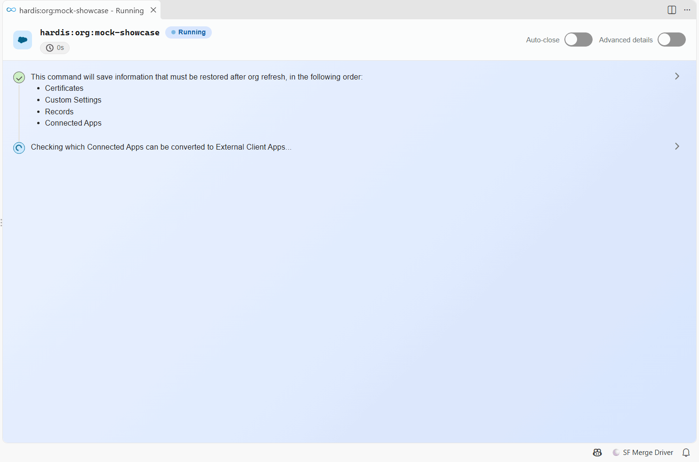
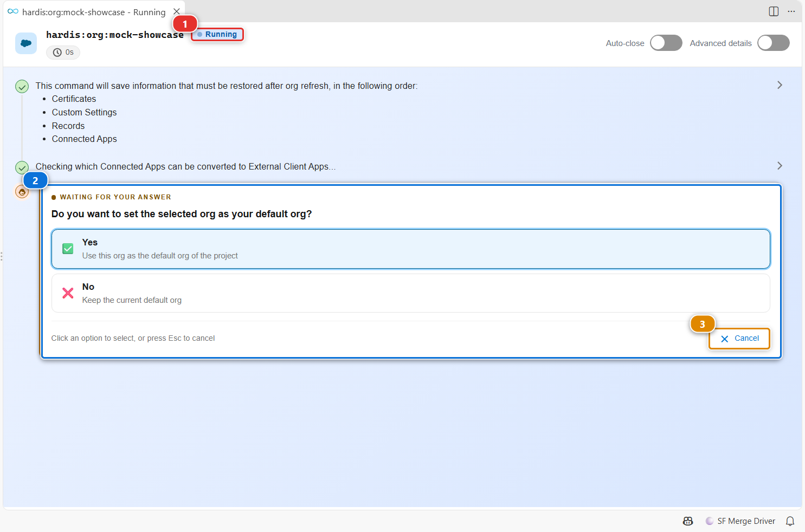
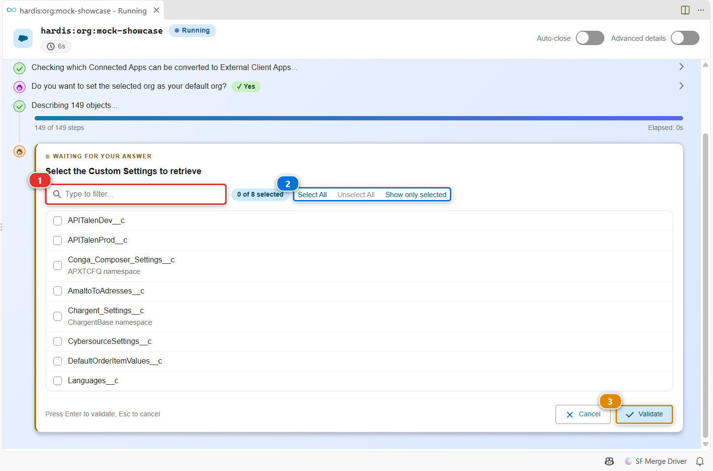
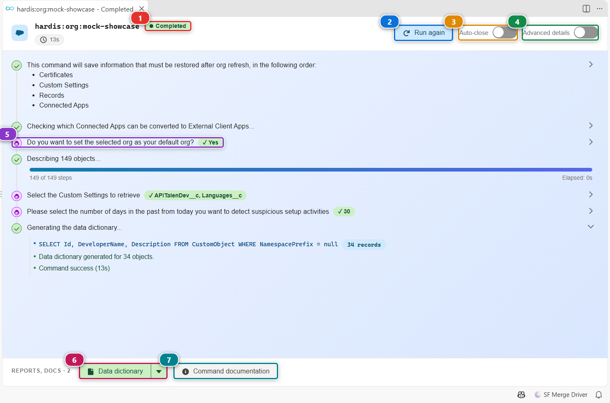

<!-- markdownlint-disable MD013 -->

# Command execution panel

Every sfdx-hardis command started from the extension runs in its own tab. The panel shows the steps as a timeline, asks the command's questions as forms, draws progress bars and tables, and gathers the report files at the bottom. You never have to read raw terminal output.

## Open it

You do not open it yourself: it opens as soon as you start a command, from a menu of the side bar, a card of a workbench or a custom command of your team. Several commands can run side by side, each in its own tab.

## Answer a question

When the command needs an answer, the badge **(1)** says **Running** and the question shows in the timeline **(2)**, highlighted as **Waiting for your answer**. Click an option to answer. **(3)** cancels the question, which stops the command.

## Pick several values

Some questions accept several values:

1. Type in **(1)** to filter a long list.
2. **(2)** counts the selected values and selects or unselects them all at once. **Show only selected** hides the rest.
3. Check the values you want, then click **(3)** or press Enter.

## Read the result

- **(1)** gives the final status: **Completed**, or **Failed** with the error in the timeline.
- **(2)** runs the same command again in this tab, with the same arguments.
- **(3)** closes the tab by itself the next time this command succeeds.
- **(4)** shows the advanced details: the sub-commands and the full logs of each step.
- **(5)** each answer you gave stays in the timeline. Click a line to expand what it did.
- **(6)** opens a report file produced by the command. Its arrow offers the other ways to open it, for example in VS Code instead of the default application.
- **(7)** opens the documentation of the command on this site.

## Customize

| What | Setting |
|---|---|
| Always show the advanced details | `vsCodeSfdxHardis.showCommandsDetails` |
| Close the tab automatically when these commands succeed | `vsCodeSfdxHardis.autocloseCommands` (list of commands, filled by toggle **Auto-close**) |
| Run these commands in a terminal without asking, when they cannot run in the background | `vsCodeSfdxHardis.autorunCommands` |
| Run commands in the background or in a terminal | `vsCodeSfdxHardis.userInputCommandLineIfLWC` (`background` or `terminal`) |
| Skip the confirmation questions you always answer the same way | `vsCodeSfdxHardis.userModeExpert` |

These settings are also in the **User Input** tab of the extension settings, see [Customize the extension](vscode-extension-customize.md).
