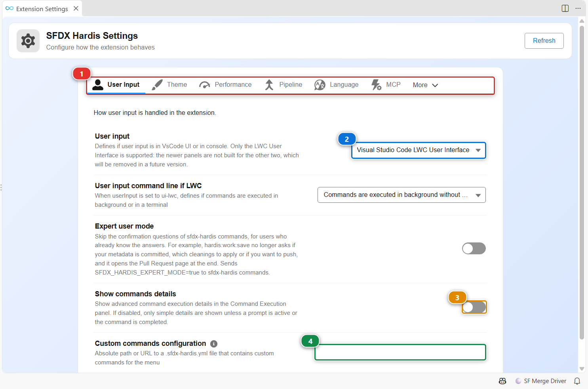

<!-- markdownlint-disable MD013 -->

# Customize the extension

Most of the extension works without any setting. This page lists what you can change, and where: the settings of the extension itself, and the keys of `.sfdx-hardis.yml` that the whole team shares through git.

## Open the extension settings



Click the gear of the [Welcome panel](vscode-extension-welcome.md) toolbar, or run **SFDX Hardis: Extension Settings** from the command palette. The settings are grouped in tabs **(1)**: user input, theme, performance, pipeline, language, MCP, and more.

- **(2)** decides where commands ask their questions. Keep **Visual Studio Code LWC User Interface**: the panels of the extension are built for it.
- **(3)** always shows the advanced details of the [command execution panel](vscode-extension-command-runner.md).
- **(4)** points to a `.sfdx-hardis.yml` file, local or at a URL, whose custom commands are added to your menus (see below).

Every value is a regular VS Code setting prefixed with `vsCodeSfdxHardis.`, so you can also set it in `settings.json`, for yourself or for the workspace.

## Color VS Code by org type

A badge in the status bar shows the type of your default org: **PROD**, **MAJOR**, **SANDBOX**, **SCRATCH** or **DEV ORG**. Click it to open the [Orgs Manager](vscode-extension-orgs-manager.md). The window is colored with the same palette as the panels, so you never confuse production with a sandbox:

- **Production**: red
- **Major sandbox** (UAT, integration...): orange
- **Dev sandbox**: green
- **Scratch org**: cyan
- **Other** (Developer Edition, trial...): blue

| What | Setting |
|---|---|
| How much of the window is colored | `vsCodeSfdxHardis.orgColorMode`: `accent` (status bar, default), `tinted` (title bar too), `full` (activity bar too) or `off` |
| Save the colors for the workspace or for you | `vsCodeSfdxHardis.colorUpdateLocation`: `Workspace` or `User` |
| Hide the org type badge | `vsCodeSfdxHardis.showOrgStatusBarItem` |

The colors follow your light or dark theme and are never applied on high contrast themes. You can also pick a custom color for the current org, from a palette with a live preview.

## Language and theme

The extension is translated into English, French, Spanish, German, Italian, Dutch, Polish, Japanese and Brazilian Portuguese. Pick the language from the flag of the Welcome panel, or set `vsCodeSfdxHardis.lang` (`auto` follows VS Code). The panels use a light or dark theme, set from the sun icon of the Welcome panel or with `vsCodeSfdxHardis.theme.colorTheme`.

## Add your own menus and commands

Declare menus in `.sfdx-hardis.yml` to give your team its own entry points. Each menu shows as a card on the Welcome panel and as a section of the **Commands** tree. A command can be any shell command, not only an sfdx-hardis one.

```yaml
customCommandsPosition: first # or last (default)
customCommands:
  - id: team-tools
    label: Team tools
    description: The commands our team runs every day
    sldsIcon: utility:apps # icon of the Welcome panel card
    vscodeIcon: symbol-misc # icon of the Commands tree section
    commands:
      - id: generate-manifest
        label: Generate manifest
        tooltip: Generates a package.xml from the local sources
        command: sf project generate manifest --source-dir force-app --name myNewManifest
        vscodeIcon: file
        sldsIcon: utility:file
      - id: list-orgs
        label: List all orgs
        command: sf org list --all
```

To share the same menus across several projects, publish that file at a URL and point the **Custom commands configuration** setting (`vsCodeSfdxHardis.customCommandsConfiguration`) to it. A CLI plugin can also add menus of its own, see [Creating sfdx-hardis plugins](sfdx-hardis-plugins.md#5-expose-custom-menus-in-the-vs-code-extension).

## Check extra CLI plugins

The **Dependencies** tree of the side bar checks that the Salesforce CLI and its plugins are installed and up to date, and upgrades them in one click. Add the plugins your team needs with `customPlugins` in `.sfdx-hardis.yml`:

```yaml
customPlugins:
  - name: mo-dx-plugin
    helpUrl: https://github.com/msrivastav13/mo-dx-plugin
```

## Side bar trees

The SFDX Hardis side bar holds three trees next to the workbenches:

- **Commands**: every sfdx-hardis command, organized by menu, with a help button that opens its page on this site.
- **Status**: current default org, Dev Hub, git repository, branch and org expiration date.
- **Dependencies**: the Salesforce CLI, its plugins and the other tools, each with its version.

## Apex tools

- **SFDX Hardis: Run anonymous Apex code** runs Apex against your default org, like the Developer Console.
- **SFDX Hardis: Activate debug logs tracing**, **Display live logs in terminal** and **Deactivate debug logs tracing** follow the logs of your org, filtered to keep the `USER_DEBUG` lines if you want.
- **SFDX Hardis: Toggle checkpoint** and **Run apex replay debugger** replay a debug log in the VS Code debugger.
