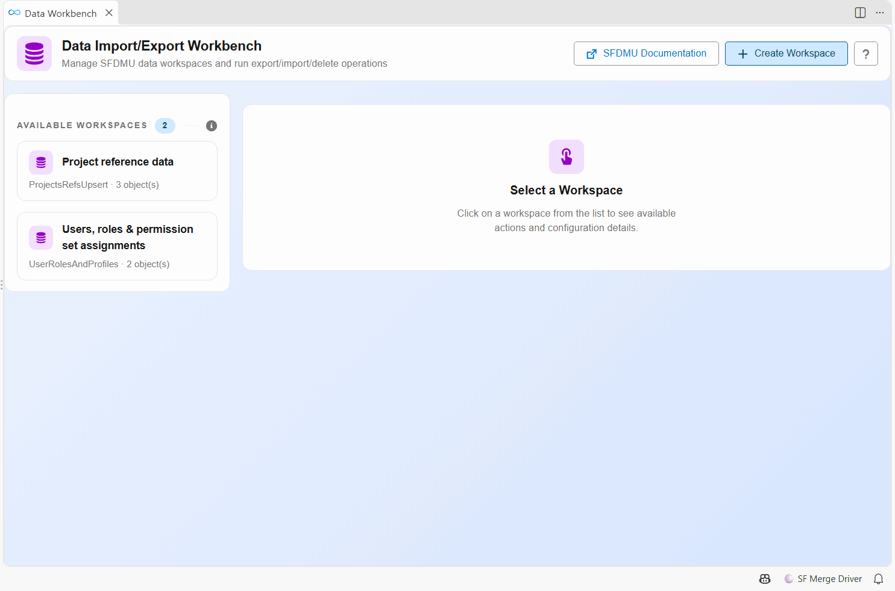
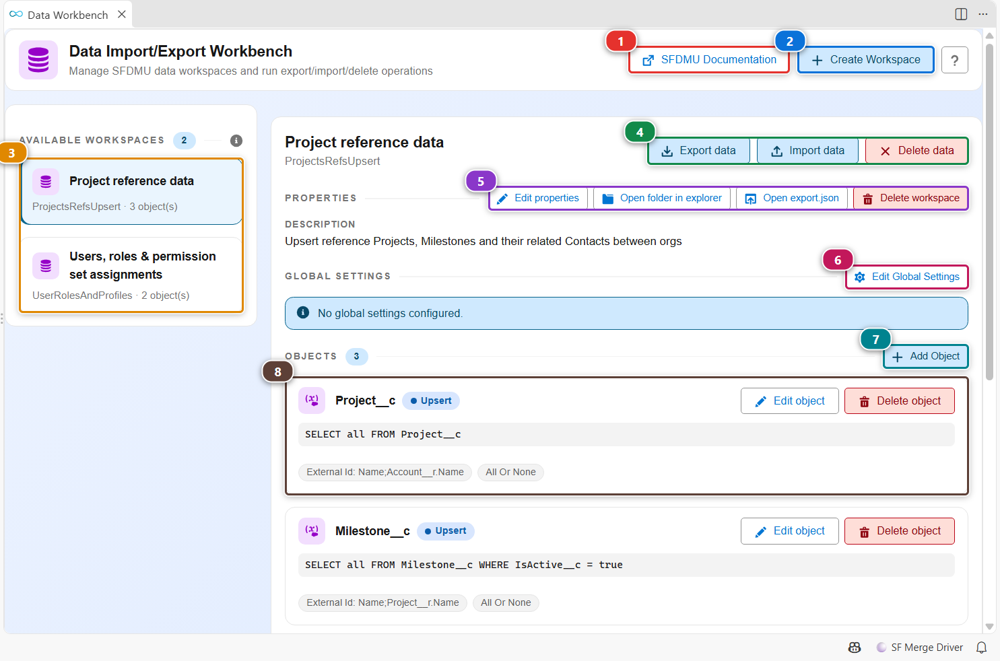
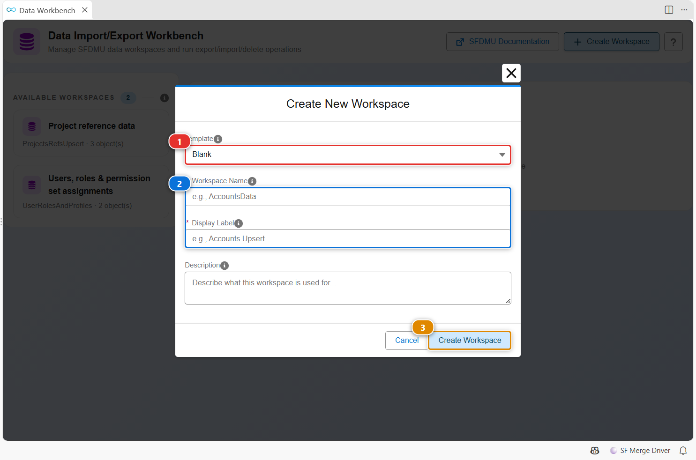
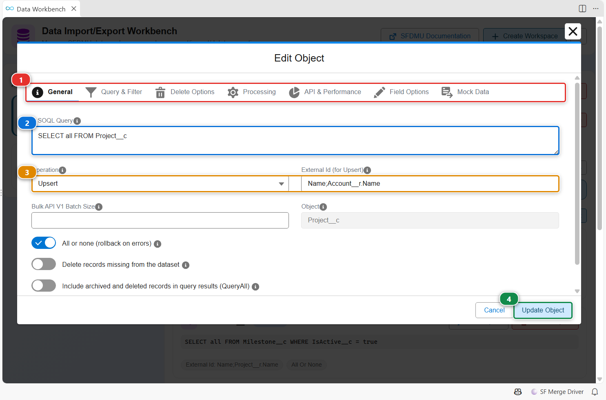
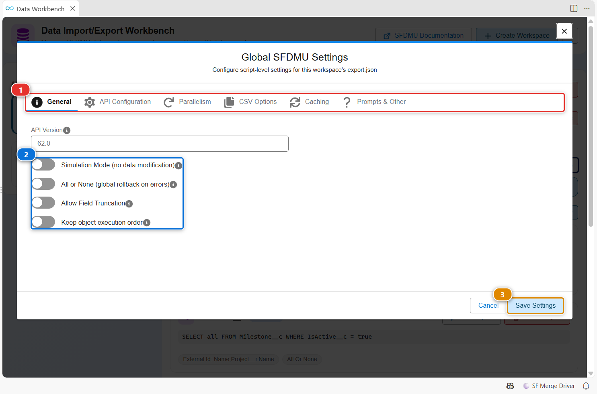

<!-- markdownlint-disable MD013 -->

# Data Workbench

The Data Workbench is a visual editor for [SFDMU](https://help.sfdmu.com/) workspaces. A workspace describes which records to move: the objects, the SOQL query of each one, the external id used to match records, and the operation (insert, update, upsert...). The workbench writes the `export.json` for you, then exports, imports or deletes the data in one click.

Workspaces live in `scripts/data/<workspace>/export.json` of your project, so they are shared through git like the rest of your configuration. A [deployment action](salesforce-devops-work-on-user-story-deployment-actions.md) can import a workspace automatically when a Pull Request is deployed.

## Open it

- Click **Data Workbench** in the **Data Import/Export** menu of the side bar.
- Click the **Data Workbench** card of the [Welcome panel](vscode-extension-welcome.md).

## Find your way around

- **(3)** lists the workspaces of the project. Click one to open it.
- **(4)** runs the workspace against an org: **Export data** writes the records of an org as CSV files in the workspace folder, **Import data** loads those files into an org, **Delete data** deletes the matching records in an org. Each one asks for the org.
- **(5)** edits the name and description of the workspace, opens its folder or its `export.json`, or deletes it.
- **(6)** opens the settings of the whole workspace (see below).
- **(7)** adds an object, and **(8)** shows each object with its query, its operation and its options.
- **(1)** opens the SFDMU documentation, and **(2)** creates a workspace.

## Create a workspace

1. Click **Create Workspace**.
2. Start from a template in **(1)**, or keep **Blank**. Templates cover known setups, such as CPQ or Conga configuration, or the anonymization of contact emails.
3. Give the workspace a folder name and a label **(2)**. The label is what the list shows.
4. Click **(3)**. The workspace appears in the list, ready for its objects.

## Add or edit an object

Click **Add Object**, or **Edit object** on an existing one.

1. The tabs **(1)** group the SFDMU options of the object: query and filter, delete options, processing, API and performance, field options, mock data for anonymization.
2. Write the SOQL query in **(2)**. `SELECT all FROM Project__c` takes every field.
3. Pick the operation and the external id in **(3)**. For an upsert, the external id is the field, or combination of fields, that identifies the same record in both orgs, for example `Name;Account__r.Name`.
4. Click **(4)** to save it in `export.json`.

## Set options for the whole workspace

Click **Edit Global Settings**. The tabs **(1)** hold the script-level options of SFDMU. The first ones **(2)** are the most used: simulation mode to test an import without changing anything, all or none to roll back everything on an error. Click **(3)** to save.

## Customize

| What | Where |
|---|---|
| Your workspaces | `scripts/data/<workspace>/export.json`, edited by the workbench or by hand |
| Run a workspace from a terminal or a pipeline | [hardis:org:data:export](hardis/org/data/export.md), [hardis:org:data:import](hardis/org/data/import.md), [hardis:org:data:delete](hardis/org/data/delete.md) |
| Import a workspace when a Pull Request is deployed | A **Data** [deployment action](salesforce-devops-work-on-user-story-deployment-actions.md) |
| Let a coding agent write the workspace | [Data Workspaces with AI Coding Agents](salesforce-devops-agent-data-workspaces.md) |
