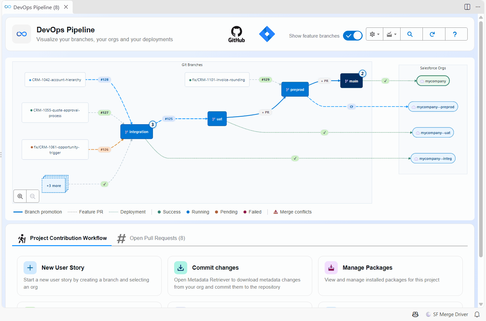
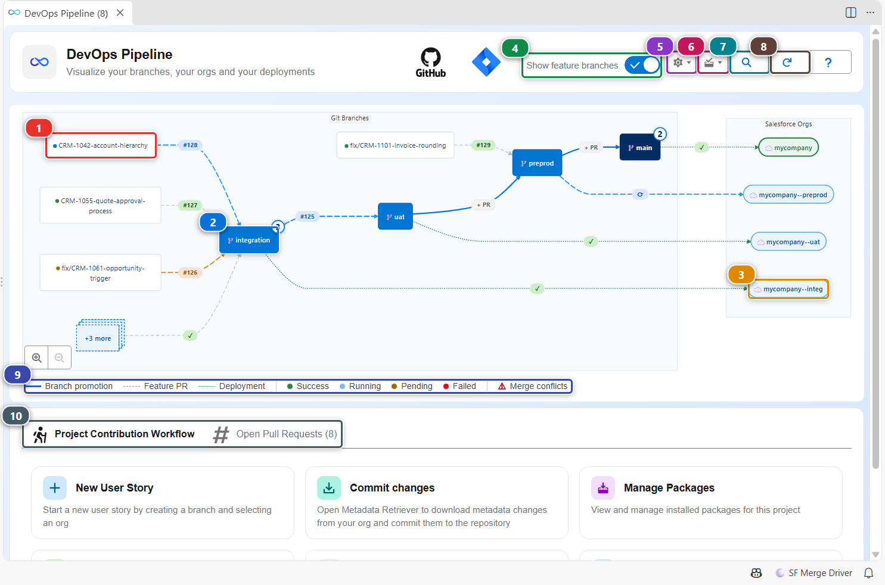
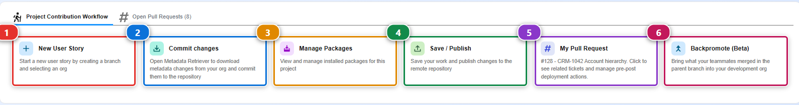
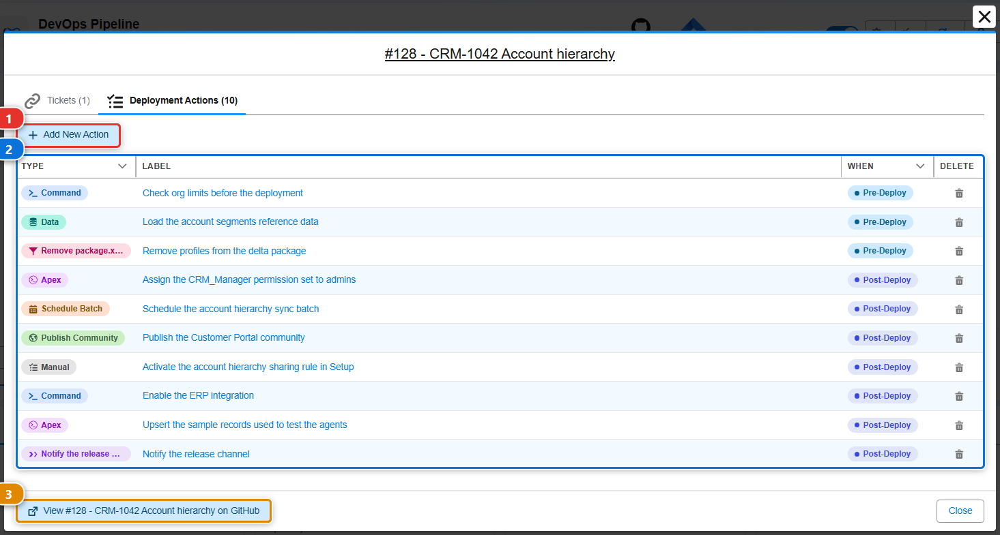
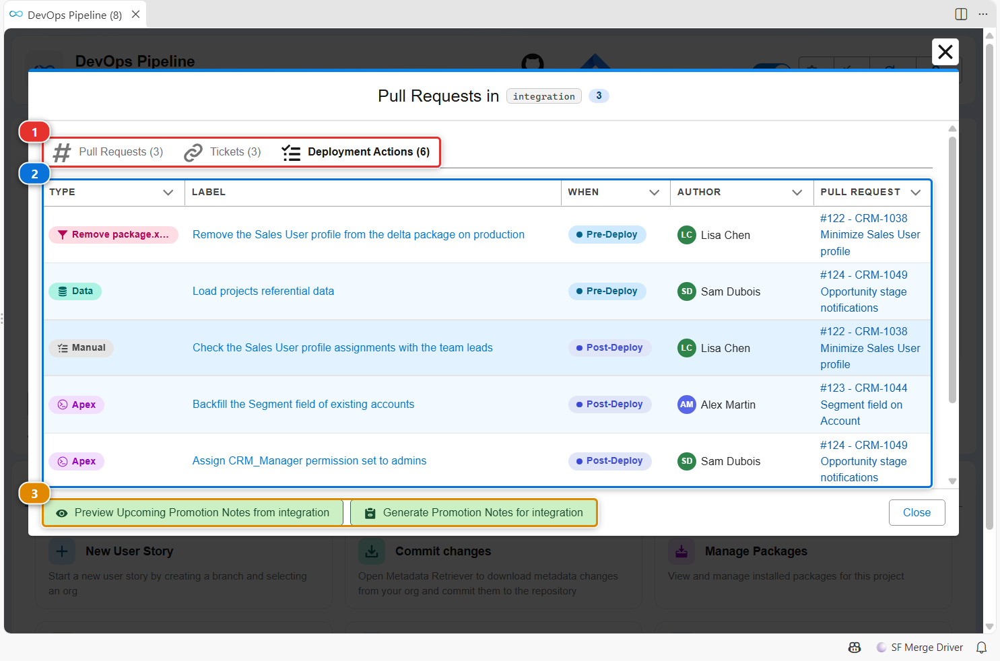
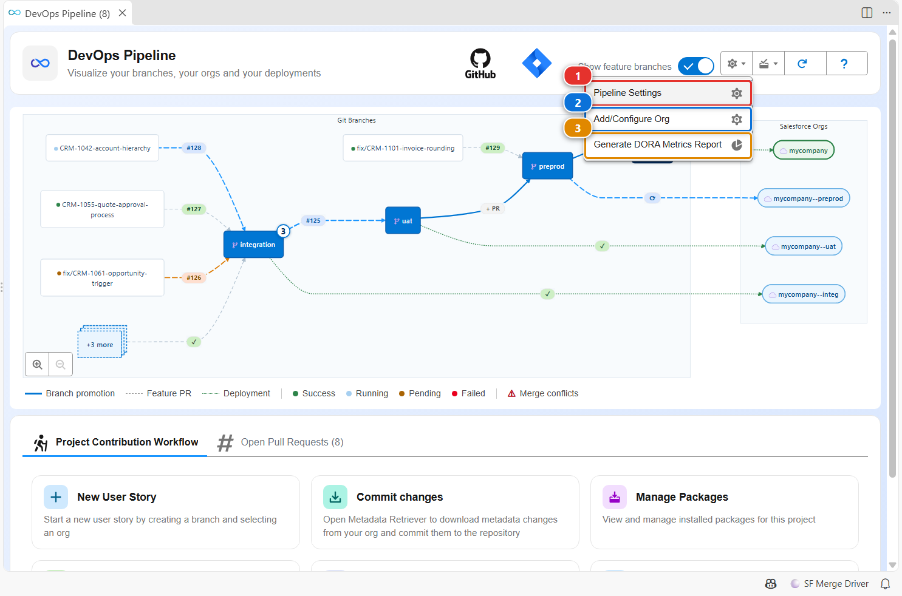
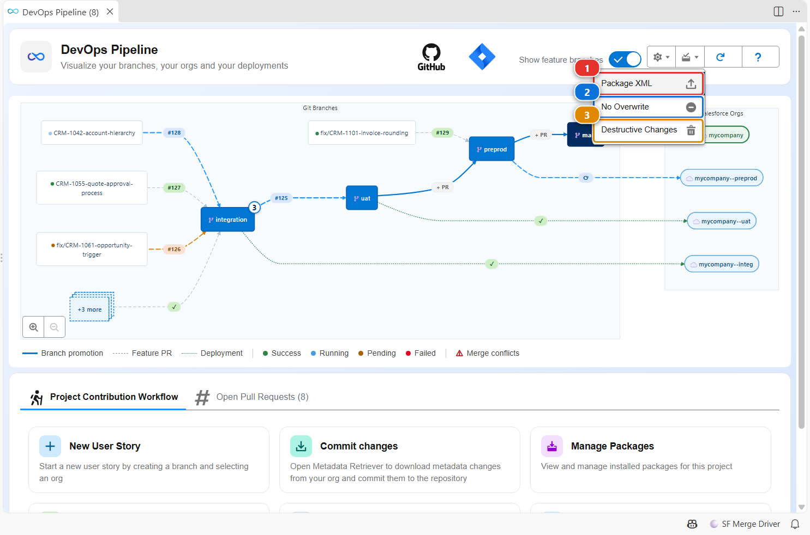

<!-- markdownlint-disable MD013 -->

# DevOps Pipeline view

The DevOps Pipeline view draws your branches, where each one merges and the Salesforce org each one deploys to, with the open Pull Requests and the status of the last deployments. Below the diagram, cards start every step of the contributor workflow.

For the concepts behind it (major branches, merges, delta deployments), read [Salesforce CI/CD](salesforce-devops-home.md) first.

## Open it

- Click **DevOps Pipeline** in the **CI/CD (simple)** menu of the side bar.
- Click the **DevOps Pipeline** card of the [Welcome panel](vscode-extension-welcome.md).

## Read the diagram

- **(1)** is a feature branch, with the number of its Pull Request. When too many target the same branch, they are grouped in a **+N more** box.
- **(2)** is a major branch. The badge on its corner counts the Pull Requests open against it. Click it to see its Pull Requests, tickets and deployment actions.
- **(3)** is the org a major branch deploys to. The dotted line carries the result of the last deployment: a check mark when it passed.
- **(4)** shows or hides the feature branches. They are shown by default.
- **(5)** opens the pipeline settings menu, **(6)** the package files menu, **(7)** reloads branches, Pull Requests and deployments, and **(8)** opens this guide.
- **(9)** is the legend of the lines and statuses.
- **(10)** switches between the contribution cards and the list of open Pull Requests.

## Start and publish a User Story

The cards follow the order of the work:

1. **(1)** creates the branch of a new User Story and selects the org to work in. See [Start a User Story](salesforce-devops-create-new-user-story.md).
2. **(2)** opens the [Metadata Retriever](vscode-extension-metadata-retriever.md) to pull what you changed in your org, so you can commit it.
3. **(3)** installs or updates managed packages. See [Install packages](salesforce-devops-work-on-user-story-install-packages.md).
4. **(4)** cleans your changes, pushes them and opens the Pull Request. See [Publish a User Story](salesforce-devops-publish-user-story.md).
5. **(5)** shows the Pull Request of your current branch, with its tickets and deployment actions.
6. **(6)** brings into your development org what your teammates merged in the parent branch. See [Backpromote](salesforce-devops-backpromote.md).

## Add a deployment action to your Pull Request

Some changes need a step that metadata alone cannot do: load reference data, run an Apex script, assign a permission set. Open your Pull Request with the **My Pull Request** card, then its **Deployment Actions** tab.

1. Click **(1)** to add an action, pick its type and when it runs (before or after the deployment).
2. The list **(2)** shows the actions of the Pull Request, numbered in the order they run. Click a label to see or edit it, **Run in my org** to try the action in your developer org before the merge (**Rerun** after a failed try), or open the menu at the end of its row to delete it. See [Try your actions in your own org](salesforce-devops-work-on-user-story-deployment-actions.md#try-your-actions-in-your-own-org).
3. The **Open on** button of the header opens the Pull Request on your git provider.

The actions run automatically when the Pull Request is deployed. See [Deployment actions](salesforce-devops-work-on-user-story-deployment-actions.md) for every action type.

## Review what is about to be deployed to a major branch

Click a major branch in the diagram. The window lists the Pull Requests merged into it:

- **(1)** switches between its Pull Requests, the tickets they mention and their deployment actions.
- **(2)** lists the deployment actions of those Pull Requests, grouped by Pull Request with its author, numbered in the order they run. Once the deployment ran, each action shows its status in the org of the branch, and a failed one can be retried from there: see [Recover a failed action](salesforce-devops-work-on-user-story-deployment-actions.md#recover-a-failed-action).
- **(3)** previews or generates the promotion notes of the next merge to the upper branch.

Click the number or the title of a Pull Request to open it without leaving the window: a line above the title brings you back, with the stories you had ticked still ticked.

## Find and open any Pull Request

The search button of the toolbar opens the **Pull Requests explorer**. Type a number, a title, a branch, an author or a ticket: the Pull Requests the pipeline already shows are listed at once, then the ones found on your git provider, open or merged.

A Pull Request opens the same way from everywhere: the explorer, the **My Pull Request** card, the **Open Pull Requests** tab, a feature branch or a Pull Request number of the diagram, and a Pull Request named in a ticket, a deployment action or another panel. Ctrl+click (Cmd+click on macOS) on a Pull Request number of the diagram still opens it on your git provider.

The window of a Pull Request shows:

- Its state, its author, its branches, and its way through the pipeline: the validation, then each major branch up to production, with the promotion that carried it when there is one. A branch reads **Not in the pipeline windows** when the Pull Request was merged too long ago for the pipeline to tell.
- **General**: the description of the Pull Request.
- **Tickets**, with their status and who they are assigned to.
- **Deployment Actions** and **Tests**, as in your own Pull Request.
- **Validation**, **Code Quality** (MegaLinter) and **Deployment**: the comment each of them posted on this Pull Request, as you would read it on your git provider, with its outcome and the links to the job and to the comment. They show the comments of this Pull Request only, not those of a promotion that carried it further.

**Open on GitHub** (or your git provider) in the header is the way out to the Pull Request page. When the Pull Request was opened from a list or from another Pull Request, **Previous** and **Close** bring that window back; **Close** closes the window otherwise.

The deployment actions and the test classes are read from the files of the branch you have checked out, and written there. When you change them on a Pull Request that is not the one of your branch, a warning names that branch: what you change travels with your own Pull Request. **Run in my org** is only offered on your own Pull Request.

## Configure the pipeline

The gear menu gathers the settings of the project:

- **(1)** opens **Pipeline Settings**, the editor of `.sfdx-hardis.yml`: branches, deployment options, tickets, notifications. See [Configuration](sfdx-hardis-config-file.md).
- **(2)** connects a major branch to its org, so the CI/CD pipeline can deploy there.
- **(3)** generates a DORA metrics report of the deployments (frequency, lead time, failure rate).

## Edit the package files

The second menu opens the package files of the project in a visual editor:

- **(1)** `manifest/package.xml`, what the pipeline deploys.
- **(2)** `manifest/package-no-overwrite.xml`, metadata that is created once and never overwritten afterwards.
- **(3)** `manifest/destructiveChanges.xml`, metadata to delete in the target orgs.

See [Configure overwrite management](salesforce-devops-config-overwrite.md) for when to use each one.

## Customize

| What | Where |
|---|---|
| Hide feature branches | The **Show feature branches** toggle, or the `vsCodeSfdxHardis.pipelineDisplayFeatureBranches` setting (default `true`) |
| Group feature branches after N | `vsCodeSfdxHardis.pipelineFeatureBranchGroupThreshold` (default `3`) |
| Branches, orgs, deployment options | **Pipeline Settings**, stored in `.sfdx-hardis.yml` |
| Promotion branches | `enablePromotionBranches`, see [Promotion branches](salesforce-devops-promotion-branches.md) |
