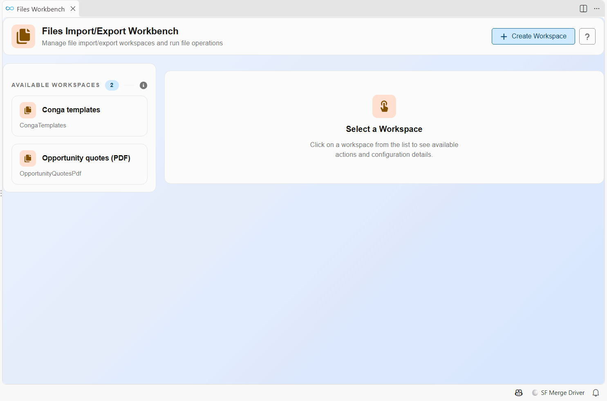
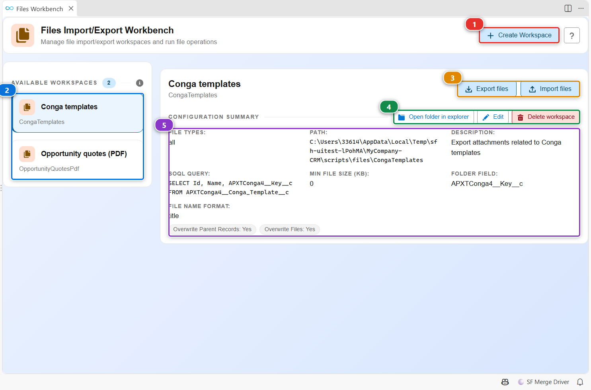
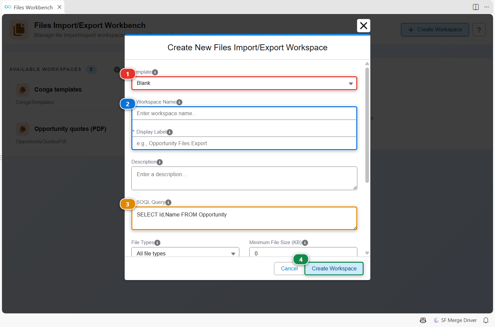
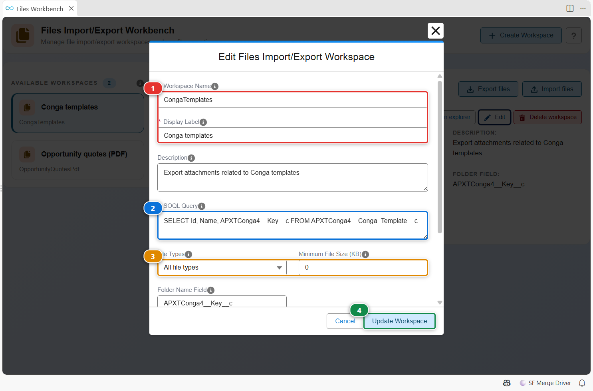

<!-- markdownlint-disable MD013 -->

# Files Workbench

The Files Workbench moves **files and attachments** between orgs: the documents attached to the records of an object, such as the quotes of closed opportunities or the templates of a document generation tool. A workspace says which parent records to read (a SOQL query), which files to keep, and how to name the folders and files on disk.

Workspaces live in `scripts/files/<workspace>/export.json` of your project, and the files they export land in the same folder.

## Open it

- Click **Files Workbench** in the **Files Import/Export** menu of the side bar.
- Click the **Files Workbench** card of the [Welcome panel](vscode-extension-welcome.md).

## Find your way around

- **(2)** lists the workspaces of the project. Click one to see its configuration **(5)**.
- **(3)** runs it: **Export files** downloads the files of the matching records from an org, **Import files** uploads them to another org. Each one asks for the org.
- **(4)** opens the workspace folder, edits the workspace or deletes it.
- **(1)** creates a workspace.

## Create a workspace

1. Click **Create Workspace**, then start from a template **(1)** or keep **Blank**.
2. Give it a folder name and a label **(2)**.
3. Write the SOQL query of the parent records in **(3)**, for example `SELECT Id, Name FROM Opportunity WHERE StageName = 'Closed Won'`. Their files are the ones exported.
4. Scroll down to choose the file types, the minimum size, the field used to name each folder and the format of the file names.
5. Click **(4)**.

## Edit a workspace

Select the workspace, then click **Edit**. You change the same settings as at creation: the name and label **(1)**, the query **(2)**, the file types and the minimum size **(3)**, then the naming and overwrite options further down. Click **(4)** to save.

## Customize

| What | Where |
|---|---|
| Your workspaces | `scripts/files/<workspace>/export.json`, edited by the workbench or by hand |
| Run a workspace from a terminal or a pipeline | [hardis:org:files:export](hardis/org/files/export.md), [hardis:org:files:import](hardis/org/files/import.md) |
