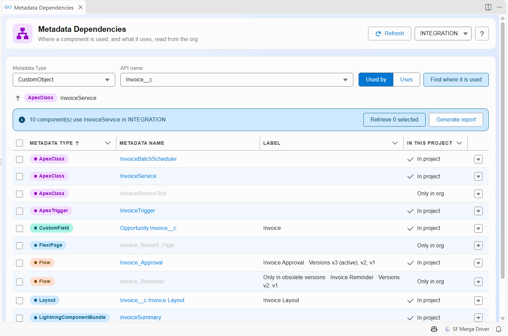
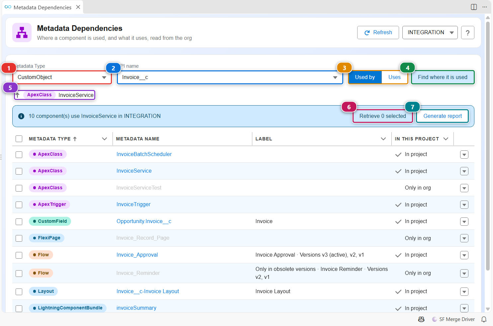
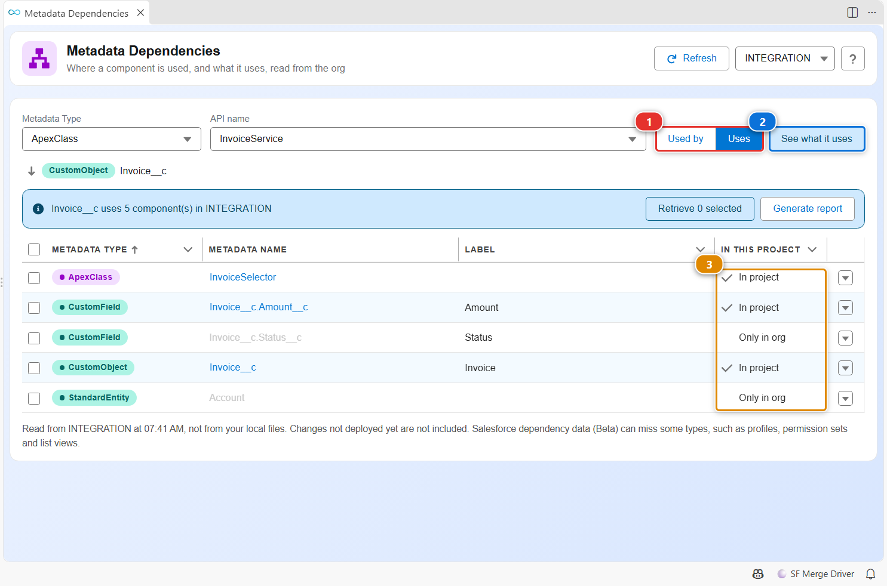
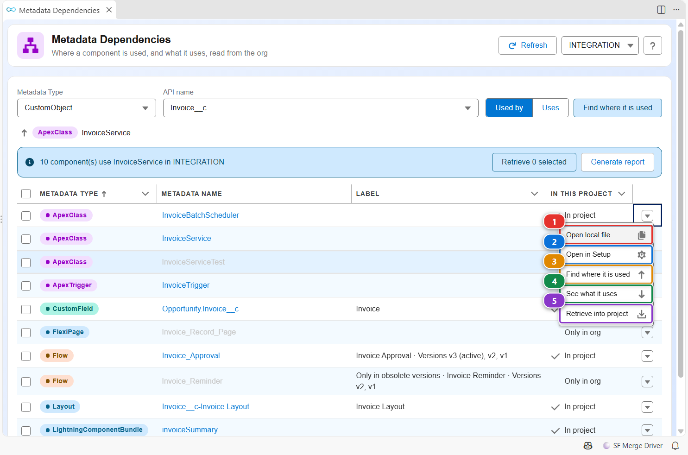

<!-- markdownlint-disable MD013 -->

# Metadata Dependencies

Before you change or delete an Apex class, a Flow, a field or a layout, you want to know what uses it. The Metadata Dependencies panel asks the org, lists every component that uses the one you picked (or every component it uses), and lets you walk the chain one level at a time.

Dependencies are read from the org, not from your local files: a change that is not deployed yet is not included. The panel runs [hardis:doc:metadata-deps](hardis/doc/metadata-deps.md), which you can also call from a terminal or a pipeline.

## Open it

- Right-click a metadata file, in the Explorer or in the editor, then **SFDX Hardis: Find where this metadata is used** or **SFDX Hardis: See what this metadata uses**.
- Pick **Find where it is used** in the row menu of the [Metadata Retriever](vscode-extension-metadata-retriever.md).
- Click **Metadata dependencies (used by)** in the **Documentation** menu of the side bar, or its card in the [Org Monitoring Workbench](vscode-extension-org-monitoring.md).

## Find what uses a component

1. Pick the metadata type in **(1)** and the component in **(2)**. Both lists complete as you type. When you opened the panel from a file or a row menu, they are already filled.
2. Keep **Used by** selected in **(3)**.
3. Click **(4)**. The list shows every component of the org that uses yours, with its type and whether it exists in your project.
4. Click a component name to open its file. It is greyed out when the component is not in your project. To go one level down, pick **Find where it is used** in the row menu (see below): the list then shows what uses that component, and **(5)** shows the path you followed. Click a step of the path to go back to it.
5. Check some rows, then click **(6)** to retrieve them into your project.
6. **(7)** writes the list as a CSV and an Excel file, to share it or attach it to a ticket.

## See what a component uses

Select **Uses** **(1)**, then click **(2)**. The list now shows what the component needs to work: the fields an Apex class reads, the objects a Flow updates. The **In this project** column **(3)** tells you whether each one is already in your project, which is what you check before you deploy the component somewhere else.

## Act on one component

The arrow at the end of a row opens its menu:

- **(1)** opens the file of the component in your project, when it is there.
- **(2)** opens its page in Setup, or Flow Builder for a Flow.
- **(3)** and **(4)** start a new search from this component, in either direction.
- **(5)** retrieves this component into your project.

## Customize

Nothing to configure. Salesforce dependency data is a Beta feature of the platform: it can miss some types, such as profiles, permission sets and list views. The panel says so under the list.
