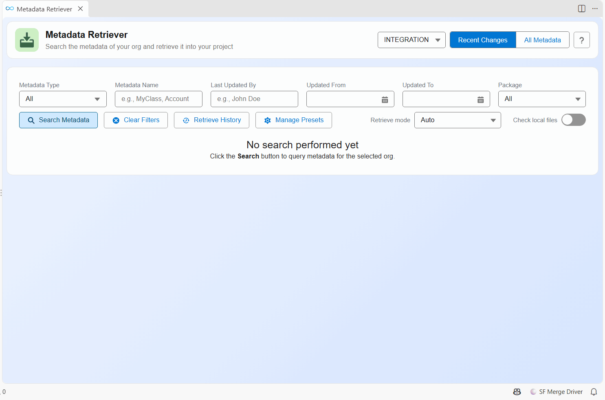
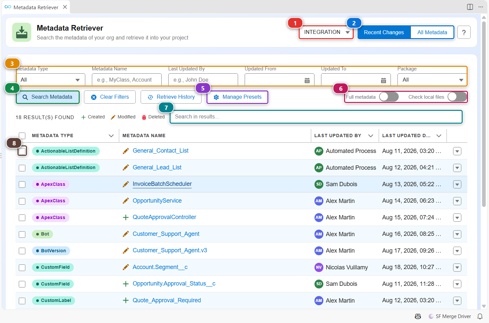
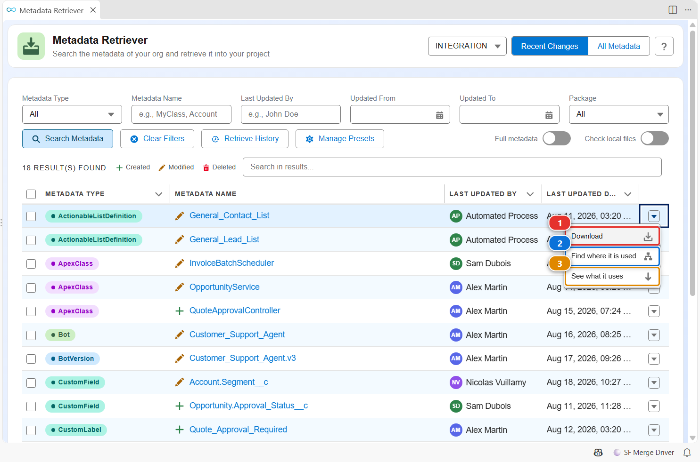
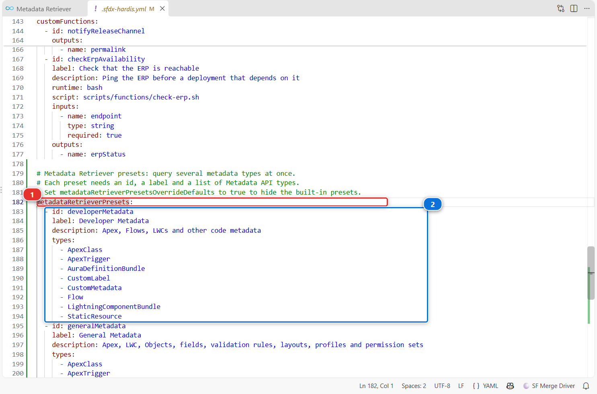

<!-- markdownlint-disable MD013 -->

# Metadata Retriever

The Metadata Retriever replaces the standard Org Browser. It answers "what did I change in my org?" in one click, filters by type, name, author, date and package, shows which components already exist in your project, and retrieves the ones you pick.



## Open it

- Click **Metadata Retriever** in the **CI/CD (simple)** menu of the side bar.
- Click the **Commit changes** card of the [DevOps Pipeline](vscode-extension-devops-pipeline.md), or the **Metadata Retriever** card of the [Welcome panel](vscode-extension-welcome.md).

## Find and retrieve what you changed



1. Check the org in **(1)**. It is your default org when the panel opens.
2. Pick a mode in **(2)**:
   - **Recent Changes** lists what was created, modified or deleted recently, with who did it. Use it before you commit a User Story.
   - **All Metadata** lists every component of the org, including the ones nobody touched.
3. Narrow the list with **(3)**: metadata type (or a preset of several types), name, last updated by, date range, installed package.
4. Click **(4)**. The results show below, with an icon telling whether each component was created, modified or deleted.
5. **(7)** filters the results without querying the org again.
6. Check the rows you want **(8)**, then click the floating **Retrieve** button that appears once something is selected. The files land in your project, ready to commit.

Two settings change how it works **(6)**:

- **Retrieve mode** picks how the selected components are retrieved:
    - **Auto**, the default, retrieves Profiles complete with [sf hardis:mdapi:read](hardis/mdapi/read.md) and keeps only the permissions they grant. Everything else goes through the standard retrieve. A standard retrieve returns a Profile with only the permissions related to the other components retrieved with it, which is why Profiles get this treatment.
    - **Full, active only** reads every selected component whole through the CRUD Metadata API, and leaves out the Profile and Permission Set entries that grant nothing.
    - **Full, all tags** reads every selected component whole through the CRUD Metadata API, `false` entries included.
    - **Off** uses the standard retrieve for everything.

    The CRUD Metadata API can not read code, binary and bundle types (Apex, LWC, Static Resources...): the Full modes report them as skipped.
- **Check local files** adds a column that tells which components already exist in your project.

When you retrieve a field, a list view or a record type without its object, Salesforce CLI writes an empty `.object-meta.xml` file for the object. Committed, it makes the deployment fail with `Must specify a non-empty label for the CustomObject`. The Metadata Retriever deletes that file when the retrieve just created it, and says so. A file that was already in your project is never touched. To catch the ones that come from elsewhere, add `emptyItems` to [autoCleanTypes](hardis/project/clean/emptyitems.md).

**(5)** manages presets, see below.

## Act on one component



The arrow at the end of a row opens its menu:

- **(1)** retrieves this component only.
- **(2)** opens [Metadata Dependencies](vscode-extension-metadata-dependencies.md) on what uses it, before you change or delete it.
- **(3)** opens Metadata Dependencies on what it uses.

## Save your own presets of metadata types



A preset is a named group of metadata types that the type filter selects in one click, for example "Developer Metadata" for Apex, Flows and LWC. Click **Manage Presets**: it opens `.sfdx-hardis.yml` at the `metadataRetrieverPresets` key **(1)**, and writes the built-in presets there the first time, so you have an example to copy. Each preset **(2)** has an `id`, a `label`, an optional `description` and its `types`:

```yaml
metadataRetrieverPresets:
  - id: securityMetadata
    label: Security
    description: Profiles, permission sets and their groups
    types:
      - Profile
      - PermissionSet
      - PermissionSetGroup
```

Save the file: the panel uses your presets at once. Commit it so the whole team gets them.

## Customize

| What | Where |
|---|---|
| Your own presets | `metadataRetrieverPresets` in `.sfdx-hardis.yml` |
| Hide the built-in presets | `metadataRetrieverPresetsOverrideDefaults: true` in `.sfdx-hardis.yml` |
| Replace one built-in preset | Declare a preset with the same `id` |
