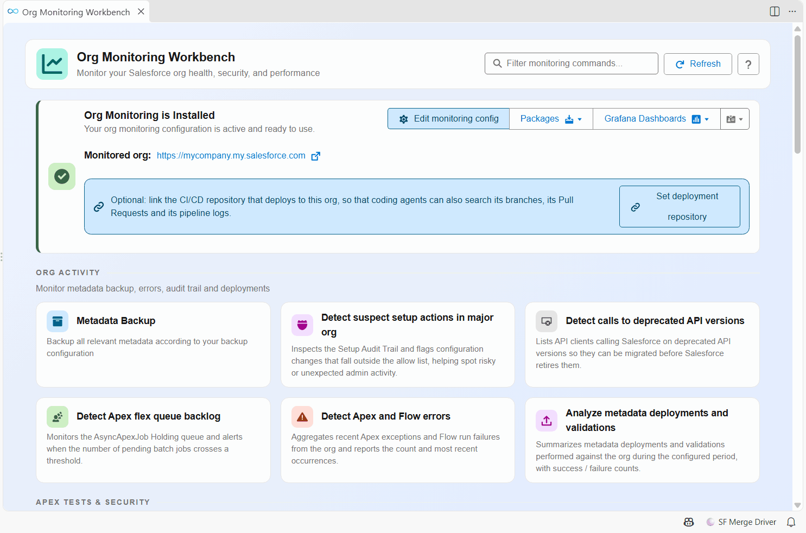
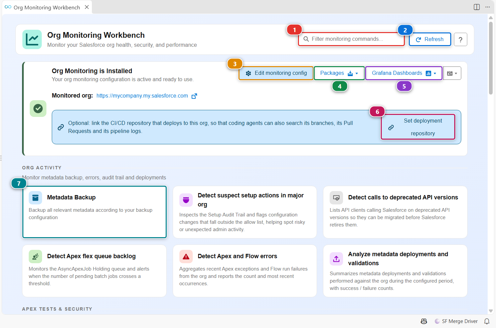
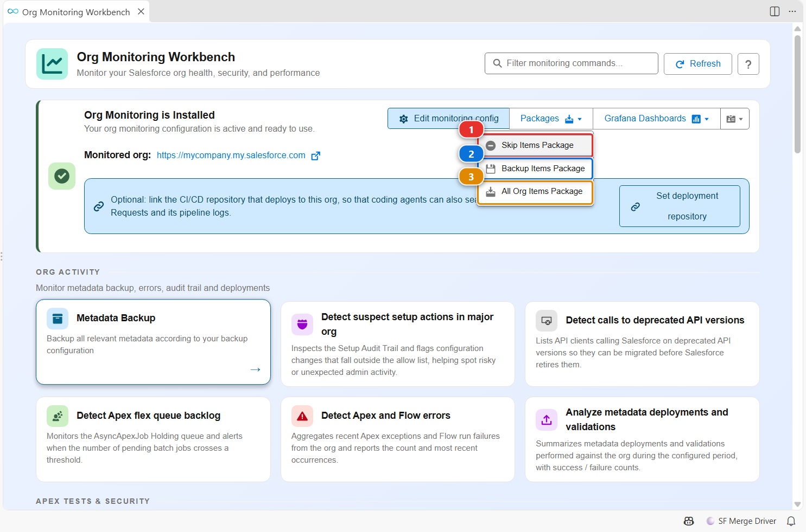

<!-- markdownlint-disable MD013 -->

# Org Monitoring Workbench

The Org Monitoring Workbench lists every monitoring and diagnostic command of sfdx-hardis, grouped by theme: org activity, Apex tests and security, user activity, technical debt. Each card runs its command against the selected org in one click.

It is also the entry point of a monitoring repository: from here you open its configuration and the lists of metadata the nightly backup keeps. What monitoring is and how to set it up is explained in [Org Monitoring](salesforce-monitoring-home.md).

## Open it

- Click **Org Monitoring** in the side bar.
- Click the **Org Monitoring** card of the [Welcome panel](vscode-extension-welcome.md).

## Run a check

1. Type a few letters in **(1)** to find a check, for example `apex` or `backup`.
2. Click its card **(7)**. The command runs against your default org, in a [command execution panel](vscode-extension-command-runner.md) that shows its progress and its reports.
3. **(2)** checks again whether monitoring is installed in the current repository.

When the current repository is a monitoring repository, the banner at the top says so and adds its tools:

- **(3)** opens the [monitoring configuration](salesforce-monitoring-config-home.md): which checks run, how often, and where notifications go.
- **(4)** opens the package files of the backup (see below).
- **(5)** opens the Grafana dashboards of the org, when Grafana is configured.
- **(6)** stores the address of the CI/CD repository that deploys to this org (`deploymentRepository` in `.sfdx-hardis.yml`), so coding agents that read the monitoring repository can also search its branches, Pull Requests and pipeline logs.

When the repository is not a monitoring repository, the banner offers to install monitoring instead.

## See what the backup keeps

The nightly [metadata backup](salesforce-monitoring-metadata-backup.md) works from three lists, each opened in a visual editor:

- **(1)** `manifest/package-skip-items.xml`: metadata the backup ignores. Add the types or members you do not want to track.
- **(2)** `manifest/package-backup-items.xml`: metadata the backup keeps.
- **(3)** `manifest/package-all-org-items.xml`: everything the org contains, as found by the last backup.

## Customize

What runs, when, and who is notified is set in the monitoring configuration (**Edit monitoring config**), stored in `.sfdx-hardis.yml` of the monitoring repository. See [Monitoring configuration](salesforce-monitoring-config-home.md).
