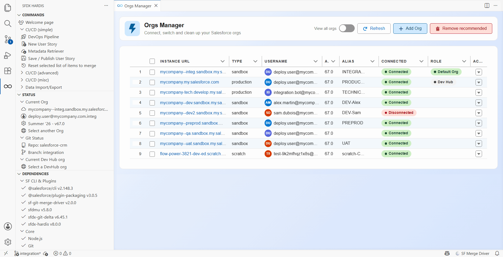
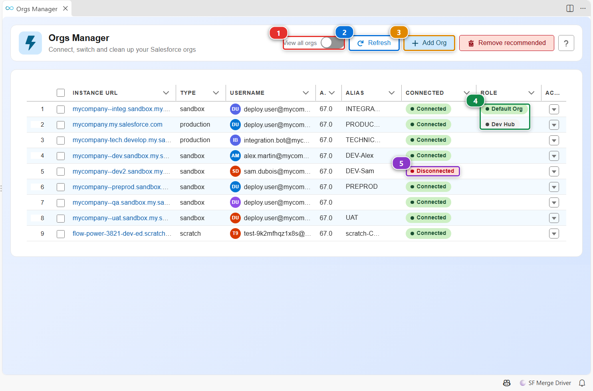
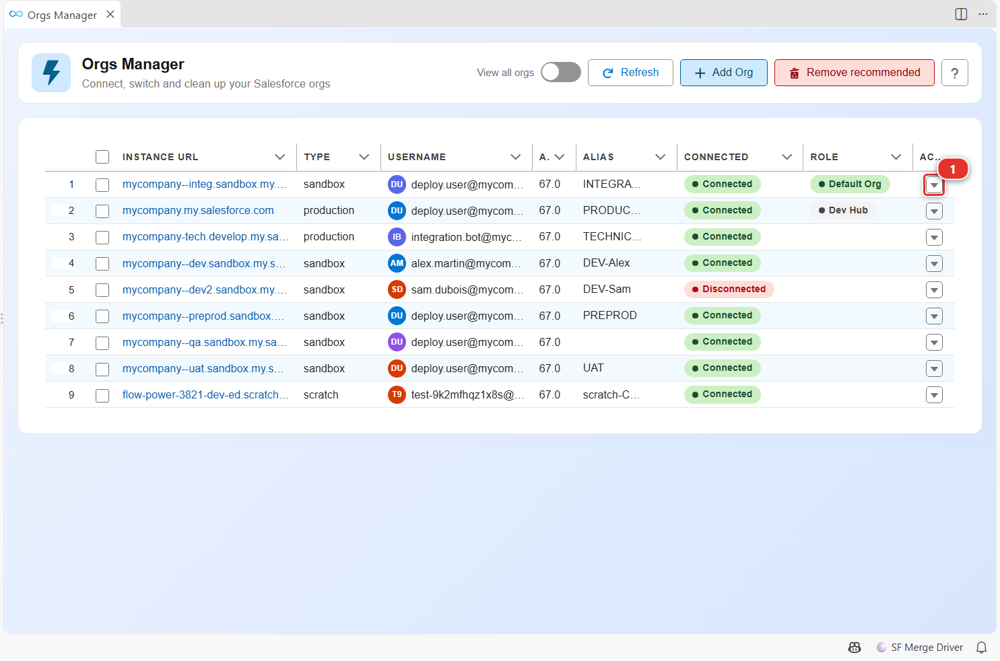
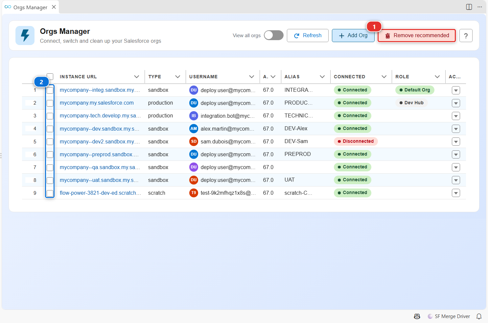

<!-- markdownlint-disable MD013 -->

# Orgs Manager

The Orgs Manager lists every Salesforce org your computer is connected to, tells you which ones still work, and gathers the actions you run on one org: open it, make it the default, reconnect it, freeze its users, prepare a sandbox refresh. Tokens and URLs are handled by the Salesforce CLI and sfdx-hardis: nothing sensitive is shown or logged.

## Open it

- Click **Orgs Manager** in the side bar.
- Click the **Orgs Manager** card of the [Welcome panel](vscode-extension-welcome.md).
- Click the org type badge (**PROD**, **SANDBOX**, **SCRATCH**...) in the status bar.

## Find and connect your orgs

- The list shows the orgs you are likely to use. Turn on **(1)** to also see the others, such as expired scratch orgs.
- **(2)** reloads the list and checks again the connection of every org.
- **(3)** connects a new org. A command asks for the type of org (production, sandbox, custom login URL) and an alias, then opens the Salesforce login page in your browser. Once you log in, the org appears in the list.
- **(4)** marks your default org, used by every command that does not ask for one, and your default Dev Hub.
- **(5)** flags an org whose session expired or was revoked. Reconnect it from its row menu.

## Work on one org

Click the arrow **(1)** at the end of a row. Its menu holds the actions that apply to this org:

| Action | What it does |
|---|---|
| **Open** | Opens the org in your browser, already logged in |
| **Set as Default Org** / **Set as Default Dev Hub** | Makes it the org commands use when they do not ask |
| **Reconnect** | Logs in again when the session expired |
| **Freeze users** / **Unfreeze users** | Freezes users before a sensitive deployment, then gives them back access |
| **Purge obsolete flows versions** | Deletes the inactive versions of your Flows |
| **Rotate External Client App credentials** | Generates new credentials for an External Client App |
| **Activate .invalid user emails in sandbox** | Removes the `.invalid` suffix a sandbox adds to user emails (sandboxes only) |
| **Sandbox refresh: Before Refresh** / **After Refresh** | Saves what a refresh destroys, then restores it (sandboxes only) |
| **Delete scratch org(s)** | Deletes the scratch org (scratch orgs only) |
| **Remove** | Forgets the org on this computer. The org itself is not touched |

## Clean up the list

- **(1)** forgets in one click every org that is disconnected, deleted, expired, or a production org. It only shows when there is something to remove.
- To forget chosen orgs, check their rows **(2)**, then click **Forget selected**, which appears in the header.

Forgetting an org only removes its connection from this computer. Connect it again when you need it.

## Customize

The color of the status bar follows the type of the default org you select here. See [Per-org colors](vscode-extension-customize.md#color-vs-code-by-org-type).
