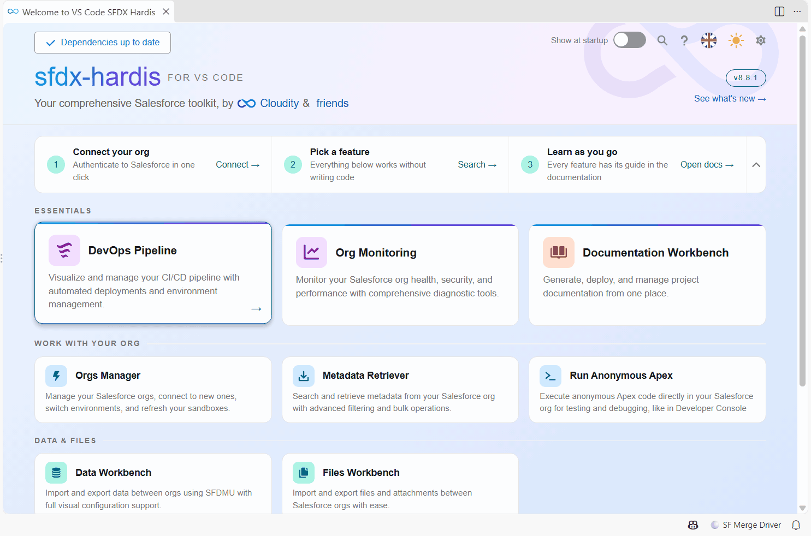
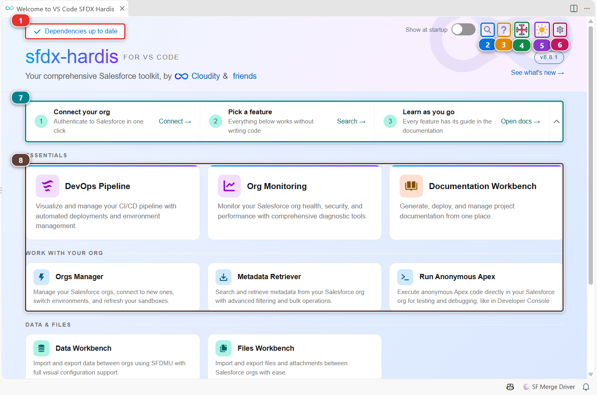
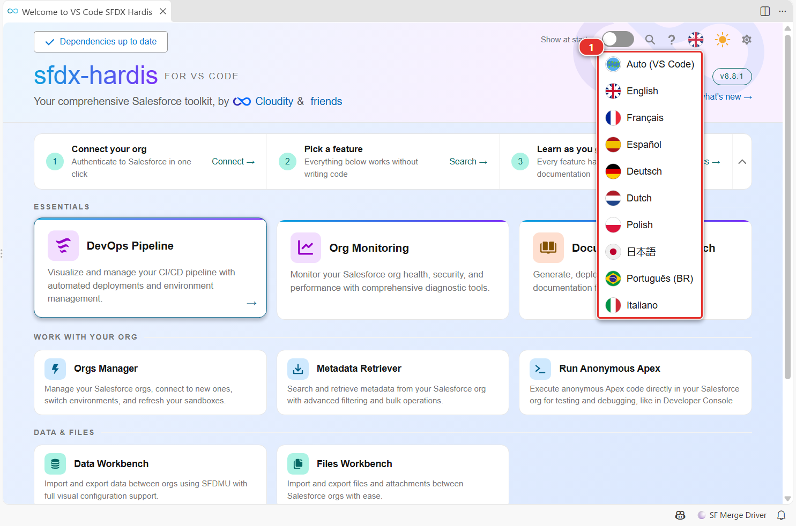

<!-- markdownlint-disable MD013 -->

# Welcome panel

The Welcome panel is the home page of the extension. It shows whether your tools are installed, opens every workbench in one click, and holds the menus your team adds.

## Open it

- It opens by itself when VS Code starts, unless you turned that off.
- Click **Welcome page**, first entry of the **Commands** tree in the SFDX Hardis side bar.
- Click the SFDX Hardis icon of the activity bar, then **Welcome page**.

## Find your way around

- **(1)** tells you whether the Salesforce CLI and its plugins are installed and up to date. Click it to open the Setup page, which installs or upgrades what is missing.
- **(2)** searches every sfdx-hardis command by name.
- **(3)** opens this guide.
- **(4)** changes the language of the extension.
- **(5)** switches the panels between light and dark theme.
- **(6)** opens the extension settings (see [Customize the extension](vscode-extension-customize.md)).
- **(7)** is the quick start: connect your org, pick a feature, open the documentation. Collapse it once you know your way.
- **(8)** is one card per workbench, grouped by what you do: CI/CD, work with your org, data and files. Click a card to open it.

## Change the language

Click the flag, then pick a language in the list **(1)**. **Auto (VS Code)** follows the display language of VS Code. The whole extension switches at once, panels and menus included. When you pick a language, the commands started from the extension also print their messages in it.

## Run a command of your team

When your project declares custom menus in `.sfdx-hardis.yml`, each menu shows as a card under **Custom Menus**. Click the card to see its commands, click a command to run it, and use **Back to Home** to return. The same menus show in the **Commands** tree of the side bar.

## Customize

| What | Where |
|---|---|
| Open the panel at startup or not | The **Show at startup** toggle of the toolbar, or the `vsCodeSfdxHardis.showWelcomeAtStartup` setting |
| Language | Flag menu, or `vsCodeSfdxHardis.lang` (`auto`, `en`, `fr`, `es`, `de`, `it`, `nl`, `pl`, `ja`, `pt-BR`) |
| Light or dark panels | Sun icon, or `vsCodeSfdxHardis.theme.colorTheme` (`light`, `dark`, `auto`) |
| Custom menus and commands | `customCommands` in `.sfdx-hardis.yml`, see [Customize the extension](vscode-extension-customize.md#add-your-own-menus-and-commands) |
