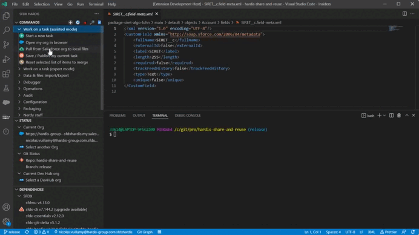
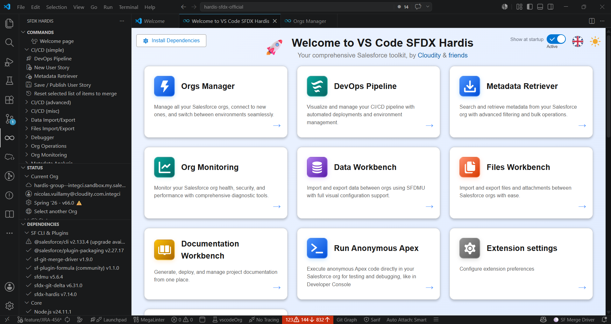
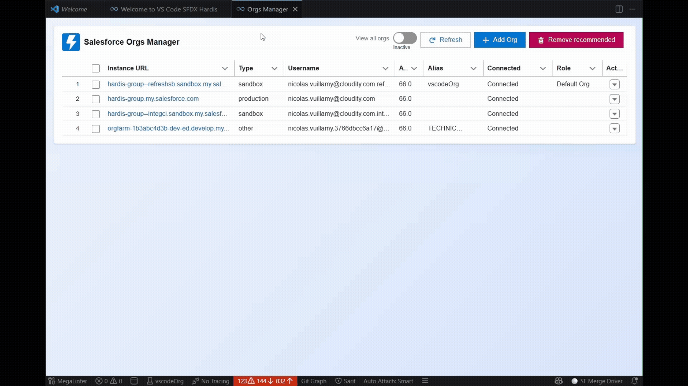
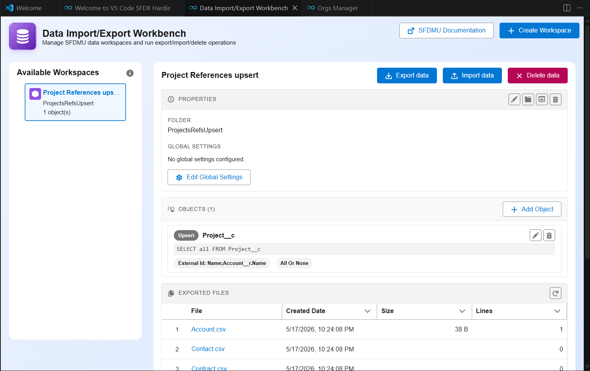
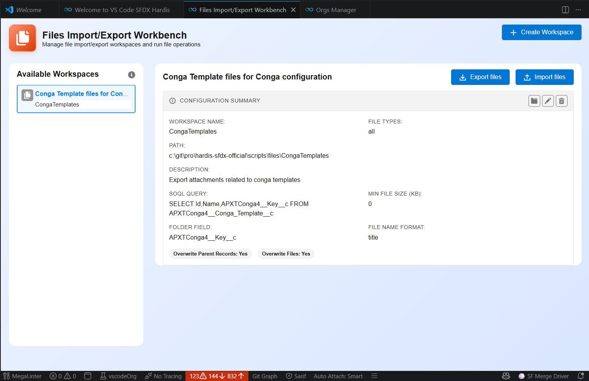

<!-- markdownlint-disable MD013 -->

Every command documented on this site can also be triggered from the **[VsCode SFDX Hardis](https://marketplace.visualstudio.com/items?itemName=NicolasVuillamy.vscode-sfdx-hardis)** extension - a graphical companion built on top of the CLI.

If you prefer clicks to flags, install the extension and skip the terminal: see [Installation](installation.md#with-ide).

---

## Workbenches that wrap existing features

These workbenches are just visual front-ends for features already documented elsewhere on this site. Follow the link for the underlying concepts, options and YAML keys.

| Workbench / Panel | What it drives | Underlying docs |
|---|---|---|
| DevOps Pipeline view | Visualize branches, environments and deployments | [Salesforce CI/CD](salesforce-ci-cd-home.md) |
| User Story workflow | New story -> retrieve -> save & publish, no terminal | [Create](salesforce-ci-cd-create-new-task.md) / [Work](salesforce-ci-cd-work-on-task.md) / [Publish](salesforce-ci-cd-publish-task.md) |
| Documentation Workbench | Generate and publish AI-enriched project docs | [Generate Documentation](salesforce-project-documentation.md) |
| Monitoring Config Workbench | Edit triggers, frequency, channels per check | [Monitoring config](salesforce-monitoring-config-home.md) |
| Pipeline Settings | Configure deployment actions, auth, branches | [`.sfdx-hardis.yml`](sfdx-hardis-config-file.md) |
| Installed Packages Manager | Install/update packages and pin them in CI/CD | [Install packages](salesforce-ci-cd-work-on-task-install-packages.md) |
| Flow Visual Git Diff | Side-by-side diagram of two Flow versions | [Flow Visual Git Diff](salesforce-deployment-agent-flow-visual-git-diff.md) |
| AI Assistant | Explain deployment errors, suggest fixes | [AI setup](salesforce-ai-setup.md) / [Prompts](salesforce-ai-prompts.md) |

---

## Workbenches that only exist in VsCode

These features live in the extension UI only - the section below is the canonical documentation.

### Welcome panel

A single dashboard that gives one-click access to every other workbench, with localized labels, theme switching and any custom menus you have pinned alongside the built-ins.

### Orgs Manager

Connect to new orgs, switch between sandboxes, scratch orgs and Dev Hubs, and clean up stale authentications - all from one panel. Token and URL handling is performed by the sfdx-hardis CLI; nothing sensitive is ever displayed or logged.

### Metadata Retriever

A modern replacement for the standard Org Browser. Filter by **type, name, last modified by, last modified date, managed package**, multi-select, then retrieve in a single click.

### Data Workbench (SFDMU)

A visual editor for [SFDMU](https://github.com/forcedotcom/SFDX-Data-Move-Utility) workspaces: build the queries, field mappings and per-object options graphically, then run import/export between orgs without writing a `export.json` by hand.

### Files Workbench

Mass-upload or mass-download **files and attachments** between orgs from a guided UI - pick the SOQL parent query and the destination folder, the extension drives the export/import for you.

### Apex tools

- **Run Anonymous Apex** directly from VsCode, like the Developer Console.
- **Apex Debugger shortcuts**: activate replay debug, toggle checkpoints, tail logs, and filter the output to keep only `USER_DEBUG` lines.

### Side-bar tree views

Three classic tree views complement the workbenches:

- **Commands** - every sfdx-hardis command, organized by menu, with a help button that opens the matching page on this site.
- **Status** - current default org, Dev Hub, Git repo, branch and org expiration date.
- **Plugins** - checks that every required CLI plugin is present and up to date, with a one-click upgrade if not.

### Per-org VsCode colors

The workspace is tinted based on the selected default org so you never confuse Production with a sandbox:

- **Production** - red
- **Major sandbox** (UAT, integration...) - orange
- **Dev sandbox / scratch org** - green
- **Other** (Dev org, trial...) - blue

You can override the color per org or per URL pattern (e.g. `https://*.scratch.my.salesforce.com`), choose between workspace and user settings via `vsCodeSfdxHardis.colorUpdateLocation`, or disable the feature entirely with `vsCodeSfdxHardis.disableVsCodeColors`.

### Multi-language UI

The whole UI is translated into **English, French, Spanish, German, Italian, Dutch, Polish, Japanese and Brazilian Portuguese**. Switch language from the Welcome panel, or let VsCode pick it from your environment.

### Custom commands and plugins

Add your own menus and buttons to the Commands panel and Welcome dashboard by declaring them in [`.sfdx-hardis.yml`](sfdx-hardis-config-file.md) - perfect to share a team toolkit through a shared YAML URL. The Plugins panel can be extended the same way to monitor extra Salesforce CLI plugins.

---

## Source

The extension is Open-Source (AGPL-3.0): [github.com/hardisgroupcom/vscode-sfdx-hardis](https://github.com/hardisgroupcom/vscode-sfdx-hardis).
