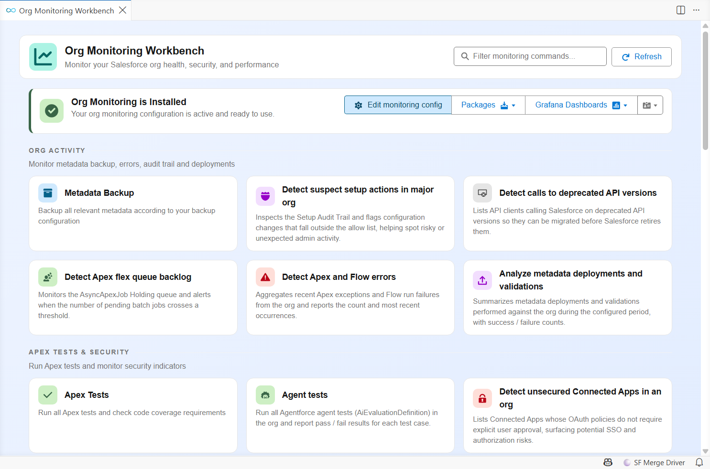
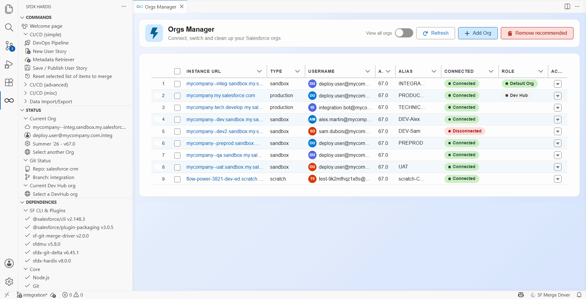
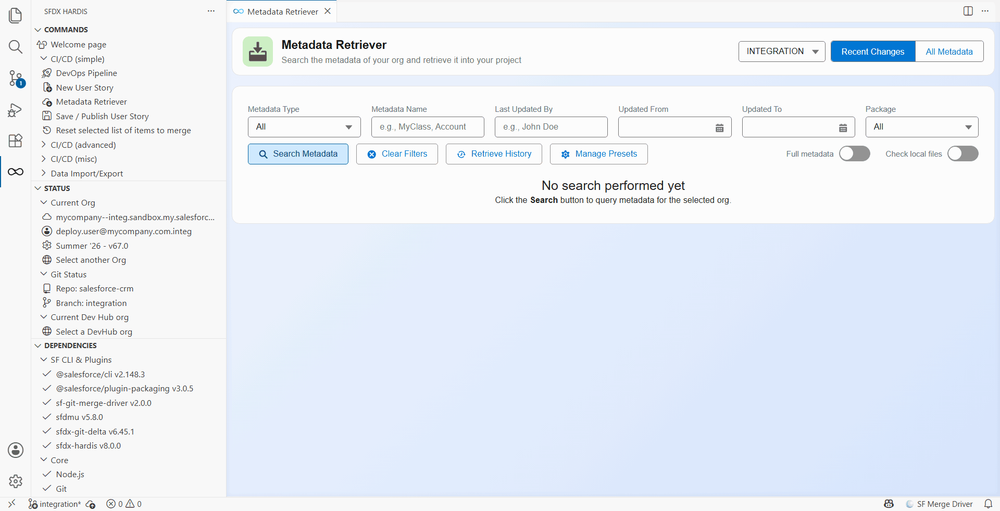
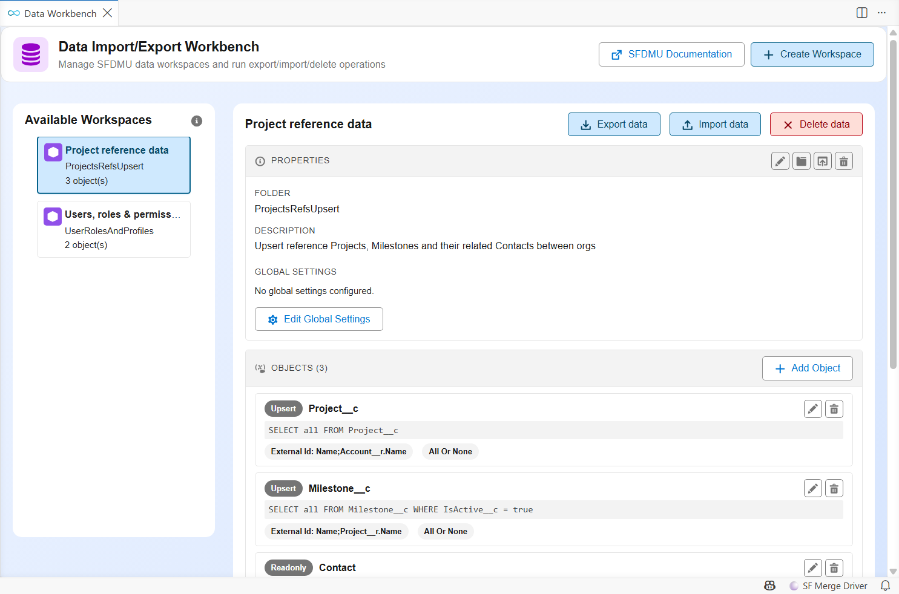
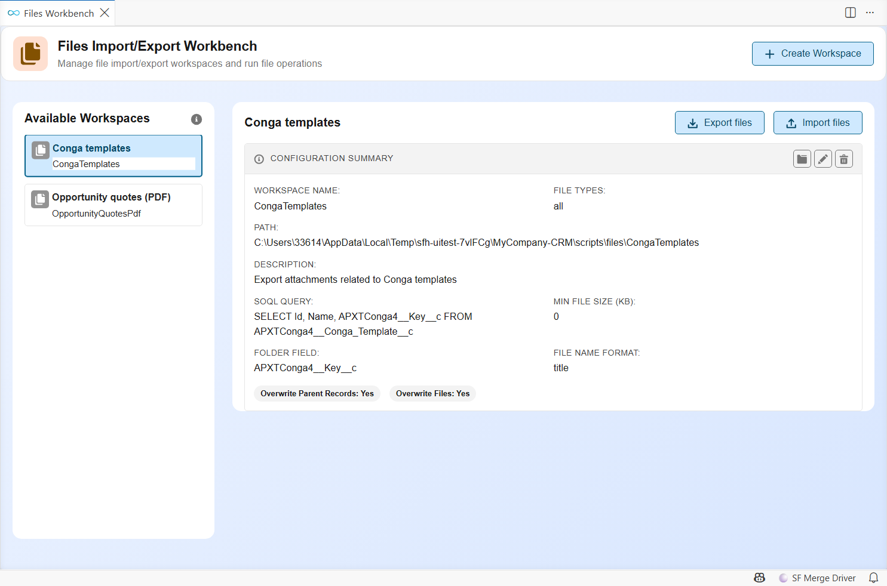

<!-- markdownlint-disable MD013 -->

Every command documented on this site can also be triggered from the **[VS Code SFDX Hardis](https://marketplace.visualstudio.com/items?itemName=NicolasVuillamy.vscode-sfdx-hardis)** extension, a graphical companion built on top of the CLI.

If you prefer clicks to flags, install the extension and skip the terminal: see [Installation](installation.md#with-ide).

---

## Workbenches that wrap existing features

These workbenches are just visual front-ends for features already documented elsewhere on this site. Follow the link for the underlying concepts, options and YAML keys.

| Workbench / Panel | What it drives | Underlying docs |
|---|---|---|
| DevOps Pipeline view | Visualize branches, environments and deployments | [Salesforce CI/CD](salesforce-ci-cd-home.md) |
| User Story workflow | New User Story -> retrieve -> save and publish, without a terminal | [Create](salesforce-ci-cd-create-new-task.md) / [Work](salesforce-ci-cd-work-on-task.md) / [Publish](salesforce-ci-cd-publish-task.md) |
| Documentation Workbench | Generate and publish AI-enriched project docs | [Generate Documentation](salesforce-project-documentation.md) |
| Monitoring Config Workbench | Edit triggers, frequency, channels per check | [Monitoring config](salesforce-monitoring-config-home.md) |
| Pipeline Settings | Configure deployment actions, auth, branches | [`.sfdx-hardis.yml`](sfdx-hardis-config-file.md) |
| Installed Packages Manager | Install/update packages and pin them in CI/CD | [Install packages](salesforce-ci-cd-work-on-task-install-packages.md) |
| Flow Visual Git Diff | Side-by-side diagram of two Flow versions | [Flow Visual Git Diff](salesforce-deployment-agent-flow-visual-git-diff.md) |
| AI Assistant | Explain deployment errors, suggest fixes | [AI setup](salesforce-ai-setup.md) / [Prompts](salesforce-ai-prompts.md) |

---

## Workbenches that only exist in VS Code

These features live in the extension UI only, so this section is their canonical documentation.

### Welcome panel

A single dashboard that gives one-click access to every other workbench, with localized labels, theme switching and any custom menus you have pinned alongside the built-ins.

### DevOps Pipeline view

A live diagram of your branches, their merge targets and the Salesforce org each one deploys to, with the open Pull Requests and the contribution shortcuts right below it.

### Org Monitoring Workbench

The full catalog of monitoring and diagnostic commands, grouped by theme (org activity, Apex tests & security, user activity, technical debt...), each runnable in one click.

### Command execution panel

Every command runs in its own tab, with a timeline of the steps, the questions asked by the CLI rendered as forms, live progress bars and the generated reports available in a single click.

### Orgs Manager

Connect to new orgs, switch between sandboxes, scratch orgs and Dev Hubs, and clean up stale authentications, all from one panel. Token and URL handling is performed by the sfdx-hardis CLI; nothing sensitive is ever displayed or logged.

### Metadata Retriever

A modern replacement for the standard Org Browser. Filter by **type, name, last modified by, last modified date, managed package**, multi-select, then retrieve in a single click.

### Data Workbench (SFDMU)

A visual editor for [SFDMU](https://github.com/forcedotcom/SFDX-Data-Move-Utility) workspaces: build the queries, field mappings and per-object options graphically, then run import/export between orgs without writing an `export.json` by hand.

### Files Workbench

Mass-upload or mass-download **files and attachments** between orgs from a guided UI: pick the SOQL parent query and the destination folder, and the extension drives the export/import for you.

### Apex tools

- **Run Anonymous Apex** directly from VS Code, like the Developer Console.
- **Apex Debugger shortcuts**: activate replay debug, toggle checkpoints, tail logs, and filter the output to keep only `USER_DEBUG` lines.

### Side-bar tree views

Three classic tree views complement the workbenches:

- **Commands**: every sfdx-hardis command, organized by menu, with a help button that opens the matching page on this site.
- **Status**: current default org, Dev Hub, git repository, branch and org expiration date.
- **Plugins**: checks that every required CLI plugin is present and up to date, with a one-click upgrade if not.

### Per-org VS Code colors

A badge in the status bar shows the type of the selected default org (**PROD**, **MAJOR**, **SANDBOX**, **SCRATCH** or **DEV ORG**) and opens the Orgs Manager when clicked. The status bar is colored with the same palette as the extension panels, so you never confuse production with a sandbox:

- **Production**: red
- **Major sandbox** (UAT, integration...): orange
- **Dev sandbox**: green
- **Scratch org**: cyan
- **Other** (Developer Edition, trial...): blue

The colors follow your light or dark theme and are never applied on high contrast themes. The `vsCodeSfdxHardis.orgColorMode` setting chooses how much of the window is colored: the status bar only (default), the title bar too, the whole activity bar, or nothing. You can also pick a custom color for the current org from a palette with a live preview, and choose between workspace and user settings with `vsCodeSfdxHardis.colorUpdateLocation`.

### Multi-language UI

The whole UI is translated into **English, French, Spanish, German, Italian, Dutch, Polish, Japanese and Brazilian Portuguese**. Switch language from the Welcome panel, or let VS Code pick it from your environment.

### Custom commands and plugins

Add your own menus and buttons to the Commands panel and Welcome dashboard by declaring them in [`.sfdx-hardis.yml`](sfdx-hardis-config-file.md): perfect to share a team toolkit through a shared YAML URL. The Plugins panel can be extended the same way to monitor extra Salesforce CLI plugins.

---

## Source

The extension is Open-Source (AGPL-3.0): [github.com/hardisgroupcom/vscode-sfdx-hardis](https://github.com/hardisgroupcom/vscode-sfdx-hardis).
